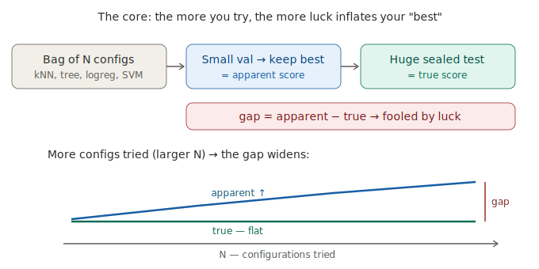

# Data Snooping in Deep Learning — dissertation (working draft)

*Audience: supervisor. The **core thesis is the whole arc** — measure the snooping gap exactly on synthetic data (truth known), then test whether it appears on real data, and conclude from the comparison. The **~6 July gate** is the first checkpoint inside that arc: the synthetic instrument and the headline figure. Sections below are tagged by *when* they land, not by importance.*
*__Order of work: reasoning first (why → hypothesis → method), code last.__ Every claim is grounded so you can check it — by a short derivation, by the experiment, or by the exact tool documentation.*
*Constraints (handbook): final submission must use the approved Word/LaTeX template (§5.2); size ≤ 50 pages **including** bibliography/tables/figures but **excluding** appendices (§5.5). 50 pp is an upper bound, not a target.*

---

## Contents & roadmap

Legend — all of §1–§6 is the core thesis: **✅ in the ~6 July gate** (synthetic instrument + headline) · **⏳ after the gate** (the rest of the arc — carries the synthetic↔real conclusion; essential, not optional) · **✍️ write last**

| # | Section | Handbook req (§5.4) | Status |
|---|---------|---------------------|--------|
| 0 | Abstract | (1) | ✍️ |
| 1 | Introduction — the problem, aims & objectives | (2) | ✅ |
| 2 | Background & related work | (3) | ✅ |
| 2.1 | &nbsp;&nbsp;The learning problem — train / validation / test | (3) | ✅ |
| 2.2 | &nbsp;&nbsp;The mechanism — winner's curse | (3) | ✅ *(drafted)* |
| 2.3 | &nbsp;&nbsp;Why a synthetic laboratory | (3) | ✅ *(drafted)* |
| 2.4 | &nbsp;&nbsp;Three datasets, one conclusion — the thesis arc | (3) | ✅ *(drafted)* |
| 3 | Method — the one machine | (5) | ✅ |
| 4 | The synthetic lab — design (Gaussian X, 3 cases, isometry) | (5) | ✅ |
| 5 | Core results — gap vs N, headline figure, 3 artifacts | (6) | ✅ |
| 6 | Extensions and the real-data comparison | (5),(6) | ⏳ **after the gate** |
| 6.1 | &nbsp;&nbsp;Label noise — does more noise widen the gap? | (6) | ⏳ |
| 6.2 | &nbsp;&nbsp;Model capacity | (6) | ⏳ |
| 6.3 | &nbsp;&nbsp;Selection protocol — single split / k-fold / nested CV | (6) | ⏳ |
| 6.4 | &nbsp;&nbsp;From-scratch MLP (NumPy backprop derivation) | (5) | ⏳ |
| 6.5 | &nbsp;&nbsp;Real data — UCI loan default; finance ^GSPC (walk-forward) | (6) | ⏳ |
| 7 | Discussion & analysis — where the thesis concludes | (6) | ✅ *(skeleton; grows with §6)* |
| 8 | Self-assessment / appraisal | (7) | ✍️ *(mandatory)* |
| 9 | How to use my project — repo, notebooks, reproduce the figure | (10) | ✍️ |
| — | Bibliography | (9) | grows throughout |
| — | Appendix A — code provenance & listings | (11) | ⏳ *(outside the page limit; examiners may not read — so essential reasoning stays in the body)* |

> **The arc, in one line.** Measure the gap exactly on the synthetic lab (§1–§5) — apparent vs true as N grows, the headline figure — then test whether it survives on real data (§6.5: loan, finance) and conclude from the comparison (§7). The whole of §1–§6 is the core thesis; the **~6 July gate** is its first checkpoint: the synthetic instrument and the headline figure.

---

## Sources

The claims here are grounded three ways, in order of how much of the work they carry:

1. **Derivation from basic knowledge.** Anything that follows from elementary probability or from the definitions — a finite-sample score is noisy; the maximum of N noisy draws is inflated; a large test set drives sampling error to zero — is *derived in place* in one or two lines. No external citation: a self-contained derivation is more verifiable than a reference, because the reader checks the logic rather than trusting that some paper says it.
2. **The controlled experiment.** Every empirical claim — the gap exists, it grows with N, the isometry result — is *measured* on the synthetic lab, where the truth is known by construction, and is reproducible from `notebooks/01_core_snooping.ipynb`.
3. **Official tool documentation.** For what a library function actually does, cited inline to the exact function where the code uses it (e.g. numpy `standard_normal`, Appendix A) — not listed decoratively here.

Local context (the project's own material, not external authorities):

| Tag | Source | Used for |
|-----|--------|----------|
| `Plan` | the student's own approved project plan — body of `Plan/Plan_2.docx` (everything **before** the "Feedback:" line) | the project's framing and design rationale (§1, §2.3, §2.4) |
| `Supervisor` | the **feedback block** in `Plan/Plan_2.docx` (after "Feedback:") | the Gaussian X + three label cases (§4); `make_X` (Appendix A) |
| `Course` | `Docs/Lesson materials/` (Week 1–3) | the standard supervised-learning setup (§2.1) |

> **On the literature.** The handbook requires a background/literature survey and a bibliography (§5.4(3),(9)). Any literature appears as honest *related work* — context that situates the contribution — and never as proof of a claim the project can derive or measure itself. It is added when the background section is written, kept minimal.

---

## 0. Abstract
✍️ *Write last — a short summary of the work (handbook §5.4(1)).*

## 1. Introduction — the problem
✅

**The trusted practice.** To "improve" a model, we try many configurations (architectures, hyper-parameters), keep the one with the best validation score, and call that "the improvement".

**The hidden flaw.** A validation score is not true performance — it is *true performance + luck* (noise, because the validation set is finite, and here deliberately small). Keeping the best of *N* such scores means taking the **maximum of N noisy draws**, which usually lands on the *luckiest* configuration, not the *best*. So the reported score is **systematically inflated**, and the inflation grows with N.

**Why it matters.** Practitioners trust that number. If it is inflated, they deploy a *worse* model with *false confidence* — and the more they search, the more they fool themselves. (winner's curse = selection bias = data snooping: three names, one phenomenon.)

**Central hypothesis.** `gap = best-validation score − true performance` is **positive** and **grows with N**. We **measure** it — we do not predict it with a formula — using a sealed test set opened exactly once.

> *To add (handbook §5.3): an explicit aims & objectives list, and one line on how this work helps my future career.*
> Sources: the framing follows the approved plan (`Plan`); the winner's-curse claim is *derived*, not cited — see §2.2.

## 2. Background & related work
✅

### 2.1 The learning problem — train / validation / test
✅

**The quantity we actually care about.** A learning algorithm sees a finite sample and returns a model. What matters is not how that model does on the sample it was fitted to, but its *true performance* — its expected accuracy on fresh data drawn from the same source. We write this true performance `S`. Everything in this report is, ultimately, a statement about `S`.

We never observe `S` directly; we estimate it by holding data out. The data is split into three parts, each with a different job:

- **Training set** — used to *fit* the model. Its error is optimistic: the model has already seen these points, so a low training error can mean it learned the signal *or* merely memorised the sample. Training error is therefore not a measure of `S`.
- **Validation set** — held out from fitting, used to *choose* between configurations (model selection). The validation score `Ŝ` is our estimate of `S` for each configuration — but it is a finite-sample estimate, so it is noisy, and we select on it. Selecting the best of N such scores is exactly where the winner's curse enters (§2.2).
- **Test set** — held out from *both* fitting and selection, kept sealed and opened exactly once at the very end, to estimate `S` for the single final model. It is an honest estimate precisely because it played no part in producing that model.

**The whole project lives in one gap.** Training error, validation score `Ŝ`, test score and true performance `S` are four different numbers. We *select on and report* `Ŝ`; we *care about* `S`; and `gap = best-validation − true performance` (§1) is the distance between them. On real data the sealed test is our only window onto `S` — itself an estimate (§2.3). In the synthetic lab we can know `S` outright, which is why the lab is where the gap is measured exactly.

> Sources: standard supervised-learning material (`Course`), stated plainly — nothing here is non-obvious or needs an external authority.

### 2.2 The mechanism — winner's curse
✅

A validation score is a finite-sample estimate, so it carries noise. For configuration *i* we observe `Ŝ_i = S_i + ε_i`, where `S_i` is the configuration's true performance and `ε_i` is zero-mean noise from scoring on a finite — here deliberately small — validation set.

Searching means computing `Ŝ_1, …, Ŝ_N` and keeping the best: we select `i* = argmax_i Ŝ_i` and report `Ŝ_{i*}`. Because we keep the *largest observed* score, we preferentially land on configurations whose noise `ε_i` happened to be positive. So the reported score overstates the selected configuration's own truth — `E[ Ŝ_{i*} − S_{i*} ] ≥ 0` — and this optimism grows with N, because the expected maximum of N noisy draws increases as N increases. This is the *winner's curse* (equivalently selection bias, data snooping — §1).

This needs no external authority — it is two lines of elementary probability — and §5 *measures* it. The cleanest case is random labels (§4, case 1): every configuration has the same true score `S_i = 0.5`, so any `best-validation − 0.5` is pure noise `ε_i`, the winner's curse with nothing else mixed in.

### 2.3 Why a synthetic laboratory
✅

**What the measurement needs.** The gap is `best-validation score − true performance` (§1). To compute it, I must hold the *true performance* of the selected model in my hand — that single quantity is what the whole project rests on. So the first question is not *which* dataset, but *whose truth can I trust as the reference*.

**On real data, the reference is itself a guess.** Real datasets do not ship with true performance attached. The best available substitute is to hold out a test set and average the model's error on it — but that average is only an *estimate* of true performance, and a finite test set makes it a *noisy* estimate. The approved plan states this plainly: *"On real data … the 'true' performance is itself only an estimate from a finite test set."* (`Plan`, `Plan/Plan_2.docx`)

**So on real data the ruler carries the same disease as the thing it measures.** The gap is, by construction, an effect *of* sampling luck — a validation score inflated because the validation set is finite (§1). If the reference "truth" is *also* a noisy estimate, then — in the plan's words — *"the gap I measure is blurred by the very noise I am trying to study."* (`Plan`) I would be measuring a noise effect with a ruler made of the same noise, and could never cleanly separate a genuine gap from the wobble of my own estimate.

**Writing the data-generating process removes the blur.** When I generate the data myself, I know the true labelling rule exactly, so true performance stops being something I estimate and becomes something I control. The approved plan names three things this buys — none of them available on real data:

- **Exact truth.** *"I can make the test set as large as I like (e.g. 100k rows) ⇒ the test score ≈ true performance with almost no sampling error, so the gap is measured exactly."* (`Plan`) — a large independent test set drives the sampling error of that average toward zero (a law-of-large-numbers argument, made precise in §3).
- **A signal dial.** *"I can set the signal strength from easy … down to near-random ⇒ all three datasets sit on one axis."* (`Plan`) The three label cases (§4) are points on that dial.
- **Known noise.** *"I can inject exactly-known label noise"* (`Plan`) — precisely what the label-noise question (§6.1) requires, because the amount injected is known by construction.

**Conclusion.** As the plan concludes, *"synthetic is the only place I can measure the gap precisely and run controlled experiments; the loan and finance sets then test whether the same effect appears in the wild."* (`Plan`) The synthetic lab is where the core results are *earned* exactly; the real datasets (§6.5) are where the effect is tested in the wild — see the thesis arc, §2.4.

### 2.4 Three datasets, one conclusion — the thesis arc
✅

Measuring the gap on synthetic data is necessary but not sufficient. It buys **internal validity**: because the truth is known by construction, the synthetic lab measures the snooping mechanism *cleanly and exactly*, and proves the instrument works. But a controlled result cannot, on its own, show that the effect *bites in practice* — that is **external validity**, and only real data can supply it.

So the project places three datasets on one axis of signal strength (`Plan`):
- **Synthetic** — truth known; the gap is measured exactly and the mechanism isolated. *Internal validity.* (§3–§5)
- **UCI loan default** — real, messy, with stakes; *"does the gap appear on its own?"* (`Plan`) *External validity, strong signal.* (§6.5)
- **Financial prices (^GSPC)** — signal ≈ 0, so *"the 'edge' found by searching is almost all luck"* and the best-on-validation strategy *"collapses out-of-sample"* (`Plan`). *External validity, no signal — the warning case.* (§6.5)

The synthetic experiment does **not** assume its own answer: I fix the *truth* and the *noise*, but the gap is produced by the honest search procedure, and that *same* procedure runs unchanged on the real datasets. So the conclusion of the thesis is not "a gap exists on data I designed" — it is the **comparison across the axis**: the mechanism measured exactly where truth is known, then shown to survive (loan) or to dominate (finance) where it is not. The synthetic core is the first point on that axis and the instrument that calibrates the rest; it is not, by itself, the conclusion.

## 3. Method — the one machine
✅

**In plain words.** Picture a *bag of model configurations* — a handful of kNN, tree, logistic-regression and SVM settings. You try each on a *small* validation set and keep the one that scored best; that best score is the number you would proudly report (the *apparent* score). Then you open a *huge* sealed test set — so large it tells the truth — and read that model's *true* score. The apparent score sits above the truth, and that inflation is the **gap**. The more configurations you try, the more chances you have to get lucky, so the gap grows with N. The rest of this section makes this precise.

Every experiment in this report — gate and after — runs the *same* procedure. Fixing the procedure and varying only one input at a time is what lets a change in the gap be attributed to that input rather than to an accident of wiring.

**The one machine.** On a freshly generated dataset:
1. **Split** the data into three disjoint parts — a training set, a validation set (deliberately small, so `Ŝ` is noisy), and a sealed test set (made large; see below).
2. **Search** a space of `N` configurations (model type and hyper-parameters across the garden — kNN, tree, logistic regression, SVM).
3. For each configuration, **fit on the training set** and **score on the validation set**, giving `Ŝ_1, …, Ŝ_N`.
4. **Keep the best on validation**: select `i* = argmax_i Ŝ_i`. The *apparent* score is `Ŝ_{i*}` — the number a practitioner would proudly report.
5. **Reveal the sealed test exactly once**, scoring the single selected model to get `T_{i*}`, the estimate of its true performance `S_{i*}`.
6. **Record the gap**: `gap = Ŝ_{i*} − T_{i*}` — apparent minus true.

**The ruler: the sealed-test estimator.** The test score `T` is just the model's average correctness over the test points — a sample mean of an accuracy. By the law of large numbers it converges to its expectation, the true performance `S`, as the test size `n_test` grows; for an accuracy (a proportion) the sampling error shrinks like `√(p(1−p)/n_test) ≤ 0.5/√n_test`. This is the law-of-large-numbers argument promised in §2.3, now concrete: with `n_test = 100 000`, that standard error is at most about `0.0016`, so `T` pins `S` to within a few thousandths — far finer than the gaps we will measure. On the synthetic lab we *can* make `n_test` this large, which is exactly why the ruler is sharp here and blunt on real data.

**Open once — why the discipline is load-bearing.** The test is opened a single time, on the *one* model that search already selected. If it were consulted earlier — to pick among configurations, or to decide when to stop — it would become part of the selection and would itself be snooped, and `T` would no longer be an honest estimate of `S`. "Opened exactly once at the very end" is not ceremony; it is the condition under which `T ≈ S` holds.

**One knob per experiment.** To read cause from the data, the machine varies exactly one input and holds everything else fixed. For the gate that knob is **N**, the number of configurations searched: we sweep `N` and watch `Ŝ_{i*}` (apparent) against `T_{i*}` (true). From §2.2 we expect apparent to climb with `N` while true stays flat or falls — the gap widening as search buys luck rather than quality. That sweep is the headline figure (§5). The remaining knobs — label noise, capacity, selection protocol (§6.1–6.3) — reuse this machine unchanged.

> Sources: the procedure is the project's own design (`Plan`); the sealed-test estimator and its error are derived in place from elementary probability (the standard error of a proportion). Library calls (the split, the four estimators) will be cited inline to numpy/sklearn docs when §5's code is written.

## 4. The synthetic lab — design
✅

**The features.** `X` is an `n × d` matrix of independent standard-Gaussian entries, each row one sample `x ∈ R^d` (`Supervisor`). The choice of an isotropic Gaussian is not incidental: its distribution is **rotation-invariant** — for any orthogonal `Q`, `Qx` is again standard Gaussian (`Qx ~ N(0, Q I Qᵀ) = N(0, I)`). This single property is what turns the rotation in case 3 into a *clean control*, as shown below.

**Three labellings — three points on one signal axis.** The cases share the Gaussian features (or a rotation of them) and differ only in how labels are attached (`Supervisor`):
- **Case 1 — random labels.** Each `y` is an independent fair coin, drawn independently of `x`. There is no signal to learn, so the true performance of *any* model on unseen data is `S = 0.5`. This baseline isolates the winner's curse: any `best-validation − 0.5` is pure noise (§2.2).
- **Case 2 — `y = sign(x₁)`.** The label is the sign of the first coordinate. The true boundary is the hyperplane `x₁ = 0`: a linear rule that is also *axis-aligned*. The signal is perfectly learnable, so `S → 1` as a model captures it.
- **Case 3 — rotated.** Labels are assigned exactly as in case 2 (from the original `x₁`), then the features are rotated: `X' = X R` with `R` a random isometry (orthogonal: `RᵀR = I`; a rotation, possibly with a reflection). In the new coordinates the true boundary becomes `wᵀx' = 0` for a fixed generic unit vector `w` — the *same* linear rule, no longer aligned with any axis.

**Why the isometry leaves the problem unchanged.** An orthogonal map preserves inner products and Euclidean distances (`‖Qa − Qb‖ = ‖a − b‖`, `⟨Qa, Qb⟩ = ⟨a, b⟩`). Together with the rotation-invariance of the Gaussian above, the rotated features `X'` have the *same distribution* as `X`, and case 3 is just case 2 rewritten in rotated coordinates: identical Bayes-optimal accuracy, identical geometry — only the alignment between the (fixed) decision boundary and the coordinate axes has changed.

**Why it still separates the methods.** Because the problem is geometrically the same, any *coordinate-free* method must score identically on cases 2 and 3, while any method that secretly relies on the axes must move:
- **k-nearest-neighbours** uses only pairwise distances; the isometry preserves every distance, so each query's neighbour set — and therefore every prediction — is unchanged. Identical accuracy.
- **Logistic regression and SVM** are rotation-equivariant: the fitting objective is unchanged when the data and the weight vector rotate together (`x ↦ Qx`, `β ↦ Qβ`), and the L2 penalty is itself rotation-invariant (`‖Qβ‖ = ‖β‖`). The optimal boundary simply rotates with the data, so the achievable accuracy is identical. (A kernel SVM is preserved too, because an inner-product or distance kernel is unchanged by the isometry.)
- **Decision trees** split one feature at a time, partitioning space into axis-aligned boxes. In case 2 a single split on feature 1 captures `x₁ = 0` exactly; in case 3 the boundary `wᵀx' = 0` is oblique, and axis-aligned splits can only approximate it with a staircase of boxes — a poorer, higher-variance fit. We therefore expect the tree's true performance to *drop* from case 2 to case 3 while kNN, logistic regression and SVM stay put. §5 measures exactly this.

The point is sharp: the isometry changes nothing that should matter — same distances, same separability, same Bayes accuracy — so any method whose score falls was leaning on a coordinate artifact (axis-alignment), not on the signal. That is the third core artifact (§5).

> Sources: the design — Gaussian `X`, the three label cases, the random isometry — is the supervisor's (`Supervisor`, the feedback block of `Plan/Plan_2.docx`). The invariance arguments (orthogonal maps preserve distances and inner products; the isotropic Gaussian is rotation-invariant; trees are axis-aligned) are standard linear algebra, derived in place — no external authority. `make_X` is logged in Appendix A.

## 5. Core results
✅ *This section is the controlled measurement — **internal validity** (§2.4): with the truth known, the gap is measured exactly and the mechanism isolated. It establishes the instrument; whether the effect matters in practice is settled by the real-data comparison (§6.5), read in §7.*

*To write — figures from `notebooks/01_core_snooping.ipynb`. Three artifacts: (1) Case 1 (random labels) as the cleanest snoop demo, gap = best_val − 0.5; (2) the headline figure — apparent (best-validation) vs true (sealed-test) as N grows; (3) the isometry insight — kNN / logistic regression / SVM identical across Cases 2↔3, only the tree drops.*

## 6. Extensions and the real-data comparison
⏳ **The rest of the core arc — after the ~6 July gate, but integral (not optional).** The same machine (§3) extends with no new parts: first to the other three questions and the from-scratch MLP, then onto real data, where the synthetic↔real comparison delivers the conclusion (§2.4, §7).

### 6.1 Label noise — does more noise widen the gap?
⏳ *Inject known label noise into the lab; measure the gap vs noise level.*

### 6.2 Model capacity
⏳ *Vary capacity; measure the gap vs capacity.*

### 6.3 Selection protocol — single split / k-fold / nested CV
⏳ *Which honest protocol shrinks the gap — measured, not asserted. The protocols (single split, k-fold, nested CV) are standard procedures, implemented via documented sklearn functions cited inline when coded.*

### 6.4 From-scratch MLP (NumPy backprop)
⏳ *The original instrument — derive backprop + the optimizer updates + L2 from the chain rule (a self-contained derivation, no external authority needed); implemented in numpy with calls cited inline to its docs.*

### 6.5 Real data — UCI loan default; finance ^GSPC
⏳ *The external-validity half of the arc (§2.4). Loan = real stakes: does the gap appear on its own? Finance = signal ≈ 0, walk-forward split: the searched "edge" is almost all luck and collapses out-of-sample — the warning case. The conclusion is the comparison of these against the synthetic measurement.*

## 7. Discussion & analysis — where the thesis concludes
✅ *Skeleton (grows with §6) — what the gap means; the optimal search budget (apparent keeps rising, true rises then turns down); honest reporting even against myself. **This is where the thesis concludes**, by reading the synthetic↔real comparison across the signal axis (§2.4): the mechanism measured exactly on synthetic, then shown to appear on loan and to dominate on finance (§6.5).*

## 8. Self-assessment / appraisal
✍️ *Write last (MANDATORY — handbook §5.3, §5.4(7)) — how the project went, what I did right/wrong, what I learnt about planning and executing a project, where next.*

## 9. How to use my project
✍️ *Write last (handbook §5.4(10)) — the GitHub repo (https://github.com/VinhDac/RHUL_Final), the notebooks, and exactly how to reproduce the headline figure.*

## Bibliography
*Built when the background section is written (handbook §5.4(9)) — related work only, kept minimal.*

---

## Appendix A — code provenance (build log)
*Outside the 50-page limit (handbook §5.5); examiners may not read it — so the essential reasoning stays in the body. Per piece: exact source → code → check. `lab.py` is implemented and verified — every check below passes in `tests/test_lab.py` (and an independent harness confirmed the Case 3 tree-drop).*

### `lab.py` · `make_X(n, d, rng)` — the Gaussian samples
**Why.** Supervisor: *"construct a matrix of Gaussian samples. This is your X — each row is one synthetic 'sample'."* (`Supervisor`, `Plan/Plan_2.docx`)
**Source.** numpy `Generator.standard_normal` — *"Draw samples from a standard Normal distribution (mean=0, stdev=1)"*; with `size=(m,n)` it draws `m*n` samples into that shape. <https://numpy.org/doc/stable/reference/random/generated/numpy.random.Generator.standard_normal.html>
**Check (verified).** `X.shape == (n, d)`; each column mean ≈ 0; each column std ≈ 1. ✓

### `lab.py` · `labels_random(n, rng)` — Case 1 labels
**Why.** No signal → true generalisation = chance (§2.2, §4 case 1); the baseline that isolates the winner's curse.
**Source.** numpy `Generator.integers(low, high=None, size=None, …, endpoint=False)` — draws from the half-open interval `[low, high)`, so `integers(0, 2, size=n)` yields `{0, 1}`. <https://numpy.org/doc/stable/reference/random/generated/numpy.random.Generator.integers.html>
**Check (verified).** values ⊆ `{0,1}`; class balance ≈ 50/50; independent of `X` by construction. ✓

### `lab.py` · `labels_sign(X)` — Case 2 labels
**Why.** Supervisor: *"Label each row j as label_j = sign(X_{j,1})"* (`Supervisor`) — a clean, axis-aligned linear rule (§4 case 2).
**Source.** Implemented as `(X[:, 0] > 0).astype(int)` → `{0,1}`. This realises the supervisor's `sign` rule while avoiding the `sign(0)=0` third value — numpy `sign` returns *"-1 if x < 0, 0 if x==0, 1 if x > 0"*, and the `> 0` form sidesteps the measure-zero tie. <https://numpy.org/doc/stable/reference/generated/numpy.sign.html>
**Check (verified).** equals `(X[:,0] > 0)`; class balance ≈ 50/50 (Gaussian symmetric); linearly separable at `flip_y=0`. ✓

### `lab.py` · `random_isometry(d, rng)` — the random rotation R
**Why.** Supervisor: *"multiply the matrix X by a random isometry … R is a square matrix which is a rotation and (possibly) a reflection"* (`Supervisor`); used for Case 3 (§4).
**Source.** numpy `linalg.qr` — *"Factor the matrix a as qr, where q is orthonormal and r is upper-triangular"*, with `q` = *"A matrix with orthonormal columns"*. Taking `q` of a random Gaussian `A` gives a random orthogonal matrix (an isometry), whatever `A` is. <https://numpy.org/doc/stable/reference/generated/numpy.linalg.qr.html>
**Check (verified).** `R @ R.T ≈ I` (`np.allclose`). ✓ *(Uncorrected QR is orthogonal but not Haar-uniform; the `sign(diag(R))` correction is an optional refinement — any orthogonal R suffices here.)*

### `lab.py` · `rotate(X, R)` — Case 3 features
**Why.** Apply the isometry so the (axis-aligned) Case-2 boundary becomes oblique in the observed coordinates (§4). Labels are taken from the **original** `X` first, *then* the features are rotated — order matters: rotate-then-label makes the boundary axis-aligned again and erases the tree-drop artifact.
**Source.** numpy matrix product `X @ R`. An orthogonal map preserves inner products and distances (`(XR)(XR)ᵀ = X RRᵀ Xᵀ = X Xᵀ`) — standard linear algebra, derived in place.
**Check (verified).** `X @ X.T ≈ (X@R) @ (X@R).T` (inner products preserved → distances preserved). ✓ Consequence (measured): kNN/logreg unchanged Case 2↔3, tree drops `1.000 → 0.72`.

### `lab.py` · `inject_noise(y, flip_y, rng)` — the label-noise knob
**Why.** The §6.1 question — *does more noise widen the gap?* The lab can inject *exactly-known* noise (`Plan`). Off in the core (`flip_y = 0` → no-op).
**Source.** numpy `Generator.choice(a, size, replace=False, …)` picks `n_flip = int(flip_y · n)` distinct indices; flipped via `1 - y`. <https://numpy.org/doc/stable/reference/random/generated/numpy.random.Generator.choice.html>
**Check (verified).** fraction actually flipped ≈ `flip_y`. ✓

### `lab.py` · `make_dataset(case, n, d, flip_y, sizes, rng)` — assemble + split
**Why.** One call builds a case's data and the three splits that feed the machine (§3): a training set, a **small** validation set (the snooping engine), and a **large** sealed test (truth ≈ no sampling error). Re-samples fresh each call.
**Source.** numpy `split(ary, indices_or_sections)` — *"a 1-D array of sorted integers … indicate where along axis the array is split"*; the cut points are the cumulative sizes `np.cumsum(sizes[:-1])` (= `[train, train+val]`), so the three parts get the requested sizes (requires `n == sum(sizes)`). <https://numpy.org/doc/stable/reference/generated/numpy.split.html>
**Check (verified).** three splits with shapes summing to `n`, `val` small < `test` large; Case 3 built label-then-rotate (tree drops vs Case 2). ✓
