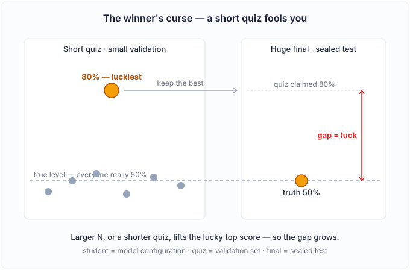
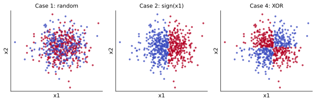
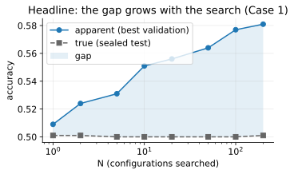
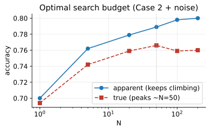
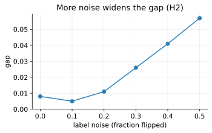
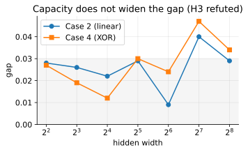
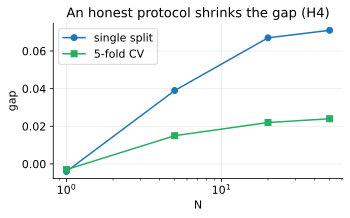
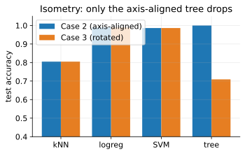

# Data Snooping in Deep Learning — dissertation (working draft)

*Audience: supervisor. The **core thesis is the whole arc** — measure the snooping gap exactly on synthetic data (truth known), then test whether it appears on real data, and conclude from the comparison. The **~6 July gate** is the first checkpoint inside that arc: the synthetic instrument and the headline figure. Sections below are tagged by *when* they land, not by importance.*
*__Order of work: reasoning first (why → hypothesis → method), code last.__ Every claim is grounded so you can check it — by a short derivation, by the experiment, or by the exact tool documentation.*
*Constraints (handbook): final submission must use the approved Word/LaTeX template (§5.2); size ≤ 50 pages **including** bibliography/tables/figures but **excluding** appendices (§5.5). 50 pp is an upper bound, not a target.*

---

## Contents & roadmap

**Reading order:** §1–§7 is the argument, written to be read once through. §0 (abstract), §8 (self-assessment) and §9 (how-to-use) are written last. The appendices hold the full derivations and code provenance, outside the page limit.

| #   | Section                                                                             | Handbook req (§5.4)  |
| --- | ----------------------------------------------------------------------------------- | --------------------- |
| 0   | Abstract                                                                            | (1) —*write last*  |
| 1   | Introduction — the problem, aims & objectives                                      | (2)                   |
| 2   | Background — train/val/test, the winner's curse, why a synthetic lab, the arc      | (3)                   |
| 3   | Method — the one machine                                                           | (5)                   |
| 4   | The synthetic lab — designing the truth (Cases 1, 2, 4)                            | (5)                   |
| 5   | Core results — the gap, measured                                                   | (6)                   |
| 6   | Extensions and the real-data comparison                                             | (5),(6)               |
| 6.1 | &nbsp;&nbsp;Label noise (H2)                                                        | (6)                   |
| 6.2 | &nbsp;&nbsp;Model capacity (H3 — refuted)                                          | (6)                   |
| 6.3 | &nbsp;&nbsp;The knobs we don't count — hidden search in deep learning (Hd)         | (6)                   |
| 6.4 | &nbsp;&nbsp;An honest protocol shrinks the gap (H4)                                 | (6)                   |
| 6.5 | &nbsp;&nbsp;Real data — loan default; finance ^GSPC                                | (6)                   |
| 6.6 | &nbsp;&nbsp;The remedy — an honest procedure you can trust (H5)                    | (6)                   |
| 7   | Discussion — where the thesis lands                                                | (6)                   |
| 8   | Self-assessment / appraisal                                                         | (7) —*write last*  |
| 9   | How to use my project                                                               | (10) —*write last* |
| —  | Bibliography                                                                        | (9)                   |
| —  | Appendices A (code provenance), B (the MLP's mathematics), C (the isometry control) | (11)                  |

> **The arc, in one line.** Measure the gap exactly where the truth is known (synthetic, §3–§5), test whether it survives in the wild (loan and finance, §6.5), and close with a remedy (§6.6): **measure → confirm → cure**. The conclusion is the comparison across the signal axis, not any single dataset.

---

## Sources

The claims here are grounded three ways, in order of how much of the work they carry:

1. **Derivation from basic knowledge.** Anything that follows from elementary probability or from the definitions — a finite-sample score is noisy; the maximum of N noisy draws is inflated; a large test set drives sampling error to zero — is *derived in place* in one or two lines. No external citation: a self-contained derivation is more verifiable than a reference, because the reader checks the logic rather than trusting that some paper says it.
2. **The controlled experiment.** Every empirical claim — the gap exists, it grows with N, the isometry result — is *measured* on the synthetic lab, where the truth is known by construction, and is reproducible from `notebooks/01_core_snooping.ipynb`.
3. **Official tool documentation.** For what a library function actually does, cited inline to the exact function where the code uses it (e.g. numpy `standard_normal`, Appendix A) — not listed decoratively here.

Local context (the project's own material, not external authorities):

| Tag            | Source                                                                                                                    | Used for                                                         |
| -------------- | ------------------------------------------------------------------------------------------------------------------------- | ---------------------------------------------------------------- |
| `Plan`       | the student's own approved project plan — body of`Plan/Plan_2.docx` (everything **before** the "Feedback:" line) | the project's framing and design rationale (§1, §2.3, §2.4)   |
| `Supervisor` | the**feedback block** in `Plan/Plan_2.docx` (after "Feedback:")                                                   | the Gaussian X + three label cases (§4);`make_X` (Appendix A) |
| `Course`     | `Docs/Lesson materials/` (Week 1–3)                                                                                    | the standard supervised-learning setup (§2.1)                   |

> **On the literature.** The handbook requires a background/literature survey and a bibliography (§5.4(3),(9)). Any literature appears as honest *related work* — context that situates the contribution — and never as proof of a claim the project can derive or measure itself. It is added when the background section is written, kept minimal.

---

## 0. Abstract

## 1. Introduction — the problem

**The trusted practice.** To improve a deep-learning model we try many
*configurations* — a configuration is a model together with its settings: its
architecture, its width, its learning rate. We train each one, keep the one that
scores best on a held-out *validation set* (data the model was not trained on), and
call that "the improvement."

**The hidden flaw.** Picture ten students who know nothing sitting the same short
quiz: by luck alone, the best of them scores 80%. A validation score is the same —
not the model's true skill, but **true skill + luck**, because the validation set is
finite (and here, small on purpose). Keeping the best of *N* such scores lands on the
*luckiest* configuration, not the *best* one — so the reported score is inflated, and
the harder we search, the more inflated it gets.

**Why deep learning makes this worst.** Deep learning is where we search hardest, and
most of that search goes uncounted. Every extra training *epoch* (one pass over the
training data) is another candidate model — and stopping at the best-looking epoch is
itself a choice made on the validation set. Every random seed is another attempt. So
the number of models we *effectively* tried is far larger than the handful we think
we chose. The more knobs there are to turn, the more luck we harvest — and the more
we fool ourselves.

**What we claim, and how we show it.** So the question is: of a reported improvement,
how much is real, and how much is luck we bought by searching? We argue that trust
does not live in the number but in the *process* that produced it. We do not guess
the inflation from a formula — we **measure** it:

> gap = best validation score − true performance,

using a test set kept sealed and opened exactly once. The gap is positive, it grows
with the search, and it is the amount of trust lost per unit of searching. (Winner's
curse, selection bias, data snooping: three names for this one phenomenon.)

**Aims and objectives.** This project sets out to (1) *measure* the snooping gap
exactly in a controlled lab where the truth is known; (2) find what drives it — the
size and blindness of the search, and label noise — and what does not (model
capacity); (3) test whether it survives on real, high-stakes data; and (4) give a
practical, honest remedy. For my own development it is training in the one discipline
that separates a real result from a lucky one — the habit any trustworthy data-science
or machine-learning role depends on.

> Sources: framing follows the approved plan (`Plan`); the winner's-curse claim is
> *derived* (§2.2); the hidden-search claim is *measured* (§6.3).

## 2. Background & related work

### 2.1 The learning problem — train, validation, test

**What we actually care about.** A model is only useful on data it has never seen.
So the quantity that matters is *true performance*: the model's accuracy on fresh
data from the same source. Call it S. Everything here is, in the end, a statement
about S — which we never see directly, only estimate.

**Three sets, three jobs.** To estimate S honestly, the data is split three ways:

- **Training set** — used to *fit* the model. Its error is optimistic: the model has
  already seen these points, so low training error can mean it learned the signal
  *or* just memorised the answers. It is not a measure of S.
- **Validation set** — held out from fitting, used to *choose* between configurations.
  Its score estimates S for each configuration — but from finite data, so it is noisy,
  and we pick the best on it. That is exactly where the trouble starts (§2.2).
- **Test set** — held out from *both* fitting and choosing, kept sealed and opened
  once at the very end, to estimate S for the single final model. It is honest
  precisely because it played no part in producing that model.

**The whole project lives in one gap.** We *select on and report* the validation
score; we *care about* S; and the distance between them —
`gap = best validation score − true performance` — is what the rest measures.

> Sources: standard supervised-learning material (`Course`), stated plainly.

### 2.2 The mechanism — the winner's curse

**A concrete version first.** Flip a fair coin ten times and record the fraction of
heads; call that a "score." Do it for two coins and keep the higher score — it
averages above 50%. Do it for five and keep the highest — higher still. Nothing about
the coins changed; you simply *took the best of more tries*, and the best of more
noisy tries is larger. Swap "coin" for "configuration" and "fraction of heads" for
"validation score," and that is the whole mechanism.

**In words.** Each validation score is *true skill + luck*. For a *single* fixed
model the luck averages to zero — the score neither over- nor under-states that
model's skill. The bias appears only when we **keep the best of N** scores: we
preferentially pick the configuration whose luck happened to be positive. So the
reported score sits above the truth, and the gap grows with N, because the best of
more noisy draws overshoots more. No heavy formula is needed — §6 *measures* this.
(The cleanest case is random labels, §4 case 1: every configuration's true score is
exactly 0.5, so any `best validation − 0.5` is pure luck, the curse with nothing else
mixed in.)

**One caveat, load-bearing.** "The luck averages to zero" assumes the validation
points are independent, like fresh coin flips. On the synthetic lab and the loan data
that holds; on financial prices it does not — adjacent days move together — so there
even the reference wobbles (§6.5). We flag it wherever it bites.

**The number we don't count.** N is not just the configurations we consciously list.
Every random seed we retry, and every epoch we stop at "when validation looked best,"
is another draw. The *effective* count is therefore
`N_eff = configurations × seeds × epoch-checkpoints`, usually far larger than the
handful we think we tried — which is why the curse bites hardest in deep learning
(§3 makes N_eff precise; §6.3 measures its effect).

### 2.3 Why a synthetic laboratory

**We are here because** measuring the gap needs the one thing real data will not give
us: the *true* performance of the selected model, held in our hand as a reference.

**On real data the reference is itself a guess.** Real datasets do not come with true
performance attached. The best substitute is to hold out a test set and average the
model's error on it — but that average is only an *estimate* of the truth, and a
finite test makes it a *noisy* one. So the ruler we measure with carries the same
finite-sample noise as the thing we are measuring: we could never cleanly separate a
real gap from the wobble of our own estimate. (The plan puts it the same way: on real
data *"the gap I measure is blurred by the very noise I am trying to study."*)

**Writing the data ourselves removes the wobble.** When we generate the data, we know
the labelling rule exactly, so true performance stops being estimated and becomes
*controlled*. That buys three things real data cannot:

- **Exact truth** — we can make the test set as large as we like (100 000 rows), so
  its estimate of the truth has almost no sampling error and the gap is measured
  exactly (§3 makes this precise).
- **A signal dial** — we can set the difficulty from easy to near-impossible, so all
  our datasets sit on one axis.
- **Known noise** — we can inject an exactly-known amount of label noise, which is
  what the noise experiment (§6.1) needs.

The synthetic lab is where the gap is *earned* exactly; the real datasets (§6.5) then
test whether the same effect appears in the wild.

> Sources: the synthetic-first rationale and the three things it buys follow the
> approved plan (`Plan`).

### 2.4 Three datasets, one arc — and a remedy

**We are here because** an exact measurement on data we designed is necessary but not
sufficient: it proves the instrument works (*internal validity*), but not that the
effect bites in practice (*external validity*). Only real data shows the second.

So the project runs the *same* machine across three datasets on one axis of signal
strength:

- **Synthetic** — truth known; the gap measured exactly, the mechanism isolated. (§3–§5)
- **Loan default** (UCI) — real and messy, with stakes; does the gap appear on its
  own? *Strong signal.* (§6.5)
- **Financial prices** (^GSPC) — signal ≈ 0, so the "edge" found by searching is
  almost all luck and collapses out-of-sample. *The warning case.* (§6.5)

The conclusion is not "a gap exists on data we designed" — it is the **comparison
across the axis**: the mechanism pinned down where truth is known, then shown to
survive where signal is real and to dominate where it is absent.

**And then a remedy.** Diagnosing the disease is only half a thesis. So we close by
*comparing* an honest, restrained procedure against an aggressive, over-searched one
on the same data (§6.6), and give a plain rule for when a model's score can be
trusted. Measure → confirm → cure.

## 3. Method — the one machine

**The idea, as an exam.** Picture N students who all know nothing sitting the *same*
short quiz. On a ten-question quiz, someone scores 80% by luck. Hire that top scorer,
sit them a ten-thousand-question final, and they fall back to 50%: the 80% was luck,
not skill. Swap *student* for *model configuration*, *short quiz* for a small
validation set, *long final* for a huge sealed test, and that is this whole report.
The **gap** is the top scorer's quiz mark minus their final mark — how much the quiz
fooled us — and it grows the more students sit the quiz.



Three design choices fall out at once: the quiz is *short* (a small validation set)
so the luck, and the gap, are large; the final is *huge* (a large sealed test) so it
reports the truth; and because the top mark climbs fast then ever more slowly, we try
N at 1, 2, 5, 10, 20, … rather than 1, 2, 3, 4.

**The one machine.** Every experiment runs the *same* procedure on a fresh dataset:

1. **Split** into three parts — training, a small validation set (so its score is
   noisy), and a large sealed test.
2. **Search** N configurations — settings of a small neural network, drawn at random.
3. **Fit** each on the training set and **score** it on the validation set.
4. **Keep the best on validation** — that best score is the number a practitioner
   would proudly report (the *apparent* score).
5. **Open the sealed test exactly once**, on that one selected model, for its *true* score.
6. **Record the gap** = apparent − true.

Fixing the procedure and varying only one input at a time is what lets a change in the
gap be blamed on that input, not on an accident of wiring.

**The instrument — a small neural network (MLP).** The model we search is a small
*multilayer perceptron*: an input layer, one hidden layer, and two outputs (one per
class). Its searchable knobs are its **width** (how many hidden units) and its
**learning rate** (how big a step each training update takes), drawn at random; the
model family is held fixed so a change in the gap comes from the search, not the
wiring. How it learns is derived in the appendix; here we need only that it turns
settings into a trained model.

**The knobs we don't count.** Two more knobs hide inside every fit. Training runs for
many *epochs* (passes over the data); keeping the model from the epoch that looked
best on validation — ordinary *early stopping* — is another choice made on the
validation set. And each fit starts from a random *seed*; retrying seeds and keeping
the best is another choice. So the effective number searched is
`N_eff = configurations × seeds × epoch-checkpoints` (§2.2), far larger than the
handful we list. §6.3 measures how much this inflates the gap.

**The ruler — why a huge test tells the truth.** The test score is just the fraction
of test points the model gets right — an average, like the fraction of heads in many
coin flips. The more flips, the closer the fraction settles to the true rate; the
error shrinks like `0.5 / √(test size)`. With 100 000 test points that error is at
most about 0.0016 — far below the gaps we measure (≈ 0.01–0.09), so the test pins the
truth. This works because each point is a clean right/wrong outcome (we score by
accuracy) on *independent* data; it does **not** hold when points are correlated, as
on financial prices (§6.5), where the ruler is blunter. Full derivation: appendix.

**Open once — why the discipline is load-bearing.** The test is opened a single time,
on the one model search already selected. Consult it earlier — to pick a configuration
or to decide when to stop — and it becomes part of the selection and is itself
snooped, so its score no longer tells the truth. "Opened exactly once at the end" is
not ceremony; it is the condition under which the test score equals true performance.

> Sources: the procedure is the project's own design (`Plan`); the ruler's error is
> the standard sampling error of a proportion, derived in the appendix.

## 4. The synthetic lab — designing the truth

**We are here because** §3's ruler is only sharp when we *know* the truth, and real
data will not tell us. So here we build data whose truth we set ourselves. The
features are the same throughout — a table of independent standard-Gaussian numbers,
one row per example — and only the *labelling rule* changes. Choosing that rule **is**
choosing the truth. Three rules, each forced by a specific need.

**Case 1 — no signal (isolate the luck).** Each label is an independent fair coin,
unrelated to the features. There is nothing to learn, so the true accuracy of *any*
model is exactly 0.5. This is the purest measurement of the winner's curse: any
validation score above 0.5 is pure luck, nothing else mixed in. *(Forced by: we want
to see luck alone.)*

**Case 2 — a linear signal (show the cost).** The label is the sign of the first
feature (`y = 1` when `x₁ > 0`) — a real, learnable rule, so a good model approaches
100%. We need this because Case 1 can never show the *cost* of over-searching: with
truth flat at 0.5 there is no real model to damage. With a real signal, searching too
hard can pick a genuinely *worse* model (§5), and this is also the ground for the
noise and capacity experiments (§6.1–§6.2). *(Forced by: we want to see the cost, and
a signal to vary.)*

**Case 4 — a nonlinear signal (make the deep model earn its place).** The label is
the XOR of the signs of the first two features: `y = 1` when exactly one of `x₁, x₂`
is positive. No straight line separates the four sign-quadrants, so linear models
(logistic regression, a linear SVM) are stuck at chance — while the MLP learns it. On
Cases 1 and 2 a linear model does as well as the MLP, so the network is just a
config-generator; Case 4 is where the deep model does something a linear one *cannot*,
and where we re-test whether capacity matters when the problem actually needs it
(§6.2). *(Forced by: we want the MLP to be necessary, not decorative.)*



*(A picture only, to fix intuition — the argument does not rest on it.)*

**A fourth rule lives in the appendix.** One more instructive rule — Case 2 *rotated*
by a random isometry — leaves everything that should matter unchanged (distances,
difficulty, best achievable accuracy) yet exposes which methods secretly leaned on the
coordinate axes rather than the signal. It is a clean linear-algebra aside, off the
main snooping thread, so it lives in the appendix.

> Sources: the Gaussian features and the labelling cases are the supervisor's design
> (`Supervisor`); XOR is the standard textbook example no straight line can solve.

## 5. Core results — the gap, measured

**We are here because** §3 built the machine and §4 gave it a world whose truth we
know. Now we run the machine and read the gap.

**The headline — the gap grows with the search.** On Case 1 (random labels) the truth
is exactly 0.5, so any apparent score above 0.5 is pure luck. Searching N
configurations, keeping the best on a small validation set, and revealing a huge
sealed test once, the **apparent** score climbs from 0.51 to 0.58 as N grows to 200,
while the **true** score never leaves 0.50. The gap between them grows monotonically
from ≈ 0 to **+0.080**:



| N             | 1     | 2     | 5     | 10    | 20    | 50    | 100   | 200             |
| ------------- | ----- | ----- | ----- | ----- | ----- | ----- | ----- | --------------- |
| apparent      | .509  | .524  | .531  | .551  | .556  | .564  | .577  | .581            |
| true          | .501  | .501  | .500  | .500  | .500  | .500  | .500  | .501            |
| **gap** | +.009 | +.023 | +.031 | +.051 | +.057 | +.063 | +.077 | **+.080** |

This is the winner's curse of §2.2, now *measured* rather than argued: keep the best
of more noisy draws and the best overshoots more. Reproduce from
`notebooks/01_core_snooping.ipynb`.

**The optimal search budget — past a point, more search buys a worse model.** On a
problem *with* signal the curse does something sharper than inflate a number. On Case
2 with 20% label noise, as N grows the **true** performance of the selected model
rises, peaks around N ≈ 50 (0.766), then flattens and dips slightly (0.760 at N = 200)
— while the **apparent** score keeps climbing to 0.80:



| N        | 1    | 5    | 20   | 50             | 100  | 200  |
| -------- | ---- | ---- | ---- | -------------- | ---- | ---- |
| apparent | .700 | .762 | .779 | .789           | .798 | .800 |
| true     | .694 | .742 | .759 | **.766** | .759 | .760 |

So there is an **optimal search budget** (here around N ≈ 50): past it, extra search
buys apparent inflation, not a better model. (The dip in true is small, within
run-to-run noise; the robust point is that true stops improving while apparent keeps
climbing — a *worse-or-equal* model carried by *higher* false confidence.)

**The deep model earns its place (Case 4).** On Cases 1 and 2 a linear model matches
the MLP, so the network is just a config-generator. On Case 4 (XOR) it is not: the
linear models sit at chance while the MLP learns a rule no straight line can draw.
(Even distance- and axis-based methods struggle once the two signal features are
buried among eighteen noise features; only the MLP captures it cleanly.)

|                            | logreg | SVM  | kNN  | tree | **MLP**  |
| -------------------------- | ------ | ---- | ---- | ---- | -------------- |
| Case 4 (XOR) test accuracy | 0.50   | 0.50 | 0.64 | 0.72 | **0.97** |

**Fit is not generalisation.** One last reading of Case 1 makes the whole point in
miniature: a flexible model can fit the random training labels almost perfectly, yet
its accuracy on fresh data is exactly chance — memorising answers is not learning. A
high score on data you *fitted* (or *searched over*) says nothing about true
performance.

## 6. Extensions and the real-data comparison

**The rest of the arc.** The same machine (§3) turns one knob at a time — label noise (§6.1), model size (§6.2), the hidden knobs of deep learning (§6.3), the selection protocol (§6.4) — then runs unchanged on real data (§6.5), and closes with a remedy (§6.6). The MLP's own mathematics is derived in Appendix B.

### 6.1 Does more label noise widen the gap? (H2)

**We are here because** §5 measured the gap; now we turn one knob at a time to see
what drives it. The first knob is label noise.

**The result.** Sweeping the fraction of labels flipped on Case 2, the gap rises
monotonically, from ≈ 0 on clean labels to **+0.057** when half the labels are random:



| flip_y | 0.0   | 0.1   | 0.2   | 0.3   | 0.4   | 0.5   |
| ------ | ----- | ----- | ----- | ----- | ----- | ----- |
| gap    | +.008 | +.005 | +.011 | +.026 | +.041 | +.057 |

**Why.** With clean labels the model saturates near 100%, so there is no room for the
best-of-N validation score to overshoot, and the gap is near zero. As noise pushes
accuracy off that ceiling, the small validation set scatters more, the best of N
overshoots further, and the gap grows. At `flip_y = 0.5` the labels are independent of
the features — Case 1's regime — and the gap (+0.057) matches the headline gap at the
same N (§5). So the gap is set by how much room there is for validation luck (the
signal-to-noise ratio and N), not by the model. Reproduce from
`notebooks/03_extensions.ipynb`.

### 6.2 Does a bigger model widen the gap? (H3 — refuted)

**We are here because** §6.1 traced the gap to noise and search size. The natural next
suspect is model *size*: surely a bigger network, with more room to overfit, snoops
more? It does not.

**The result.** Varying the hidden width from 4 to 256 units — each width searched over
N = 20 configurations, on Case 2 with 30% label noise (where overfitting could bite) —
the gap stays **flat**, with no trend:



| width                | 4    | 8    | 16   | 32   | 64   | 128  | 256  |
| -------------------- | ---- | ---- | ---- | ---- | ---- | ---- | ---- |
| gap, Case 2 (linear) | .022 | .019 | .029 | .023 | .031 | .040 | .024 |
| gap, Case 4 (XOR)    | .018 | .025 | .037 | .027 | .033 | .048 | .047 |

The second row is the *fair* test: a skeptic could say Case 2 is linear, so a small
net already fits it and capacity was never needed. So we re-ran on Case 4 (XOR), where
the model genuinely needs capacity to fit — and the gap is still flat. (Width-to-width
scatter is within the ±0.03 run-to-run noise on both.)

**Why.** Here the gap *is* the overshoot of the best of N noisy validation draws,
governed by the search size N and the validation noise — model size does not enter.
Capacity changes how a single model fits; it does not change how far the best-of-N
validation score runs past the truth. So H3 is refuted **even where capacity is needed
to fit the signal**: the dangerous knobs are **N and a small validation set**, not raw
model size. Reproduce from `notebooks/03_extensions.ipynb`.

### 6.3 The knobs we don't count — hidden search in deep learning (Hd)

**We are here because** §6.1–§6.2 found the gap is driven by the search size N, not by
model size. But so far "N" has meant the configurations we consciously list. Deep
learning's real danger is the search we *don't* count.

**The experiment.** Take a deliberately small search — just 5 configurations — on Case
1, and add the two hidden dimensions of §3 one at a time. For each configuration we
(a) retry 5 random seeds and keep the best on validation, and (b) checkpoint training
at 6 epochs and keep the best-looking one (ordinary early stopping). Each addition
multiplies the *effective* number of models searched:

| what we count                 | effective N | gap              |
| ----------------------------- | ----------- | ---------------- |
| 5 configurations only         | 5           | +0.033           |
| + best of 5 seeds             | 25          | +0.055           |
| + best of 6 epoch-checkpoints | 150         | **+0.072** |

**The punchline.** The same 5 configurations we *think* we tried carry the gap of about
150 — a three-fold jump — once the uncounted seeds and epochs are counted. And each row
lands on the headline curve (§5) at its effective N: the gap of "5 configs" with hidden
selection (+0.072) is the gap of ~150 honest configs. Hidden knobs are not free; they
are N in disguise. (The match sits slightly *under* the headline, because the seeds and
epochs of one configuration give correlated draws, so the effective independent count
is a touch below 150 — but the effect is unmistakable.)

This is why the curse bites hardest in deep learning: a logistic regression has
essentially one knob, but a neural network hides architecture, seed, and a full
training trajectory behind every "configuration." Reproduce from
`notebooks/03_extensions.ipynb`.

### 6.4 An honest protocol shrinks the gap (H4)

**We are here because** §6.1–§6.3 found what makes the gap *large* (a small validation
set, a large — often hidden — search). The question back: what makes it *small*? The
first remedy is a less noisy way of choosing.

**The result.** The single small validation split used everywhere above is the
*noisiest* honest estimate: with only 200 held-out points the score scatters, so the
best of N overshoots far. Scoring each configuration instead by **5-fold
cross-validation** — the average over five folds, a far less noisy estimate — shrinks
the gap to about a third:



| N            | 1      | 5     | 20    | 50    |
| ------------ | ------ | ----- | ----- | ----- |
| single split | −.004 | +.039 | +.067 | +.071 |
| 5-fold CV    | −.003 | +.015 | +.022 | +.024 |

**Why.** The mechanism is the same winner's curse, dampened: averaging over folds cuts
the variance of each validation estimate, so the maximum of N draws overshoots less.
Spending data on a lower-variance estimate of quality is what buys back honesty.
(Strictly, the two rows score "apparent" a little differently — the single split
reports the best validation score, the k-fold the best cross-validation score — so the
comparison is directional, not a like-for-like subtraction; the direction is
unambiguous.) A fully *nested* cross-validation would shrink it further, at more
compute. This is the first half of the remedy that §6.6 completes. Reproduce from
`notebooks/03_extensions.ipynb`.

### 6.5 Does it bite in the wild? Loan default and financial prices

**We are here because** everything so far is measured in the lab, on data we designed.
§2.4 promised the test: does the same machine, run unchanged on real data, find the
same gap? It does — and its *size* tracks how much real signal there is.

**Loan default — the gap appears, muted by real signal.** UCI credit-card default has
genuine signal: a plain logistic regression scores 0.82, above the 0.79 you get by
always predicting "no default." Run the machine on it and the gap is present but small
— from ≈ 0 to **+0.035** at N = 100 — because real quality differences between
configurations, and the smaller finite-sample noise of an accuracy near 0.8, keep the
winner's overshoot quiet. The curse survives; it is just subtler.

**The stakes hide inside the accuracy.** Accuracy is the number the search optimises,
but not the number that matters. The classes are imbalanced (22% default), so the
winning model — 0.82 on the test — still **approves 58% of the real defaulters**
(1 226 of 2 126). Chasing accuracy optimises, for the real cost, the wrong quantity.

**Financial prices — the warning: the searched edge is luck.** Daily ^GSPC direction
has essentially no signal: logistic regression scores 0.54, exactly the "always up"
rate. Search fifty MLP configurations on a small validation window and one *looks* like
an edge — an apparent directional accuracy of 0.57 — but out-of-sample it is **0.53, a
coin flip**. The gap (+0.03, growing with N) is pure luck. A strategy built on a
coin-flip signal has no real edge, and once any trading cost is subtracted it
underperforms simply holding the index. The danger is largest exactly where there is
least real signal to fall back on.

**The ruler is blunter here.** On real data we no longer know the truth; the test is a
finite — and for finance an autocorrelated — estimate (§2.3, §3), so a real-data gap is
the winner's curse *plus* the test's own sampling error. Read these figures as
*directional*, not to the third decimal (the finance number is one fixed walk-forward
path). Even so the pattern is unmistakable: the gap is smallest where signal is real
(loan), and largest, dangerous, and money-losing where it is absent (finance).
Reproduce from `notebooks/02_real_data.ipynb`.

### 6.6 The remedy — an honest procedure you can trust (H5)

**We are here because** §6.1–§6.5 diagnosed the disease and §6.4 hinted at a cure. Here
we make it concrete: build two models on the same data — one the aggressive way, one
the honest way — and open the sealed test on both.

**The head-to-head (Case 2 with 20% noise).**

- **A, aggressive** — search 20 configurations and, for each, keep the best of 3 seeds
  and 6 training epochs (the hidden knobs of §6.3), choosing on a small validation set.
- **B, honest** — search only 10 configurations, each scored by 5-fold cross-validation,
  with no per-configuration seed or epoch fishing.

|                 | apparent (reported) | true (sealed test) | gap               |
| --------------- | ------------------- | ------------------ | ----------------- |
| A — aggressive | 0.805               | 0.753              | **+0.052**  |
| B — honest     | 0.762               | 0.765              | **−0.003** |

**A looks better and is worse.** A reports the prettier number (0.805 vs 0.762), so a
practitioner comparing the two on their reported scores would ship A. But A's *true*
performance is 0.753 — *below* B's 0.765 — and A's number is inflated by +0.052, while
B's is honest to within noise. The restrained procedure wins twice: a real model that
is as good or better, and a reported number you can actually trust.

**When can you trust a number? The acceptance rule.** The lesson is not a magic
threshold like "70%." Trust does not live in the size of the number; it lives in
whether the number was produced by a process that *cannot* have inflated it.
Concretely: accept a model only when its score, measured on a **sealed test opened
once** by an honest procedure, beats the problem's baseline (chance, or the model
already in use) by **more than the measurement error** (`0.5/√test-size`). By that rule
B passes on its own reported score; A does not, because its reported score is not an
honest estimate at all. The number to believe is the one the process earned the right
to report. Reproduce from `notebooks/03_extensions.ipynb`.

## 7. Discussion — where the thesis lands

**The question we opened with.** If a validation score is `true + luck`, then when the
sealed test comes back worse than the validation number we *know* we were fooled — so
surely we just fix the model and try again? But every time we look at the test and let
it steer the next attempt, the test becomes part of the search and is itself snooped:
its number stops telling the truth. So how can a number ever be trusted?

**The answer, in one line.** Trust does not live in the number; it lives in the
*process* that produced it. A high score means nothing on its own — it can be pure
snooping (§5) — while a modest score from a sealed test opened once, by an honest
procedure, can be believed. The `gap` this project measures is exactly the trust lost
per unit of searching, and everything below is that one idea, measured.

**Measured, not predicted.** On the synthetic lab, where the truth is known by
construction, we did not argue the gap or bound it with a formula — we read it off a
sealed test. On random labels the apparent score climbs while the truth never leaves
0.5, so the gap grows from ≈ 0 to +0.08 (§5). No extreme-value machinery; a measurement.

**Deep learning is the worst habitat.** The danger scales with the *effective* number
of things searched, and deep learning hides most of that number: architecture, seed,
and a whole training trajectory sit behind every "configuration." Counting just seeds
and epochs turned a search of 5 configurations into the gap of ~150 (§6.3). A logistic
regression cannot fool you this way; a neural network can, and does.

**What drives it, and what does not.** Varying one knob at a time: more label noise
widens the gap (§6.1); a *bigger model does not* — the gap is refuted against capacity
even on a nonlinear problem that needs it (§6.2); an honest, lower-variance protocol
shrinks it to a third (§6.4). The dangerous knobs are the size and blindness of the
search, never model size.

**It bites in the wild — worst where signal is least.** Run unchanged on real data the
same gap appears: small where there is genuine signal (loan, +0.035, though a
0.82-accuracy model still approves 58% of defaulters), and pure luck where there is
none (finance, where a searched 0.57 "edge" is a 0.53 coin flip). The danger is largest
exactly where there is least real signal to fall back on (§6.5).

**And it has a remedy.** The cure is not a magic threshold but a discipline: search less
and more honestly, keep a sealed test for one final look, and accept a model only when
that honest score beats the problem's baseline by more than the measurement error. Head
to head, the honest procedure produced a *better* real model than the aggressive one,
and a number you could actually trust (§6.6).

**Internal and external validity, together.** Neither half stands alone. The synthetic
lab earns *internal* validity — the gap measured exactly because the truth is controlled
— but cannot show the effect bites in practice. The real datasets earn *external*
validity — it bites, and on finance it bites hard — but cannot measure the gap cleanly,
because their "truth" is itself a finite-test estimate. The conclusion is the
*comparison across the signal axis*, not any single dataset.

**Honest limits.** The real-data gaps are measured against a test *estimate*, not exact
truth, so their sizes carry sampling error; the finance figure is one fixed walk-forward
path, read as directional, not to the third decimal; and the sweeps here use modest
repeats, so individual points carry a run-to-run band of a few hundredths. None of this
touches the central, repeatedly-measured finding: the gap is positive, grows with the
(often hidden) search, is refuted against model size, and is most dangerous where signal
is least — and an honest, restrained process is what keeps a reported number worth
believing.

## 8. Self-assessment / appraisal


## 9. How to use my project

The project is at [https://github.com/VinhDac/RHUL_Final](https://github.com/VinhDac/RHUL_Final). Start with `README.md` (a
one-page map) and this report, `Core.md`. Everything reproduces **offline** and
deterministically (`seed=0`): the input data is frozen to `data/*.csv`.

1. `pip install -r requirements.txt`
2. `python -m tests.test_lab && python -m tests.test_mlp && python -m tests.test_pipeline` — fast fail-loud checks.
3. Run all cells in the notebooks:
   - `01_core_snooping.ipynb` — §5 (headline, optimal budget, Case 4) + isometry (Appendix C)
   - `02_real_data.ipynb` — §6.5 (loan, finance)
   - `03_extensions.ipynb` — §6.1–§6.4, §6.6 (noise, capacity, hidden search, protocol, remedy)
   - `python figures/make_figures.py` regenerates every figure.

The parameter sweeps take a few minutes each on CPU.

## Bibliography

*Built when the background section is written (handbook §5.4(9)) — related work only, kept minimal.*

---

## Appendix A — code provenance (build log)

*Outside the 50-page limit (handbook §5.5); examiners may not read it — so the essential reasoning stays in the body. The numbers below are illustrative sanity checks (run `python -m tests.test_lab` / `test_mlp` / `test_pipeline`, which now exit non-zero on any failure); the canonical tables of §5–§6 are reproduced deterministically (`seed=0`) in the notebooks. All code lives under `snooping_backend/` (add the repo root to `sys.path`, as the notebooks do): `config.py` (canonical split sizes — one source of truth), `lab.py` (data), `mlp.py` (the searched MLP), `models.py` (the sklearn garden), `pipeline.py` (the gap machine), `experiments.py` (the E-2 and H5 search loops), and `data_loan.py` / `data_finance.py` (real data, frozen to `data/*.csv`).*

### `lab.py` — supervisor's design ↔ code ↔ verified number

| Supervisor / Plan                                                                     | Code (`lab.py`)                                                                                                     | Verified — number (`python -m tests.test_lab`)                 |
| ------------------------------------------------------------------------------------- | --------------------------------------------------------------------------------------------------------------------- | ----------------------------------------------------------------- |
| *"a matrix of Gaussian samples … each row is one sample"*                          | `make_X`: `rng.standard_normal((n, d))`                                                                           | column mean ≤ 0.063;\|std − 1\| ≤ 0.03                         |
| *"Random labels"* (Case 1)                                                          | `labels_random(n, rng)` — **never receives `X`**                                                           | balance 0.488; independent of`X` by construction                |
| *"label_j = sign(X_{j,1})"* (Case 2)                                                | `labels_sign`: `(X[:, 0] > 0)`                                                                                    | `y == (feature 0 > 0)` exactly; balance 0.506                   |
| XOR —`y = 1` iff exactly one of `x₁, x₂ > 0` (Case 4, §5)                     | `labels_xor`: `(X[:,0]>0) ^ (X[:,1]>0)`                                                                           | balance ~0.5; differs from the linear rule (nonlinear)            |
| *"multiply X by a random isometry, X′ = XR (rotation ± reflection)"* (Case 3)     | label**first** from original `X` → `R = random_isometry` (the `q` of QR) → `rotate(X, R)` = `X @ R` | `R · Rᵀ = I` (err 2.2e-16); distances preserved (err 1.1e-14) |
| *"inject exactly-known label noise"* (§6.1)                                        | `inject_noise(y, flip_y, rng)` — `flip_y = 0` is a no-op                                                         | flipped fraction 0.10 at`flip_y = 0.1`                          |
| split: validation**small** (the snoop), sealed test **large** (the truth) | `make_dataset(case, d, flip_y, sizes, rng)` — explicit row slices from `sizes`                                   | shapes (600,10) / (200,10) / (200,10) match`sizes`              |

**Worked example** — 6 samples, small enough to read the labelling rules by eye (seed 1); the isometry consequence is on a larger sample (n = 7000, d = 5, seed 0):

```
feature 0 : [ 0.35 -1.30 -0.54  0.29 -0.74  0.60]
Case 1 y  : [   1     0     1     0     0     1  ]   coin flip — labels_random never sees X
Case 2 y  : [   1     0     0     1     0     1  ]   = (feature 0 > 0)
Case 3 y  : [   1     0     0     1     0     1  ]   same labels (from original X), then rotated
            distance preserved 1.65 -> 1.65   ·   kNN 0.953 = 0.953   ·   tree 0.998 -> 0.810
```

The last line is the isometry insight (§4): an orthogonal map preserves every distance, so the distance-based kNN is identical across Case 2 ↔ 3, while the axis-aligned tree drops; measured in full in §5.

**Tool sources** (official docs, cited where the code uses them):

- `make_X` — numpy `Generator.standard_normal`: [https://numpy.org/doc/stable/reference/random/generated/numpy.random.Generator.standard_normal.html](https://numpy.org/doc/stable/reference/random/generated/numpy.random.Generator.standard_normal.html)
- `labels_random` — numpy `Generator.integers` (half-open `[0, 2)` → `{0, 1}`): [https://numpy.org/doc/stable/reference/random/generated/numpy.random.Generator.integers.html](https://numpy.org/doc/stable/reference/random/generated/numpy.random.Generator.integers.html)
- `labels_sign` — the `> 0` form vs numpy `sign` (dodges the `sign(0) = 0` tie): [https://numpy.org/doc/stable/reference/generated/numpy.sign.html](https://numpy.org/doc/stable/reference/generated/numpy.sign.html)
- `random_isometry` — numpy `linalg.qr` (`q` orthonormal → an orthogonal `R`): [https://numpy.org/doc/stable/reference/generated/numpy.linalg.qr.html](https://numpy.org/doc/stable/reference/generated/numpy.linalg.qr.html)
- `inject_noise` — numpy `Generator.choice` (distinct indices, `replace=False`): [https://numpy.org/doc/stable/reference/random/generated/numpy.random.Generator.choice.html](https://numpy.org/doc/stable/reference/random/generated/numpy.random.Generator.choice.html)
- `rotate` / `make_dataset` — matrix product `@` and explicit row slicing; standard, no citation needed.

### `mlp.py` — the deep-learning instrument ↔ code ↔ verified number

The MLP is the headline instrument (§3); verified by `python -m tests.test_mlp`.

| Design (§3)                                    | Code (`mlp.py`)                                                                | Verified — number (`python -m tests.test_mlp`)                                    |
| ----------------------------------------------- | -------------------------------------------------------------------------------- | ------------------------------------------------------------------------------------ |
| one hidden layer, ReLU, 2 logits                | `make_mlp(d, width)`: `Linear(d,width) → ReLU → Linear(width,2)`           | trains (~2.7s for 4 fits)                                                            |
| full-batch GD, cross-entropy                    | `train(X, y, width, lr)`: `optim.SGD` + `CrossEntropyLoss`, `epochs=300` | loss descends; numbers below                                                         |
| config = (width, lr), searched                  | function args`width`, `lr`                                                   | search space =`sample_config` (§3)                                                |
| Case 2 learnable →`S → 1`                   | —                                                                               | width 16 / 128 →**test 0.991 / 0.982**                                        |
| Case 1 random →`S = 0.5` (no generalisation) | —                                                                               | width 16 / 128 →**test 0.495 / 0.500**; train 0.665 / 0.668 (fits some noise) |

**Worked example** (`n_train = 2000, d = 20, n_test = 20000, seed 0`):

```
Case 2 (y = sign feature 0): width 16 -> test 0.991 | width 128 -> test 0.982   learns the signal
Case 1 (random labels)     : width 16 -> test 0.495 | width 128 -> test 0.500   no generalisation
                             train 0.665 / 0.668 -> fits some noise; clear capacity effect = §6.2
```

**Tool sources:** PyTorch API — `nn.Linear`, `nn.ReLU`, `nn.CrossEntropyLoss`, `torch.optim.SGD` ([https://pytorch.org/docs/stable/](https://pytorch.org/docs/stable/)). The backprop and SGD **mathematics** is *derived* in Appendix B — that derivation is the grounding; the library only executes it.

### `pipeline.py` — the gap machine ↔ code ↔ verified number

`run_once` implements the six steps of §3; it is **data-agnostic** — it takes a `make_splits(rng)` provider, so the *same* machine runs on the synthetic lab and (later) on real data. Verified by `python -m tests.test_pipeline`.

| §3 step                      | Code (`run_once`)                                                                                      | Discipline / number          |
| ----------------------------- | -------------------------------------------------------------------------------------------------------- | ---------------------------- |
| split (val small, test large) | `make_splits(rng)` — e.g. `synthetic_splits(case, d, flip_y, sizes)`; loan/finance supply their own | n_val = 200, n_test = 10 000 |
| search N, score on val        | loop:`sample_config` → `train` → `accuracy(·, X_val)`                                           | apparent climbs with N       |
| keep best on val              | `if val > best_val` — **selection on validation only**                                          | —                           |
| reveal test once, on winner   | **one** `accuracy(best_model, X_test, ·)`, outside the loop                                     | true ≈ 0.50 on Case 1       |
| gap = apparent − true        | `best_val - true`                                                                                      | grows with N (below)         |

`sweep(make_splits, N_values, rng, R)` runs this **cumulatively** over a grid of N — one config pool per repeat, best-of-the-first-N by validation, test revealed only on each winner — and averages; that is the headline (§5).

**Worked example** — `sweep` on Case 1 random labels (n_val = 200, n_test = 10 000, mean of R = 6):

```
 N     apparent   true      gap
 1       0.514   0.498   +0.017
 5       0.546   0.501   +0.045
20       0.568   0.500   +0.068     apparent climbs, true stays ~0.50
```

`true` holds at 0.50 (no generalisation, by construction) while `apparent` rises with N, so the gap grows — the winner's curse, **measured** rather than predicted. The full headline (larger N, more repeats) is plotted in the notebook, §5.

**Tool sources:** none new — `run_once` composes `lab` + `mlp` (already cited). The sealed-test discipline is *visible in the code*: exactly one `accuracy(…, X_test)`, outside the search loop.

### `data_loan.py` — UCI loan default ↔ code ↔ verified number

Real data for the external-validity half (§6.5). The gap machine is unchanged; this only supplies a `make_splits` provider (it feeds `run_once` / `sweep` exactly like `synthetic_splits`).

| What                                                | Code                                       | Verified — number                                               |
| --------------------------------------------------- | ------------------------------------------ | ---------------------------------------------------------------- |
| fetch UCI 'default of credit card clients' (id 350) | `load_loan()`: `fetch_ucirepo(id=350)` | X = (30000, 23), y ∈ {0,1}                                      |
| class balance (imbalanced)                          | —                                         | default rate 0.221 → chance ≈**majority 0.786**, not 0.5 |
| provider, standardise on TRAIN only (no leak)       | `loan_provider(X, y, sizes)`             | train col mean ≈ 0, std ≈ 1                                    |
| real signal present?                                | sklearn`LogisticRegression` baseline     | logreg test**0.819 > majority 0.786** → signal            |

**Tool source:** `ucimlrepo.fetch_ucirepo` — [https://github.com/uci-ml-repo/ucimlrepo](https://github.com/uci-ml-repo/ucimlrepo). Needs network; fetched once and reused (not a per-run test).

### `data_finance.py` — finance ^GSPC ↔ code ↔ verified number

The warning case (§6.5): signal ≈ 0, **walk-forward** split. Same gap machine; this only supplies a chronological `make_splits` provider (no future leaks into training).

| What                                                                                    | Code                                   | Verified — number                                      |
| --------------------------------------------------------------------------------------- | -------------------------------------- | ------------------------------------------------------- |
| download ^GSPC daily; k=5 lagged-return features + next-day direction + aligned returns | `load_finance(ticker, start, k)`     | X = (6658, 5), y ∈ {0,1}, r (returns)                  |
| up-day rate (slight drift)                                                              | —                                     | 0.537                                                   |
| WALK-FORWARD provider (train old / val mid / test newest;**no shuffle**)          | `finance_provider(X, y, sizes)`      | splits (4000)/(200)/(1000), chronological               |
| signal ≈ 0 (the point)                                                                 | sklearn`LogisticRegression` baseline | logreg test**0.540 ≈ majority 0.543** → no edge |

**Tool source:** `yfinance` — [https://github.com/ranaroussi/yfinance](https://github.com/ranaroussi/yfinance). Needs network; fetched once and reused.

---

## Appendix B — the MLP's mathematics (backprop, SGD, weight decay)

The MLP is the searched instrument (§3). PyTorch's autograd computes its gradients, but the project *derives* them — deriving a formula is what justifies relying on it. The derivation is self-contained: the chain rule, nothing more.

**The forward pass.** For one input `x ∈ ℝ^d`, with a hidden layer of width `m`:

- `a = W₁x + b₁` — pre-activations (`W₁ ∈ ℝ^{m×d}`, `b₁ ∈ ℝ^m`);
- `h = ReLU(a) = max(a, 0)` — hidden activations;
- `z = W₂h + b₂` — the two output logits (`W₂ ∈ ℝ^{2×m}`, `b₂ ∈ ℝ^2`);
- `p = softmax(z)`, and the cross-entropy loss for the true class `y` is `L = −log p_y`.

**Backprop is the chain rule, back to front.** The one clean fact is the gradient of cross-entropy-after-softmax with respect to the logits. Writing `L = −z_y + log Σ_k e^{z_k}` and differentiating, `∂L/∂z_j = −[j = y] + e^{z_j}/Σ_k e^{z_k} = p_j − [j = y]`, i.e.

> `∂L/∂z = p − e_y`,

where `e_y` is the one-hot vector of the true class. (This is *why* softmax and cross-entropy are paired — their composition has this simple derivative.) Each layer's gradient then follows mechanically:

- **Output layer:** `∂L/∂W₂ = (p − e_y) hᵀ`,  `∂L/∂b₂ = p − e_y`.
- **Into the hidden layer:** `∂L/∂h = W₂ᵀ (p − e_y)`.
- **Through the ReLU:** `∂L/∂a = ∂L/∂h ⊙ 𝟙[a > 0]` — elementwise; the ReLU passes the gradient only where its input was positive.
- **Input layer:** `∂L/∂W₁ = (∂L/∂a) xᵀ`,  `∂L/∂b₁ = ∂L/∂a`.

For full-batch training each parameter's gradient is the mean of these over the training set.

**The SGD update.** Gradient descent moves each parameter `θ` against its gradient,

> `θ ← θ − η · ∂L/∂θ`,

with learning rate `η` (the searched `lr`). Because training is full-batch, `∂L/∂θ` is the *exact* mean gradient over the training set — plain gradient descent, no mini-batch sampling.

**L2 (weight decay).** Adding the penalty `(λ/2)‖θ‖²` to the loss adds `λθ` to each weight's gradient, so the update becomes `θ ← (1 − ηλ) θ − η · ∂L/∂θ`, shrinking the weights by `(1 − ηλ)` each step (`weight_decay = λ` in PyTorch). It is off in the core (`λ = 0`).

Every formula above is *used* by the instrument and grounded by this derivation; PyTorch's autograd merely executes them.

---

## Appendix C — the isometry control (Case 3)

An aside, off the main snooping thread: it tests whether a model's success rests on the *signal* or on an accident of the coordinate axes.

**The construction.** Take Case 2 (`y = sign(x₁)`), label it from the original features, then rotate the whole dataset by a random isometry `R` — an orthogonal matrix (a rotation, possibly with a reflection). The labelling rule is unchanged; the true boundary is the same hyperplane, only no longer aligned with any axis.

**Why the rotation changes nothing that should matter.** An orthogonal map preserves every distance and inner product (`‖Ra − Rb‖ = ‖a − b‖`), and the isotropic Gaussian is itself rotation-invariant. So the rotated data has the same distribution, the same separability, and the same best-achievable accuracy as Case 2 — only the alignment between the (fixed) boundary and the axes has changed.

**Why it still separates the methods.** Any *coordinate-free* method must therefore score identically on Case 2 and Case 3, while any method that leans on the axes must move. Measured on the four sklearn families (test accuracy):



|                       | kNN    | logreg | SVM    | tree              |
| --------------------- | ------ | ------ | ------ | ----------------- |
| Case 2 (axis-aligned) | 0.805  | 0.989  | 0.986  | 1.000             |
| Case 3 (rotated)      | 0.805  | 0.989  | 0.986  | 0.709             |
| change                | +0.000 | +0.000 | +0.000 | **−0.291** |

kNN (distances only), logistic regression and the linear SVM (rotation-equivariant) are untouched; only the axis-aligned decision tree drops, because it can approximate an oblique boundary only with a staircase of axis-parallel boxes. The tree's fall exposes that it was leaning on a coordinate artifact, not on the signal. Reproduce from `notebooks/01_core_snooping.ipynb`.
