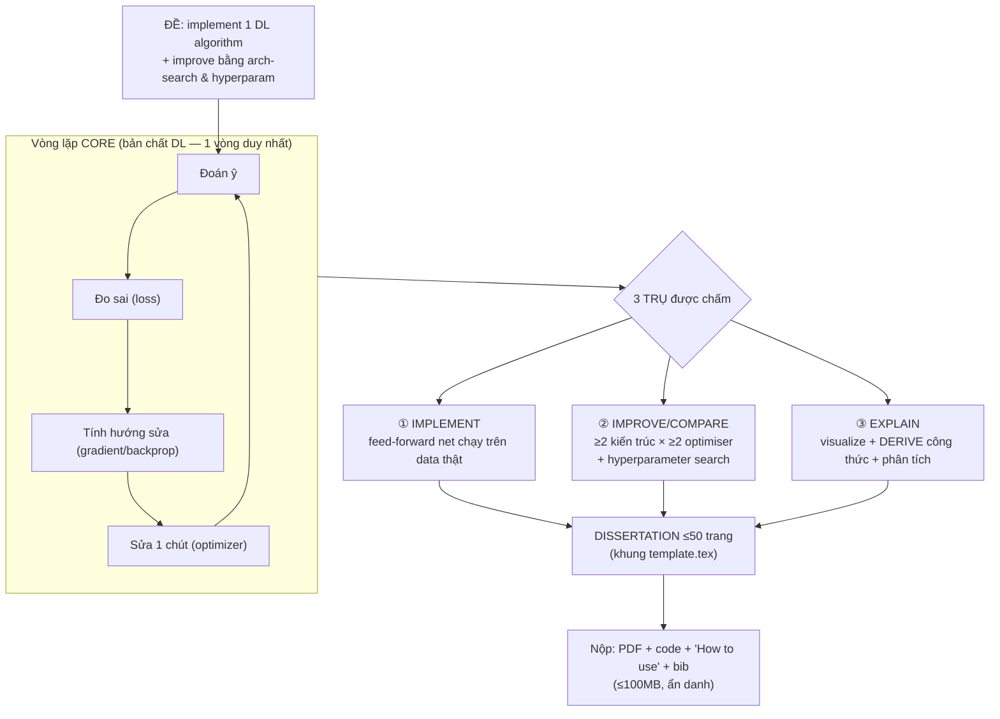

# CONSTRUCT — Bài final "CS: Deep Learning" (đọc từ bộ `Docs/Topic/`)

*Kiểm tra toàn diện 18 file trong `Docs/Topic/`. Mục tiêu: (1) chốt **core** của bài final theo đúng đề chính thức, (2) **visualize** cái chìa khoá, (3) **quy trình cơ bản nhất** mà đề ép phải làm, (4) **bản chất** được chấm, (5) đề **yêu cầu gì / mục nào không được bỏ**, và (6) một **bộ khung + reuse map** để mở ra là triển khai được ngay.*

> File này chỉ dựa trên thư mục `Docs/Topic/` (đề bài, handbook, template, 2 luận văn mẫu). Phần "bản chất DL được dạy" đã có ở [BAO_CAO_CORE_DL.md](Docs/BAO_CAO_CORE_DL.md) (rút từ notebook bài giảng) — không lặp lại ở đây.

---

## 0. Kiểm kê thư mục — có gì, dùng vào việc gì

| File | Loại | Nội dung thực | Vai trò khi làm bài |
|---|---|---|---|
| [Topic.png](Docs/Topic/Topic.png) | **SPEC** | Đề bài chính thức **"CS: Deep Learning"** | ⭐ Nguồn chân lý — mọi deliverable bám vào đây |
| [handbook.txt](Docs/Topic/handbook.txt) = [project_handbook…pdf](Docs/Topic/project_handbook%202025-26%20ver%201.0%20(1).pdf) | **RULE** | Luật project + cấu trúc dissertation + **thang điểm** | ⭐ Định nghĩa "mục không được bỏ" + cách chấm |
| [Giovanni Cherubin.pdf](Docs/Topic/Giovanni%20Cherubin.pdf) | **REF cấu trúc** | Luận văn MSc ML (distinction, 2014) | Mẫu khung: derive công thức + code structure + "How to use" |
| [Narmada Guruswamy.pdf](Docs/Topic/Narmada%20Guruswamy%20(1).pdf) | **REF cấu trúc** | Luận văn MSc visualization (13 587 từ) | Mẫu khung: **derive formulae** + **visualize** + SWOT self-assessment |
| [template.tex](Docs/Topic/template.tex) | **REUSE** | Khung LaTeX 7 section, title page, declaration, abstract, toc | Copy → đổi tên → viết thẳng vào |
| [BigDataStyle.txt](Docs/Topic/BigDataStyle.txt) | **REUSE** | Style bắt buộc (title page, declaration, bibliography) — *"must not be edited"* | Giữ nguyên, `\input` vào |
| [RHULlogo.jpg](Docs/Topic/RHULlogo.jpg) | **REUSE** | Logo trang bìa | Để cạnh file .tex |
| [bibliography.bib](Docs/Topic/bibliography.bib) | **REUSE** | 1 entry mẫu (Hastie ESL 2009) | File bib khởi điểm |
| [dice.txt](Docs/Topic/dice.txt) = [MSc-SIE-DICE…pdf](Docs/Topic/MSc-SIE-DICE%20(1).pdf) | REF (khác đề) | 2 đề Sony/DICE: VLM QA + TRC violation | **KHÔNG phải đề của bạn** — bỏ qua |
| template.pdf/.aux/.toc/.log/.bbl/.blg | rác build | Sản phẩm biên dịch LaTeX cũ | Bỏ qua |

**Kết luận kiểm kê:** đề của bạn = **`Topic.png`**. Handbook là luật chấm. template + BigDataStyle + logo + bib là bộ nộp copy-được-ngay. Hai PDF luận văn là *khung mẫu* (bắt chước **cấu trúc**, không copy chữ). Bộ DICE là nhiễu — không liên quan.

---

## 1. CORE của bài final — nguyên văn đề (`Topic.png`)

> **Aims:** *To implement a deep learning algorithm on chosen data, and to improve its performance with **architecture search** and **optimisation of hyperparameters**.*
>
> *This project is to implement and assess a deep learning algorithm — typically a **feed-forward network** — and to perform **visualisations and experiments** to analyse and improve its performance.*
>
> Câu chốt: *"This project will require some **mathematical understanding**; it is **not simply programming**."*

Bóc vỏ, core chỉ có **3 trụ**, và cả bài được chấm ở việc bạn làm đủ 3:

| Trụ | Nghĩa | Deliverable ép |
|---|---|---|
| **① IMPLEMENT** | Tự dựng 1 mạng feed-forward, chạy được trên dữ liệu thật | Early #1, Final #1 |
| **② IMPROVE / COMPARE** | Cải thiện bằng **≥2 kiến trúc** *và* **≥2 phương pháp optimisation** + tinh chỉnh hyperparameter | Final #2 |
| **③ EXPLAIN** | **Visualize** + **derive công thức** + phân tích, để chứng minh bạn *hiểu* chứ không chỉ code | Final #3, #4 |

**Prerequisite ẩn:** CS5950 (Deep Learning) *required*. Đề nhấn "không phải chỉ lập trình" → **thiếu phần toán (derive) là mất hẳn một trụ.**

---

## 2. VISUALIZE KEY — cả bài trong một bản đồ



**Bản đồ quyết định (mạch làm việc thực tế):**

```
DATA (nhìn dữ liệu trước — shape, cân bằng lớp)
  │
  ├─ POC: mạng nhỏ + dataset đơn giản
  │     └─ thí nghiệm: hyperparameter → CONVERGENCE  (lr, batch, init, epochs…)   [Early #1]
  │
  ├─ REAL: chạy trên dataset thật                                                  [Final #1]
  │
  ├─ SEARCH: đổi KIẾN TRÚC (rộng/sâu, dense↔conv…)  ✕  đổi OPTIMISER (SGD/Momentum/Adam…)
  │     └─ so sánh có kiểm soát: đổi 1 thứ / lần                                    [Final #2]
  │
  ├─ VISUALIZE + ĐO: learning curve, loss/acc, confusion, activation…             [Final #3]
  │
  └─ DERIVE: viết ra công thức forward/backward/optimiser + bàn implementation     [Final #4]
```

---

## 3. Quy trình cơ bản nhất (process) — cái đề *ép* phải có

Đây là chuỗi tối thiểu suy trực tiếp từ 3 Early + 4 Final deliverable. Thiếu bước nào = hụt deliverable đó.

1. **Chọn & soi dữ liệu** — 1 dataset đơn giản (POC) + ≥1 dataset **thật** (final). *(Early#1 / Final#1)*
2. **Dựng mạng nhỏ (POC)** — feed-forward tối giản chạy được.
3. **Thí nghiệm hyperparameter → hội tụ** — cho thấy lr/batch/init… ảnh hưởng convergence thế nào (đây là điểm được nêu *đích danh* trong Early#1).
4. **Chuyển sang dataset thật** — pipeline hoàn chỉnh (chuẩn hoá input, train/val/test).
5. **So sánh nhiều kiến trúc** — tối thiểu 2 (vd. MLP rộng vs sâu, hoặc dense vs conv). *(Final#2)*
6. **So sánh nhiều optimiser** — tối thiểu 2 (vd. SGD vs Momentum vs Adam). *(Final#2)*
7. **Visualize + đánh giá** — learning curve, loss/accuracy, confusion matrix, (tuỳ) activation/feature map. *(Final#3)*
8. **Derive công thức + bàn implementation** — viết toán của các method đã dùng. *(Final#4)*
9. **Đóng gói** — "How to use my project" + code chạy được + bib.

> Nguyên tắc thí nghiệm (để phần so sánh có giá trị): **đổi đúng một biến mỗi lần**, cùng seed/cùng split, báo cáo cả thất bại và ngõ cụt (điểm "The Journey" — xem §7).

---

## 4. Bản chất được chấm (essence) — vì sao "không phải chỉ lập trình"

Handbook §8.2 liệt kê **9 trục chấm**. Chiếu vào đề DL:

| Trục chấm (handbook §8.2) | Trong bài DL nghĩa là gì |
|---|---|
| **Difficulty** | Dám thử mục khó hơn (nhiều arch/optimiser, dataset lớn) được cộng điểm |
| **Presentation** | Trình bày để một CS-generalist (không chuyên DL) vẫn theo được |
| **The Journey** | Kể lại **ngõ cụt, cái sai, cái sửa** — không phải báo cáo bóng loáng |
| **Content** | Có **lý thuyết** (derive) *và* thực nghiệm — không chỉ code |
| **Scale** | Xứng 60 credit / 600 giờ |
| **Results** | Có kết quả; nhưng **bài dở dang vẫn điểm cao được** nếu các trục kia mạnh |
| **Review** | Mục tự đánh giá — marker thứ 2 coi trọng nhất |
| **Background** | Hiểu nền tảng / state-of-the-art (Early#2: "overview of related DL methods") |
| **Objectives** | Nêu mục tiêu rõ ràng |

**Bản chất:** bài này chấm **sự HIỂU** (toán + phân tích + hành trình), không chấm độ bóng của code. Đó là lý do 2 deliverable "mềm" — **derive công thức** (Final#4) và **visualize để phân tích** (Final#3) — lại là chỗ kéo điểm lên merit/distinction, và cũng là chỗ hay bị bỏ nhất.

---

## 5. Đề YÊU CẦU GÌ — checklist deliverable (không được thiếu)

### Early Deliverables (đạt trong ~1 tháng đầu)

| # | Đề đòi | Bằng chứng cần có |
|---|---|---|
| E1 | **POC**: DL algorithm cho mạng nhỏ trên dataset đơn giản **+ thí nghiệm hyperparameter → convergence** | Code POC + đồ thị hội tụ theo lr/batch/init |
| E2 | **Report tổng quan** một loạt phương pháp DL liên quan | Mục Background/Survey (MLP, CNN, RNN, optimiser, regularisation…) |
| E3 | **Report mô tả + đánh giá** implementation ban đầu và các thí nghiệm | Mục kết quả sơ bộ + phân tích |

### Final Deliverables (cuối kỳ)

| # | Đề đòi | Ngưỡng tối thiểu để coi là "đạt" |
|---|---|---|
| F1 | Chương trình chạy trên **dataset thật** | ≥1 real dataset, pipeline đầy đủ |
| F2 | **Implement và so sánh nhiều kiến trúc *và* nhiều optimisation method** | **≥2 kiến trúc *VÀ* ≥2 optimiser** (chữ "and" → phải có cả hai) |
| F3 | **Visualize và đánh giá** hiệu năng | ≥ learning curve + 1 loại chẩn đoán (confusion/activation/…) |
| F4 | Report **describe & DERIVE the formulae** của các method + **bàn implementation** | Có toán forward/backward/optimiser viết ra, không chỉ trích dẫn |

**3 bẫy hay trượt:** (a) F2 chỉ đổi kiến trúc mà quên đổi optimiser (hoặc ngược lại) — đề dùng chữ *and*; (b) F4 "derive" bị làm thành "kể tên" — phải **dẫn công thức**; (c) E1 quên phần **hyperparameter → convergence** (nó được nêu đích danh).

---

## 6. Mục KHÔNG THỂ BỎ trong dissertation (handbook §5.3–5.4)

Handbook §5.4 liệt kê thành phần "any dissertation must contain". Đánh dấu **[MUST]** (bắt buộc tuyệt đối) vs [nên]:

| Mục | Trạng thái | Ghi chú cho bài DL |
|---|---|---|
| Abstract | **[MUST]** | Tóm tắt việc đã làm |
| Introduction: **motivation + aims gốc + "giúp gì cho sự nghiệp"** | **[MUST]** (§5.3 nêu đích danh) | Nêu cả nguyện vọng nghề — đề bắt buộc |
| Background research / survey | **[MUST]** | = Early#2; đây là trục "Background" |
| (nếu là software) SE method + requirements/design/impl/testing **+ user/installation manual** | **[MUST nếu có code]** | Bài này có code → cần |
| (nếu thiên lý thuyết) phát triển lý thuyết, giải thích thuật toán | áp dụng | = phần **derive** (Final#4) |
| (nếu có thực nghiệm dữ liệu thật) results + analysis + conclusions | **[MUST]** | = Final#1,#3 |
| **Self-assessment / appraisal** (đi đúng/sai gì, học được gì, đi tiếp đâu) | **[MUST]** (§5.3) | Marker#2 coi trọng nhất |
| Bibliography, trích dẫn đầy đủ trong text | **[MUST]** | |
| **"How to Use My Project"** (chương trình nào, chạy ra sao, tìm code ở đâu) | **[MUST nếu có code]** (§5.4-10, §7.1) | Rất hay bị quên |
| Professional issues | nên | Cả 2 luận văn mẫu đều có |

**Ràng buộc hình thức [MUST]:**
- **≤ 50 trang** (kể cả bibliography, hình, bảng; **không** kể appendix) ≈ 15 000 từ — *và đây là trần, không phải mục tiêu*. (§5.5)
- Dùng **đúng template** Word/LaTeX, **không đổi layout/font**. (§5.2)
- **Ẩn danh**: không tên/ID/username/email; cảm ơn supervisor không nêu tên. (§5.6)
- Khai **Word Count** ở trang Declaration. (mẫu Narmada: 13 587)
- Nộp **≤ 100MB**; dataset lớn để link/URL, không nộp raw output — nộp **graph thay vì log**. (§7.1)

---

## 7. Cách được chấm + luật cứng (handbook §8, §6.1)

**Thang điểm (§8.1):**

| Dải | Nghĩa | Chìa để lên dải |
|---|---|---|
| **70–100 Distinction** | Nắm vấn đề chín, lập luận mạch lạc, kỹ thuật xuất sắc | Đủ 3 trụ + derive + phân tích sâu |
| 80%+ | "distributable code" / nền cho nghiên cứu tiếp / hiểu rất sâu kết quả | vượt kỳ vọng ở **một** hướng |
| **60–69 Merit** | Nhiều nét của distinction; sáng tạo/độ sâu bù cho vài yếu điểm | |
| **55–59 Pass-merit** | Nắm vấn đề cơ bản, có phân tích/thực nghiệm nhưng nền yếu / tổ chức kém | |
| 50–54 Bare pass | Hiểu phần chính nhưng phân tích hạn chế | |

**Luật cứng (đọc kỹ):**
- **Gen-AI bị cấm** trừ khi supervisor cho phép rõ ràng; **nội dung do AI sinh phải dán nhãn** "AI-generated" và **không được nhận là của mình** — vi phạm là assessment offence. (§6.1)
- Nộp trễ: **−10 điểm** trong 24h đầu; sau 24h = **0**. (§8.3)
- 2 marker độc lập; lệch >10% → marker thứ 3. Marker#2 nhìn kỹ **mục Review/self-assessment**.
- Milestone gợi ý (§4.5): *Review SOTA → Requirements → High-level design → Prototype → Testing spec → Outline dissertation → Final draft.*

---

## 8. Bộ khung dissertation tái dùng NGAY (map thẳng vào `template.tex`)

`template.tex` cho sẵn 7 `\section`. Đổ nội dung theo bảng dưới (budget ~50 trang). Cột "bắt chước" = copy **cấu trúc** từ luận văn mẫu nào.

| Section (trong template) | Nội dung | Deliverable | Trang | Bắt chước |
|---|---|---|---|---|
| *Abstract* (có sẵn) | 150–250 từ: bài làm gì, kết quả chính | — | — | Cherubin/Narmada abstract |
| **1. Introduction** | Motivation, aims gốc, **"giúp gì sự nghiệp"**, objectives, đóng góp | §5.3 MUST | 3–4 | Narmada §1 |
| **2. Background / Related DL methods** | Survey: MLP, CNN, RNN, optimiser, regularisation; **derive nền toán** | E2, F4 | 10–14 | Narmada §2 (derive PCA/tSNE/SVM), Cherubin §2 |
| **3. Method / Implementation** | Kiến trúc, forward/backward, pipeline, SE method, **derive công thức** | F4 | 8–10 | Cherubin §5 (thuật toán + đo) |
| **4. Experiments — POC & hyperparameters** | Mạng nhỏ, hyperparam → **convergence** | E1, E3 | 5–7 | Narmada §3.3 (phase-based) |
| **5. Experiments — architectures & optimisers** | So sánh **≥2 arch × ≥2 optimiser** trên **data thật** | F1, F2 | 6–8 | Cherubin §6 (system eval) |
| **6. Visualisation & Results analysis** | Learning curve, loss/acc, confusion, activation…; phân tích | F3 | 5–7 | Narmada §3.4 (nhiều plot) |
| **7. Conclusions + Self-assessment + Professional issues** | Kết luận, **SWOT/appraisal**, ethics, **How to use my project** | §5.3 MUST | 3–4 | Narmada §4 (SWOT) + §5, Cherubin App A |
| *References* (bib) | | MUST | trong 50tr | |
| *Appendix* (ngoài 50tr) | Code listing, bảng phụ | tuỳ | — | Cherubin App A–D |

> `template.tex` mặc định có 7 section rỗng — ánh xạ trên vừa khít, gần như không phải sửa cấu trúc, chỉ đổ chữ.

---

## 9. REUSE MAP — tận dụng gì trong `Docs/Topic/`, dùng sao

**A. Bộ nộp LaTeX (copy nguyên khối, chạy ngay):**
```
Lấy 4 file này ra thư mục viết bài, cùng chỗ:
  template.tex        → đổi tên (vd. dissertation.tex); sửa \title, \Programme, \author{Anonymous}
  BigDataStyle.txt    → GIỮ NGUYÊN (file cấm sửa; \input tự động lo title/declaration/abstract/bib)
  RHULlogo.jpg        → để cạnh .tex (title page tự nhúng)
  bibliography.bib    → thêm entry; đã có sẵn Hastie ESL 2009
Biên dịch: pdflatex → bibtex → pdflatex ×2
```
Trong `template.tex` cần đổi: dòng `\title{}`, `\newcommand{\Programme}{...}` (điền đúng MSc programme), giữ `\author{Anonymous}` (ẩn danh). Sinh viên Computational Finance mới bỏ comment `\twodepartmentstrue`.

**B. Hai luận văn mẫu — tái dùng CẤU TRÚC (không copy chữ, tránh đạo văn):**

| Cần làm | Học ở đâu |
|---|---|
| Derive công thức trong body (Final#4) | Narmada §2: dẫn **matrix form of PCA**, **t-SNE**, **SVM dual/soft-margin/kernel** — đúng "độ sâu toán" mà đề đòi |
| Visualize để *phân tích* (Final#3) | Narmada §3.4: error plot, ROC, confusion tối ưu, univariate histogram, cluster plot |
| Đánh giá hệ thống có kiểm soát | Cherubin §6: Evaluation criteria → mô tả thí nghiệm → results/analysis |
| "How to use my project" + code structure | Cherubin §7 + App A ("Installing and using the code") |
| Self-assessment | Narmada §4: **SWOT** (Strengths/Weaknesses/Opportunities/Threats) |
| Professional issues | Narmada §5 (ethics of visualisation) / Cherubin App D |

**C. Bib khởi điểm:** thêm 2 cuốn đề chỉ định (Reading trong `Topic.png`):
- Goodfellow, Bengio, Courville — *Deep Learning*, MIT Press 2016.
- Chollet — *Deep Learning with Python*, Manning 2018.
- (đã có) Hastie, Tibshirani, Friedman — *ESL*, Springer 2009.

---

## 10. Danh sách "không được quên" (in ra dán tường)

- [ ] **F2 có ĐỦ HAI chiều**: ≥2 kiến trúc **và** ≥2 optimiser (đừng chỉ 1 chiều).
- [ ] **F4 thực sự DERIVE** công thức (forward, backprop, update rule), không kể tên.
- [ ] **E1 có phần hyperparameter → convergence** (nêu đích danh trong đề).
- [ ] **Data thật** cho bản final (không chỉ toy dataset).
- [ ] **Visualize để phân tích**, không chỉ để đẹp (learning curve + ≥1 chẩn đoán).
- [ ] **Self-assessment / appraisal** (marker#2 đọc kỹ nhất).
- [ ] **"How to use my project"** + code chạy được + hướng dẫn build.
- [ ] **≤50 trang**, **đúng template**, **ẩn danh**, khai **Word Count**.
- [ ] Nộp **≤100MB**; dataset lớn → URL; nộp **graph thay vì raw log**.
- [ ] **Gen-AI**: xin phép supervisor + **dán nhãn** phần AI; không nhận là của mình.
- [ ] Intro nêu **motivation + aims gốc + "giúp gì sự nghiệp"**.
- [ ] Bibliography trích dẫn đủ trong text.

---

### Kết nối với tài liệu đã có trong repo (tham khảo, ngoài phạm vi `Topic/`)
File này là **lớp tuân thủ đề chính thức**. Nó khớp với: [BAO_CAO_CORE_DL.md](Docs/BAO_CAO_CORE_DL.md) (bản chất DL từ notebook) và các build-doc bạn đã có (NORTH_STAR / CHAPTER_MAP / CONSTRUCT_FINAL). Khi hai bên vênh nhau, **`Topic.png` + handbook thắng** — vì đó là cái được chấm.
