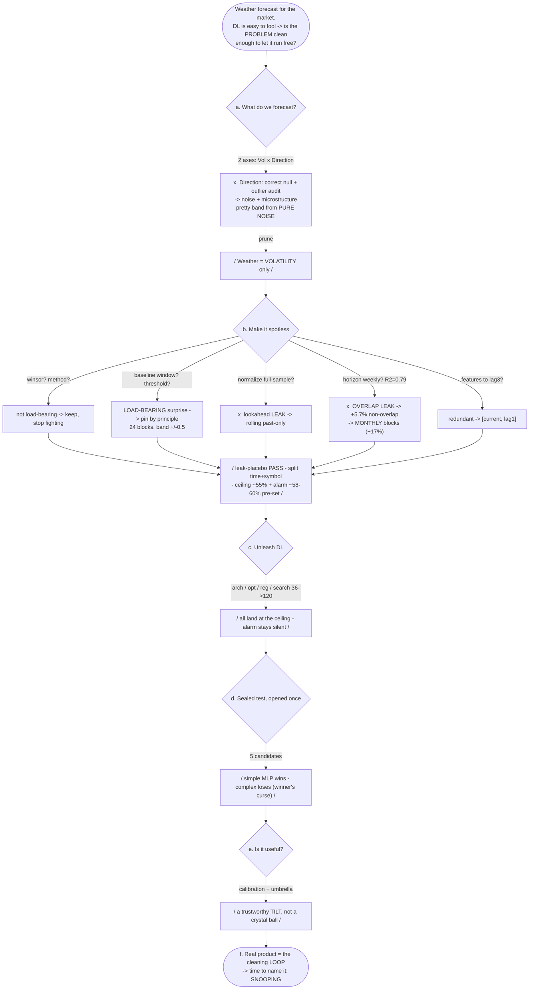

# Section 4 — KHUNG (writing blueprint)

*The weather-forecast section. This file is the skeleton + craft guide for writing §4: the voice, the ONE decision-tree spine, the repeated pipeline/keywords that tie §4 to §2/§3, and the per-part visual + reader takeaway.*
*Content source of truth: the weather journey (Beats 1-58), `notebooks/weather_regime_scratch.ipynb` (Steps 0-3) and `notebooks/weather_regime_dl.ipynb` (mau 1-8). See [[weather-regime-branch]], [[two-act-restructure]].*

---

## 0. The one idea (through-line)

> **Make the problem clean enough that DL — powerful and convenient but easy to fool — can be turned loose without fooling you; and you FIND "clean" by a loop (propose -> lab -> judge -> if wrong, hunt the hidden assumption -> clean), at peace because you trust the loop, not because you were right.**

§4 is the same market as §3, revisited by a matured hand. Macro-shape:
**a + b = CLEAN THE PROBLEM (the heart)  ->  c = UNLEASH DL (it lands at the ceiling)  ->  d = one honest verdict  ->  e = use it  ->  f = name the workflow.**

The reader must FEEL the payoff of cleaning at the a+b -> c seam: once the cage is clean, the full toolkit runs free and still cannot lie.

---

## 1. Voice & how we talk to the reader

- Plain, honest, first-person "we". Short **anchor sentences that stand alone** (the §2/§3 device). **NO em-dash.**
- §4's voice = a **COMPOSED master, not an omniscient one.** We still guess wrong (Direction, the overlap leak); the growth from §2/§3 is that we catch it fast and calmly, and we EXPECT to.
- **Co-discovery / no foreknowledge (VOICE LOCK):** the narrator does not know the verdict before the lab. The DATA springs each surprise, not the narrator. Experience carried forward is not foreknowledge.
- **The RELIEF (tho phao) is earned, never painted:** a quiet exhale each time we catch ourselves and get one notch cleaner. Confidence comes from HAVING the loop, not from being right. A little wry about our own wrong guesses ("we almost believed it again").
- Reader = a smart non-expert. Goal: they FEEL the loop turning, and they TRUST the modest final number more than a shiny one.

---

## 2. THE SPINE — one decision-tree through all of §4

One tree = the map of §4. Introduced once (opening / part a), then each part **walks one node** with a small "you are here" locator (the §4 analog of §3's suspect-map, revisited). Wrong branches are drawn as **pruned dead-ends**, so the reader literally watches "clean" being discovered by pruning.

**In the dissertation:** this becomes ONE hand-drawn figure `s4_tree.svg`, shown whole at the top of §4, then re-cropped small (a highlighted node) as each part opens.

---

## 3. THE THROUGH-LINE THREAD — repeat pipeline + keywords

The **same pipeline figure** recurs across the whole README (§2 intro -> §3 -> §4). In §4 we re-lay it as a master and, in each part, name which station we are cleaning. Keywords recur on purpose so the whole book reads as ONE continuous argument, not four reports.

| Recurring from §2 / §3 (echo these) | New in §4 (plant these) |
|---|---|
| the **pipeline** (5 stations: read -> split -> scale -> build -> measure) | **clean the problem** |
| **leak** / near-twins | **let DL off the leash / run free** |
| the **null** / the **shuffle** | **load-bearing** (vs a knob that does not matter) |
| the **ceiling** (~0.60) | the **loop** (propose -> lab -> judge -> hidden assumption -> clean) |
| **hidden assumption** / the suspect list | **we caught ourselves** |
| **walk-forward** / past to future | **trust the %** |
| "a number you cannot trust" / "there was never one number" (§3) | "there was always one **method**" (hands to ending) |
| **FRAME** = the question never on the suspect list | |

Rule: **each §4 part re-drops 2-3 of these threads** (see the table's last column).

---

## 4. THE KHUNG — annotated a-f

*(voice / visual / what the reader SEES / what the reader UNDERSTANDS / repeated keyword are noted directly, per your request)*

### opening (bridge from §3)
- **Content + loop:** back to the exact market of §3, wiser. The master's move: DL is strong and convenient but easy to fool, so do not hobble it; pour the discipline into the PROBLEM. "Clean" is not known up front; we find it by a loop. The relief ahead is trusting that loop, not being right.
- **Voice:** calm, sets the rules of the game; a touch of resolve after §3's defeat.
- **Reader SEES:** the whole `s4_tree` (the map of what is coming).
- **Reader UNDERSTANDS:** §4 will earn a trustworthy number by cleaning, not by cleverness.
- **Keyword:** clean the problem, the loop, the pipeline, "there was never one number" -> "so this time we change the method".

| Part | Content + the loop it runs | Voice & how we tell it | Visual — reader SEES | Reader UNDERSTANDS | Repeated keyword / pipeline |
|---|---|---|---|---|---|
| **a. What do we forecast? (Frame) + catching ourselves** | Propose the ambitious 2-axis map (Vol x Direction, 17 symbols). Lab Direction against the **correct sign-shuffle null** + an outlier audit -> WRONG: it is noise + non-synchronous-trading microstructure (and banding PURE NOISE already gives a pretty 31/38/31). Hidden assumption: *a nice distribution = signal; autocorr is outlier-proof.* Fix: **prune Direction, weather = Volatility only.** | Wry self-catch: "we almost built on it." Co-discovery: the null delivers the verdict, we do not. | `s4_direction_drop`: per-symbol bars, vol clustering dwarfs direction on all 17; inset = pretty band from pure noise | A plausible axis + a pretty picture can be pure noise; the correct **null** is the judge. This **heals §3's FRAME wound** (question the question first). | FRAME, the null/shuffle, "a picture you cannot trust", pipeline station 1 |
| **b. Make the problem spotless (the heart)** | Run the loop on every knob. Not load-bearing -> keep, stop fighting (winsor 97%, method 89-94%). LOAD-BEARING surprise -> pin by principle (baseline window only 75% agree -> 24 blocks; threshold -> +/-0.5). Full-sample normalize -> **lookahead LEAK** -> rolling past-only. Horizon weekly R2=0.79 -> too high -> **OVERLAP LEAK** -> monthly non-overlap blocks (+17%). Features -> redundant -> [current, lag1]. Then **leak-placebo PASS (54.8 -> 34.5)**, split holds time AND symbols, **pre-commit ceiling ~55% + alarm ~58-60%**. | Patient, deliberate; the exhale grows each catch; the overlap leak is the biggest quiet gasp ("the sneakiest leak wore a mask"). | `s4_winsor` (crises survive cleaning); `s4_baseline_window` (the 75% surprise); `s4_overlap` (0.79 -> +5.7%); `s4_pipeline` (the clean monthly stations) | Cleaning is MOST of the work. Some knobs matter (pin them before touching DL), most do not. The overlap leak is the sneakiest. Now the problem is spotless and the ceiling/alarm are fixed BEFORE any model. | leak, load-bearing, the ceiling, hidden assumption, walk-forward, pipeline stations 2-5 |
| **c. Unleash DL off the leash** | Propose "maybe more capacity / search helps." Run the WHOLE toolkit: >=2 arch, GD/momentum/Adam + convergence, activations, batch/mini/SGD, L2/dropout/early-stop, search 36 -> 120 configs, **derive the 4 formulae + gradient-check (4.12e-10)**, methods survey. Verdict: all land at the ceiling; the alarm never trips. | Brisk, almost relaxed, BECAUSE the cage is clean. Quiet satisfaction; the master enjoys the toys but is not fooled. | `s4_convergence` (speed not height); `s4_arch` (flat); `s4_search` (winner's-curse creep); gradient-check PASS line | On a clean problem the full toolkit changes SPEED, not the ceiling. Complexity buys little; the silent alarm proves the cleaning worked. The graded DL content is EVIDENCE, not a show. | the ceiling as brake, let DL run free, "load-bearing" (none of the DL knobs are), pipeline (DL sits ON the clean pipeline) |
| **d. One honest verdict (sealed test, once)** | Open the sealed test a single time, 5 candidates. Simple MLP [2,8,3] wins accuracy + calibration (ECE 0.012) + transfer; the big-search winner is WORST (54.2%, ECE 0.069) = **winner's curse**, complexity+search bought negative. | The payoff, stated plainly, no gloating. The number speaks. | `s4_reality`: candidate bars, accuracy + ECE, simple beats complex | The modest TRUSTWORTHY model beats the high UNTRUSTWORTHY one. The thesis, proven by data. | trust the number, winner's curse, the ceiling, "a high number you cannot trust" (§3 echo) |
| **e. Use it like a weather app (proven value)** | Run the chosen MLP on markets it never saw. **Trust the %** (calibration near-diagonal), **umbrella pays** (warned -> 60% vs base 27%), an honest month-by-month diary (hits, misses AND false alarms), live bulletins. | Warm, human, honest; show the misses too. "An umbrella, not a crystal ball." | `s4_usage`: the 3-panel weather-app figure (already built in mau 8) | You can TRUST the %; acting on it pays over many months; it is a humble TILT, not certainty. Usefulness = purpose + calibration + value, NOT accuracy. | trust the %, purpose, calibration, "modest but real" |
| **f. What we actually built (recap + handoff)** | Step back: DL barely moved the number; the work was cleaning the problem so DL could not fool us; the relief was the loop, not being right; the real product is the **workflow**. Hand the baton to the ending. | Quiet, reflective; closes the arc; passes to the ending. | `s4_workflow` / re-show `s4_tree` (the loop, one last time) | The real product was the cleaning LOOP, not the number. §2-§4 were all the same loop. Time to name it. | the loop, hidden assumption, the null, the ceiling, "there was never one number" -> "there was always one method" -> (ending names SNOOPING) |

---

## 5. Editorial rules

- **Do NOT narrate all 27 decisions.** Full loop treatment for the dramatic ones (drop Direction, the overlap leak, the baseline-window surprise, the wrong null). Compress the not-load-bearing knob-labs to a line ("we labbed it, it did not move the labels, we stopped fighting").
- **a + b = clean / c = unleash is the backbone.** The reader must feel the payoff of cleaning exactly when the toolkit lands safely at the ceiling in c.
- **The tree is the through-line device:** whole at the top, a highlighted node at each part open. Same discipline as §3's revisited suspect-map.
- **Repeat the pipeline + keywords** (section 3) so §4 reads as the continuation of §2/§3, not a fresh report.

### Figures to export as SVG (fresh `s4_` namespace; old `m4_` deleted)
| file | from | shows |
|---|---|---|
| `s4_tree` | NEW (hand-drawn) | the §4 decision-tree spine (through-line) |
| `s4_pipeline` | scratch Cell 22 | the clean monthly vol pipeline + US500 example |
| `s4_direction_drop` | scratch Cell 8/9 | vol clustering dwarfs direction; band-from-noise inset |
| `s4_winsor` | scratch Cell 5 | winsor before/after; crises survive |
| `s4_baseline_window` | scratch Cell 13 | baseline-window lab (the load-bearing surprise) |
| `s4_overlap` | scratch Cell 11 | overlap vs non-overlap persistence (R2 0.79 -> +5.7%) |
| `s4_convergence` | dl mau 3 | optimizers: speed not ceiling |
| `s4_arch` | dl mau 2 | architectures land flat |
| `s4_search` | dl mau 6b | winner's-curse val creep |
| `s4_reality` | dl mau 7 | sealed-test candidates: accuracy + ECE |
| `s4_usage` | dl mau 8 | the weather-app 3-panel (already rendered) |
| `s4_workflow` | NEW | the cleaning loop, for f + the ending |

*Status: khung locked in structure; write part-by-part (Mode C), starting with `a`. Voice/visual/keyword notes above are the guide for each.*
