# Data Snooping in Deep Learning: dissertation (working draft)

*Working draft, written as a journey rather than a proof: we start from the ordinary, by-the-book way of judging a model by its number, and follow honestly where it leads. Reasoning first; the code behind every number is in the appendices. Compass in `NORTH_STAR.md`; the underlying argument in `KEY_CORE.html`.*

*Constraint (handbook): final submission ≤ 50 pages, including bibliography, tables and figures, excluding appendices.*

---

## 0. The number we are about to trust

We have a model. Is it any good? How would we even know?

We do the obvious thing. We hide some data from it, let it guess on that data, and count the hits. That gives us a number. Is it high? Good. Low? Not good. So we read the number and we decide.

But we never build just one. We build many and keep the best number. So what are we really trusting in the end? *One number.*

And here is the question we almost never stop to ask.

> **Can we trust it?**

Let us find out honestly. We will not bend anything to force a problem into view. We will do the opposite, and *follow every rule the books give us, exactly.* Then we stand back and ask, together, what that honest number is really worth.

(One limit, so we are not doing everything at once. We stay with deep learning that forecasts and classifies: is tomorrow a busy day on the market, did this borrower default, which activity is this. Not vision, not language, not the rest. Just putting a label on the next case.)

So, where does everyone start? By the book. Let us start there too.

---

## 1. What deep learning really is, and the plan

So we have a job: take the next case and put a label on it. What do we build?

Almost always, the same thing: a small neural network. It is a stack of simple parts. A few features go in, get mixed and bent through a hidden layer, and come out as a guess between the classes.

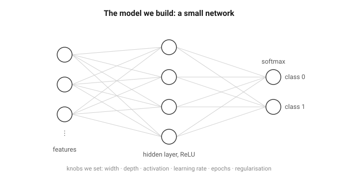

How does it learn? Not by us programming it, but by correcting itself, the same four small moves over and over. It takes the numbers in and mixes them into a guess (the forward pass). We score how wrong that guess is, in one number (the loss). We work out which way to nudge each knob to shrink that number (the gradient, the downhill direction). Then we take one small step that way (the update). A few thousand rounds of those four, and the guesses come out mostly right.

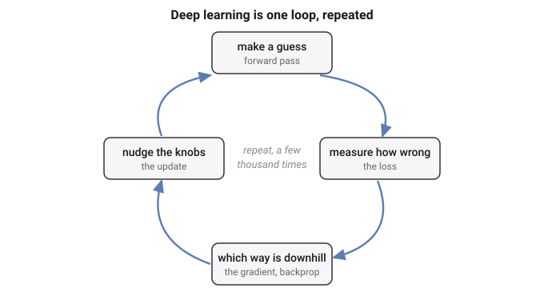

One small marvel hides in those four moves: when we score wrongness this way, the correction each step makes is *exactly how far off the guess was*, no more. That is all the training is really doing, over and over. The full working, for anyone who wants it, is in Appendix A.

Give it more knobs, make it wider or deeper, and it can fit more. That is the whole appeal: **with enough knobs, a network can fit almost any pattern we hand it.**

And there is the catch. If it can fit almost any pattern, then **it can also fit patterns that are not really there.** Show it pure noise for long enough and it will "learn" the noise, memorising which random point got which random label, and score beautifully on the training data.

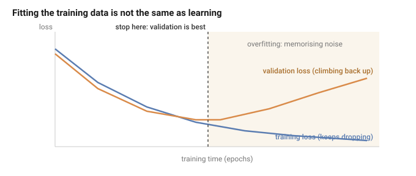

So the training score can look flawless and prove nothing, which leaves a nagging question: *if the model can fit anything, even nonsense, how do we know it learned something real, and not just the noise?* We cannot tell from the training score, it does well either way. The only way to know is to try the model on data it has never seen: keep some data back, judge it there, and never let it look while it learns.

Which brings us to the plan. To turn a network into a number we can show anyone, we follow a recipe, the same one printed in every course:

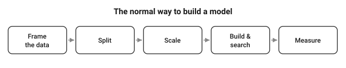

Five steps. Frame the data. Split it into training, validation and test. Scale the features. Build and search for a good model. Measure how good it turned out. Every step is standard, careful, exactly what we are told to do, and the number at the end is meant to be honest.

So here is the plan for the whole report. We are not out to attack this recipe, we want it to work. So we follow it faithfully, and carry it to one real problem after another. At each one we ask the same plain question.

> **Is this really as safe as it looks?**

By the end we will know the answer, and what it takes to walk away with a number we can actually trust.

---

We have three real problems to carry it to, and we take the friendliest first. We start with a bank's loan clients, the ordinary, clean kind of data the recipe was built for. Then the stock market, one long column of daily prices. Then thirty people carrying a phone through a handful of everyday activities. Each is its own journey, with its own dead ends and its own moment of doubt, and the pipeline stays the map that keeps us oriented across all three. We are not here to collect three tidy results, we are walking three roads to the same place.

Let us meet the first one.

---

## 2. Loan: the well-behaved one that still lies

### a. Reading the problem

A bank hands us thirty thousand credit-card clients and one question: which of them will miss their next payment?

So who are these people? Let us look at one, top to bottom.

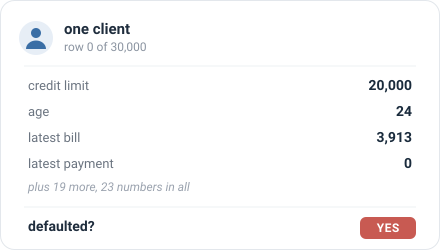

We can almost picture them: twenty-four, a small limit, a modest bill, nothing paid back last month, and a yes at the end. They defaulted. So one row is one person: twenty-three plain numbers about them, and the answer we want to predict. There are thirty thousand of them, and about one in five default.

What exactly is the job? From those twenty-three numbers, for a client we have never seen, say yes or no: will they default? A plain two-way guess, and nothing about it is exotic.

What do we build? The small network from Section 1. Twenty-three numbers go in, pass through one hidden layer of sixteen units with a ReLU, and come out as two scores that softmax turns into a probability for "yes" and "no"; we keep whichever is larger.

And how do we turn that into a number we can put in front of the bank? We run the recipe from Section 1, step for step:

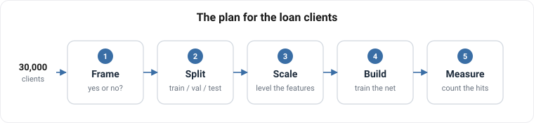

1. **Frame** it as the yes-or-no question it already is.
2. **Split** the thirty thousand clients once, into training (60%), validation (20%), and test (20%); the test part stays sealed until the end, and the validation part waits unused until Section 5.
3. **Scale** the twenty-three features, subtracting the mean and dividing by the spread, with those statistics measured on the training part only.
4. **Build and train**: from small random weights, run three hundred passes over the training clients, scoring the guess with cross-entropy, finding the downhill direction by the backprop of Section 1, and stepping every weight a little that way with plain gradient descent (a learning rate of 0.3).
5. **Measure** how good it is by accuracy: the fraction of the sealed test clients it labels correctly.

Two numbers, then, and worth keeping straight. While it trains, the network drives down one loss, cross-entropy, the score of how wrong its probabilities are. When it is done, we judge it by another, accuracy, the plain fraction it gets right. It learns by the first and is graded by the second.

So what do we expect? Honestly, not much drama. The data is clean, the question is plain, the model is standard, and every step is straight from the book. We expect the network to learn the pattern and hand us a high, honest number. So we run it, and see.

### b. By the book

So we run it, exactly as planned. Nothing fights us: epoch after epoch the network settles into the training clients, its accuracy climbing and then levelling off, the clean shape of something that is learning.

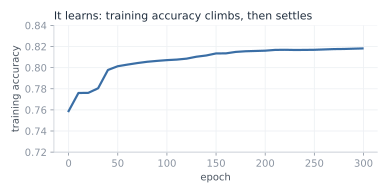

And the number it hands back is good. On the sealed test clients, the ones it never trained on, it is right **81.9%** of the time. Into the eighties, on our very first honest try.

One careful thought before we celebrate. Is that 82% real, or a fluke of the particular fifth we happened to hold out? Easy enough to check: we cut the deck again and again, a fresh random split each time, then a stratified one that forces the same default rate onto both sides, then even a cut by raw file order. If the score is solid, none of that should move it.

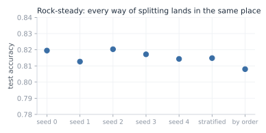

It does not move. Every cut lands between 0.81 and 0.82, the whole spread no wider than a few thousandths. The score is no accident of one lucky split; it is rock-steady, which is just what a trustworthy result looks like. So there it is: a clean, standard model, trained by the book, scoring 82% on clients it has never seen, and holding that score no matter how we slice the data. Everything points the same way. Trust this number.

**But** wait. That 82%, how much of it is really ours?

Try answering with no model at all. Train nothing, look at nothing; for every client, just answer "no default," the same answer every time. How often is that right? It is right about every client who never defaults, and most of them never do.

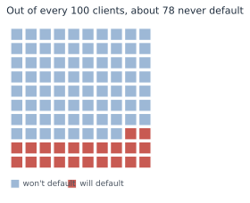

Of the 30,000, 23,364 never default; only 6,636 do. Answer "no default" for all of them and you are right about the 23,364 and wrong about the 6,636: that is 23,364 out of 30,000, or **0.779**. That score is free. It takes no model, no training, no thought at all; the data gives it away because most people simply pay.

Now stand our trained network next to that free answer.

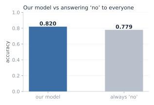

Our network, twenty-three features and three hundred epochs of training: **0.819**. The free answer, which never looks at the data at all: **0.779**. **Everything we built sits four points above what the data was handing out for nothing.**

Four points. Where did even those come from, and what did all that training actually add? And a colder doubt behind it: is our model any good at all, or is it mostly just riding that free 78%?

And then the question that should stop us cold. We have judged this entire thing on one number, its accuracy. But if that number can barely tell our careful, trained model apart from an answer that never even looked at the data, then what is it really measuring? What have we been trusting this whole time?

> **If one number cannot tell a trained model from an answer that never looked at the data, what is it measuring, and can we trust it at all?**

### c. What the number was hiding

So we stop trusting the single number, and go looking for what it hides.

First, rule out the obvious. Is the score high because we split the data badly, or because something leaked from the training set into the test? No. We watched it hold rock-steady across every cut we tried, and there is nothing in this data to leak: no dates, no ids, nothing that puts one client ahead of another or ties a training row to a test row. The data is clean and the split is honest. The fault is not there. It is in the number itself.

So take the number apart. Accuracy asks one plain thing: of all the clients, how many did we label correctly? Notice what it does not ask. It does not care who. **Getting a payer right and getting a defaulter right count for exactly the same.** And there is the crack, because the two are not the same job at all. We did not build this to wave through the people who pay; we built it to catch the people who will not. So we ask the only question that was ever the point.

**Of the 1,353 clients in the test set who really did default, how many did our model catch?**

We stop reading the blended score and count, group by group.

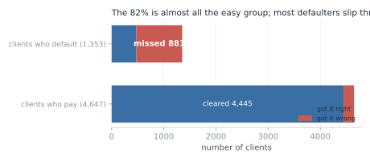

It caught 472 of them. It missed 881. Two of every three people who default, our carefully trained, 82%-scoring model waved straight through, stamped safe. Then look at the payers, and the picture turns over: it cleared 4,445 of the 4,647. That is where the 82% lives. Almost the whole score is the big, easy group it got right; almost none of it is the small, hard group we actually cared about.

Put it in the plainest terms. Picture an illness that 78% of people do not have. A lazy doctor tells everyone the same thing, "you are healthy," and is right 78% of the time, because most people really are healthy. **And yet that doctor catches zero sick people.** A 78% that looks perfectly respectable, and is useless at the one job that mattered: finding the sick.

Our model is a little better than that lazy doctor: it does catch about one in three of the sick. But its accuracy barely moves, **82% against the doctor's 78%**, because accuracy is mostly measuring how well it labels the healthy majority, which was always the easy part.

That is what makes the four points so slippery. The number was never measuring the thing we cared about. It answers "did we get most clients right?", where the answer is easily yes, and it stays silent on "did we catch the defaulters?", where the answer is mostly no. So the entire gap between our model and doing nothing, those four points, is almost nothing by the number and almost everything in the job, and the number gives us no way to tell which.

> **Four points over doing nothing: nearly nothing, or nearly everything? And if our one number cannot tell the two apart, how are we ever meant to judge this model?**

### d. The number we can trust

So how do we judge this model without being fooled? We stop handing the whole verdict to one blended number, and we measure in a way that gives the rare, costly cases their due.

The fix is small. Instead of asking "how many clients did we get right," a question the majority always wins, we score the two groups apart and then average them. How well did we do on the people who default? How well on the people who pay? Average those two, and each group counts the same, however many are in it. That is balanced accuracy.

Now judge our model and the "always no" answer both ways at once:

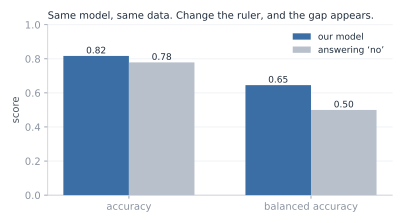

On plain accuracy they are near twins, 0.817 and 0.779, four points apart. On balanced accuracy they split wide open: our model scores **0.646**, and the "always no" answer scores exactly **0.500**, a flat coin, because it never catches a single defaulter. Same model, same data. We changed only the ruler, and a difference that was four grudging points became fifteen. The skill that accuracy was drowning is suddenly there to see.

**So which number do we keep?** Here is the honest answer: **neither**, if we keep it on faith. We are not saying trust 0.646 instead of 0.819. That would be the same mistake in new clothes, swapping one number we do not really understand for another.

What we actually trust is not a number at all. It is the four counts underneath both of them: **472 caught, 881 missed, 4,445 cleared, 202 flagged.** Those are not a summary of anything, they are simply what the model did to 6,000 real people, and nothing can hide inside four counts. Accuracy blended them so the majority buried the failure; balanced accuracy weighs the two groups evenly so the failure shows. We keep the 0.646 only because we can see it is an honest reading of the counts, and we drop the 0.819 only because we can see it is not. The counts are the evidence. A number is just shorthand, trustworthy exactly as far as we have checked what it is made of.

And there, at last, is the assumption we never knew we had made. **Reaching for accuracy without a second thought, we assumed that every client counts the same, and that getting most of them right means the job is done.** That holds only when the two outcomes are roughly balanced and the two mistakes cost the same. Here neither did, and accuracy was blind to both. This is the shape of the whole report in miniature: a plain step of the recipe, followed without question, carrying a hidden assumption that the data quietly breaks.

So notice, in the end, what is worth trusting and what is not. The number itself wobbles: 0.646 today, a hair different tomorrow under another split, and none of it shakes us, because the number was never what we were trusting. We trusted the way we made it. We looked at the real counts, we chose a measure that credits the job we actually cared about, and we can trace, step by step, why it cannot be quietly lying. 

> **The score, the goal we chase, we cannot trust on its own. The process that earns it, we can.**

If a clean, honest process is the only thing worth trusting, then at the next problem, where inside that process is the next **hidden assumption** hiding?

## 3. Market: busy days and calm days

### a. Reading the problem

We come to the second problem already a little wary. The last one taught us that a number can look clean, steady, and high, and still be lying, so this time we make ourselves a promise: we will not trust a score just because it looks good.

And then we open the problem, and there is almost nothing there to trust. No neat rows of features like the loan clients. Just one long column of numbers: the closing price of the S&P 500 at the end of each day, 6,664 days in a row. A single price that wanders across the years, from a low near 677 to a high near 7,610.

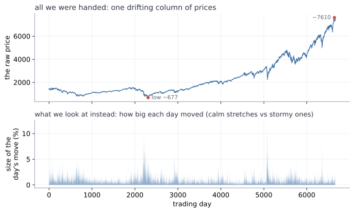

So what can we predict from one column of prices? With the loan clients we had twenty-three numbers about each person. Here we have one number a day, and nothing else.

The first idea is the obvious one: predict tomorrow's price. But 677 back then and 7,610 now are not the same kind of thing, and a model fed the raw prices would learn only that the numbers drift upward with the years. Useless. We need to turn the price into something that means the same thing in any year.

**So we stop looking at the price and look at how much it moved.** Not "the price is 1,402" but "today it moved 0.2%", which means the same thing in any decade. **Then we drop the direction as well, and keep only the size of the move.** Calling the direction is hopeless, and not only for us: the market's ups and downs are the textbook "random walk", famously unpredictable (Malkiel, 1973). Size is a different story. Wild days sit near other wild days, which is the texture in the lower panel above.

From that we build the task. Take the sizes of the last five days, and guess one thing about tomorrow: is it a busy day, a move bigger than usual, or a calm one? "Usual" we pin at the middle day, so that half of all days count as busy and half as calm. There is no lopsided majority to lean on the way the loan data had; here a blind guess is a straight coin, 0.5.

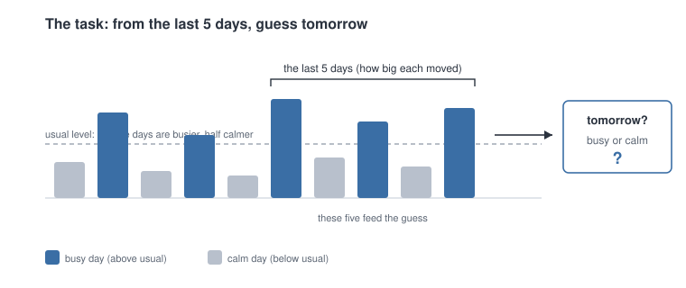

Now, what do we build, and how do we run it? Nothing new, and that is deliberate. We keep the same small network from Section 1, untouched: five numbers in, the sizes of the last five days, through one hidden layer of sixteen ReLU units, out to two scores that a softmax turns into a chance of "busy" and a chance of "calm"; we keep the larger. We tune nothing and add nothing, precisely so that whatever we find later has to come from the data, not from us fiddling with the model.

And we run it through the very same recipe as the loan clients, step for careful step:

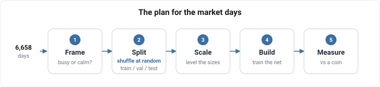

1. **Frame** it as the plain busy-or-calm question we just built.
2. **Split** the days once into the same three parts as before: training (60%), validation (20%), and test (20%), dealt out by a random shuffle, exactly as we did for the loans. The test stays sealed until the end, so we only grade ourselves on days the model has never seen. We keep the validation slice too, following the recipe exactly, though this chapter only measures one model rather than searching for the best, so it waits untouched.
3. **Scale** the five inputs the standard way, `(x - mean) / std`: measure the average and the spread once, on the training years, and then use those same two numbers to level every day that follows.
4. **Build and train** exactly as before: small random weights, three hundred passes over the training days, each scored by cross-entropy, every weight nudged downhill by plain gradient descent at a learning rate of 0.3.
5. **Measure** by accuracy, the plain fraction of the sealed test days it calls right, against the coin's 0.5.

Step two is worth pausing on, because it is the one place where we had a real choice to make. How should the days be dealt into those three piles? We do what the book says, and what worked on the loans: **shuffle them all together, then deal them out at random.** And here that feels like more than convention, it feels correct. Remember what this market is: a random walk, unpredictable, impossible to time. **If nobody alive can say what the market will do tomorrow, then the particular order we happen to file the days in cannot matter either.** Shuffling is simply us refusing to hand ourselves any advantage from the calendar, and it is the fairest test we could set ourselves.

And that last step is where the new us stops short. **Accuracy: that is the exact number that fooled us on the loan clients.** So before we lean on it again, we do what Loan should have taught us, and cross-examine it now, before a single day is trained. Why did it lie last time? Because the classes were lopsided, 78 payers to every 22 defaulters, and accuracy let the easy majority drown the group we cared about. So we ask the only question that matters: is anything lopsided here? No. We cut busy from calm at the middle day, on purpose, so the two are 50/50, dead even. There is no majority to hide behind, which means accuracy and the fairer balanced-accuracy would land in the same place. **On balanced classes like these, accuracy is an honest judge.** The trap that caught us last time is simply not set here, and we know it because we checked, not because we took the number on faith.

So this time we have earned our confidence, and more of it than before. There is a real pattern to learn, we are running the same trusted network with nothing tuned to flatter it, and the one measure that fooled us last time we have just cross-examined and cleared. Every trap we know to look for, we have looked in the eye. We run it, and see.

### b. By the book

So we run it, exactly as planned, and the score comes back.

**0.612.** The model is right about 61% of the time on days it has never seen, against the 50% a blind guess would get. Eleven points of something.

Now, before we believe a word of it, there is only one question in this chapter.

> **Can we trust 0.612?**

Everything from here is an attempt to answer it. And if the number is lying, the lie has to be sitting at one of the five stations we ran the data through. **Three of them we can check right now:**

1. **The build.** Maybe the network never learned anything, and 0.612 is a lucky roll.
2. **The measure.** Maybe it is not deciding at all, just saying the same thing over and over, and accuracy is letting it get away with it.
3. **The split.** Maybe the exam we set it was not a fair one.

So we take them one at a time.

**Suspect one, the build. Did the network actually learn?** We watch the training itself. From random starting weights the network is worth nothing, a coin at 0.494. Then, pass by pass, it climbs, fast at first and then slower, and settles around 0.630.

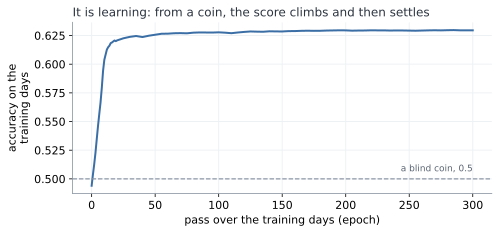

That is the shape of something genuinely learning: a climb while there is a pattern to pick up, then a flattening when there is no more to take. **Suspect one is clear.**

**Suspect two, the measure. Is it deciding, or just parroting?** That was the trap on the loan clients, where a model could look good by telling everybody "no default". Not here. On the sealed test it answers busy 45% of the time and calm 55%, close to the even split the data really has, and it gets 56% of the busy days right and 66% of the calm days right. It is making real calls, on both sides. **Suspect two is clear.**

**Suspect three, the split. Was the exam fair, or did we just draw a lucky test set?** Easy enough to check: deal the days out again, a fresh shuffle each time, and run it again.

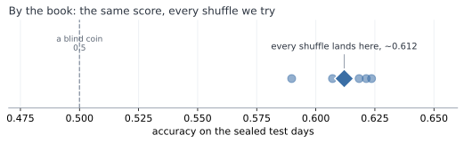

It barely moves. Every shuffle lands near 0.61. That is the same reassurance the loan clients gave us, where every way of slicing agreed. **Suspect three is clear.**

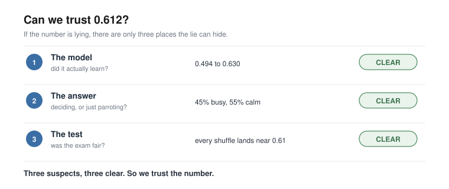

All three checked, all three clean. The model learned, it decides both ways, and the score holds however we deal the cards. Trust this number.

And then, quietly, something does not sit right.

And then something very simple gets in the way.

Look at what we actually did to clear suspect three. Shuffle, and score. Shuffle, and score. Shuffle, and score. Five times over.

**That is not five checks. It is one check, five times.**

Of course it kept giving us the same answer. We kept asking it the same question. All the care above, the curve, the counts, the five re-runs, and not one of them ever asked the test anything it had not already been asked. Suspect three was never examined at all.

> **We never checked the test. We only ran the same check five times. So what happens if we check it a completely different way?**

### c. So was it the shuffle?

Back to suspect three, and this time we check it a genuinely different way.

Every check so far shuffled the days. But nobody in real life shuffles time. You stand on today and face tomorrow, and tomorrow has not happened yet. So we cut the days the way the world actually deals them: learn from the early years, test on the latest years, sealed.

**0.587.**

Same model. Same days. We changed nothing but which day went into which pile, and the score fell by more than two points. On the loan clients every cut agreed to the third decimal. Here two honest-looking cuts give two different answers, which means **one of these two numbers is wrong.**

That tells us where the trouble is. It does not tell us what it is. Why should it matter at all which pile a day lands in?

So we stop looking at scores and look at the data. Two rows, side by side.

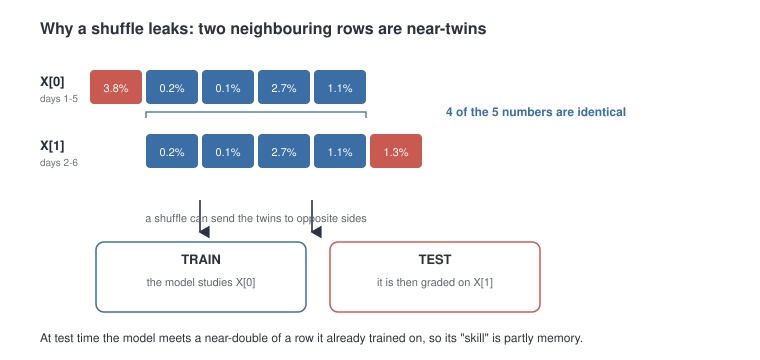

They are almost the same row. Four of their five numbers are identical.

Then we see why. Row one is days one to five. Row two is days two to six. The window slides along one day at a time, so **every row overlaps the next by four days.** We had built thousands of near-copies, and never once looked at them.

Now put near-copies like that through a shuffle.

Think of revising with flashcards, where each card covers five days running, so each card and the next are nearly identical. Shuffle the pack, and card one lands in your revision pile while card two lands in the exam. You sit the exam, recognise card two, and get it right, not because you learned anything, but because you had already revised its twin.

> **So the test was never a test. The model had already revised the exam.** The 0.612 was not skill at predicting tomorrow. **It was memory.**

Cut by time and it cannot happen. A row and its twin sit side by side in the same years, so they land in the same pile, and nothing sneaks across. That is why the honest score comes out lower.

A neat story is not proof, though. Could the shuffle simply have got lucky?

There is a clean way to check. A leak like this can only help if there is a real pattern for the twin to carry. So run the same comparison on a task with no pattern in it at all: guessing whether the market goes up or down, a pure coin flip.

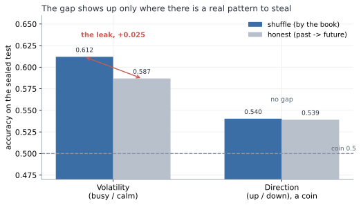

The gap disappears. On up-or-down, shuffle and honest land together, 0.540 and 0.539. **The gap turns up only where there is something worth stealing.** So it was not luck. The shuffle really was leaking.

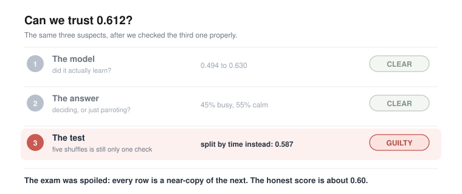

Strip the leak out and the honest number is about 0.60. And we had been careful: sealed test, trusted model, the measure cross-examined. **The one step we never questioned is the one that broke us.**

And there it is, the **hidden assumption**. 
> **When we shuffled, we assumed the days were interchangeable: that one row has nothing to do with the next, so it could not matter which pile each one fell into.** 

We even had a reason for it. The market is a random walk, we said, impossible to time, so surely the order could not matter. But the random walk is about **which way** the market moves, not **how big**, and the sizes do remember each other. On the loan clients the assumption held, and the shuffle was fine. Here it did not.

One last thing, and it is the part worth carrying out of this chapter. **A number can be steady, repeatable, and wrong, and it will never tell you so itself.** 0.612 was all three, and no amount of staring would have made it confess. It took checking from a different angle.

What else have we only ever checked one way?

### d. And what about the scaling?

So we go looking for one.

Which steps have we actually put to the test? The split, twice over now. The build and the measure, back in part b, when we were still sure of ourselves. The rest we have simply run, because the book said to.

**Scaling**, for instance. We measured the average and the spread on the training years, froze those two numbers, and used them on every day afterwards. **Why? Because that is what you do. We never asked what has to be true for it to be sensible, and if someone had stopped us and asked, we are not sure we could have answered.**

So we ask the question now. What does that formula, `(x - mean) / std`, actually need in order to be sensible? It needs those two frozen numbers, the mean and the spread, to keep describing the world. **That is the bet sitting quietly inside the arithmetic: that a normal day, and the spread of days, will stay what they were back on the training years.** We never said it out loud, and we never checked it.

How would we even see a bet like that? Only by watching it lose. So we hand the frozen scaler a feature whose normal really does drift, the simplest one there is to build: the size of each move in raw points, the plain change in the index, instead of in percent. Same day, same market, same information. We run it.

**0.509.**

A coin. The model that scored 0.587 a moment ago now knows nothing at all. Nothing leaked, the split is honest, the scaler was frozen exactly as taught, and the bet has quietly lost.

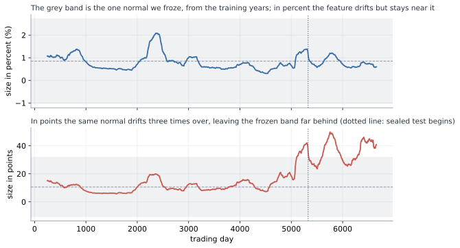

The picture shows it losing. The grey band is the one normal we froze, the mean and spread from the training years, and we had pinned a normal day at about 10.6 points. But the index climbs across the years, so the same move in points grows with it, and by the test years a normal day had drifted to 37, three and a half times larger. Every test day now arrives looking like a wild outlier: measured against the frozen normal it sits **2.73** standard deviations out on average, and 43.7 at the very worst. Imagine grading today's coffee prices by what felt normal to you thirty years ago and never updating. Four pounds is not expensive, it is off the scale, a number you have no category for. That is exactly where the frozen scaler leaves the network. It is not being asked a hard question. **It is being asked a question in a language it has never heard.**

And here is the part that should keep us up at night. Percent did not survive because percent is safe. Percent drifted too: we froze its normal at 0.85% and by the test years it had slipped to 0.75%. It simply drifted a little where points drifted a lot, so the frozen scaler could still cope. And we never measured that. We reached for percent because the book reaches for percent, and this time the book happened to be right. Hand the very same recipe a feature that drifts hard, and it dies, and nothing anywhere tells us in advance which kind we are holding.

Could a cleverer scaler rescue it? Re-fit the mean and the spread every day, on a window that only ever looks backward, and points climbs back to just 0.528: better, and still nowhere near 0.587.

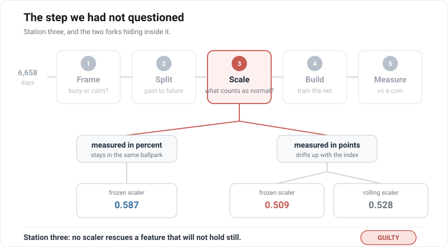

So it was never about a smarter scaler, and it was never really about the unit either. It was those two frozen numbers, and the bet hiding inside them.

And there it is again, the **hidden assumption**.

> **Standardizing froze one mean and one spread and used them forever, betting a normal day would stay normal. We never once checked whether it would.**

The scaler, it turns out, is not really a piece of arithmetic. It is a **memory**: two numbers we took from one stretch of the past, and then used to mark everything that came after. While the world stayed roughly as it had been, the memory held. The moment it moved, we were grading today against a yesterday that had stopped existing.

We keep the feature in percent, where the bet happens to hold, and we are left holding 0.587 again. But we are less easy about it now. If one step of the recipe is a frozen memory like that, we would very much like to know how many others are.

What else did we freeze once, and then forget we had frozen?

### e. The process we can finally trust

Twice now the same thing has happened, and it is worth stopping to name, because it is the real lesson of this chapter. Both times we ran a step simply because the book said to. Both times that step was quietly betting on something: the shuffle, that one day has nothing to do with the next; the scaler, that a normal day stays normal. And both times the bet was invisible, folded inside a number that looked perfectly healthy, until we happened to check it from an angle we had not tried.

So the recipe is not the thing we took it for. It is not a list of instructions to carry out. **It is a list of bets to read.** Every step quietly assumes something is true, and to follow it without looking is just to take the bet sight unseen.

That is what changes now. We do not patch the two holes and rerun. We build the plan again from the top, and this time, at every step, we stop and ask the question we kept skipping: **what does this quietly assume, and is it true here?**

First the plan, the way we laid it out in part a. The same five stations, in the same order, only now we walk them with our eyes open. **Frame** the question, busy or calm. **Split** the days, no longer by a shuffle but past to future, so no near-twin can cross into the exam. **Scale** the sizes in percent, whose normal barely moves, so the frozen mean and spread still fit the world. **Build** the same little network. **Measure** against the coin. The recipe, corrected.

Then the trial, the way we ran it in part b. Back then we asked the question that saved us: if this number is lying, where could it be hiding? We named three suspects. This time we are wiser by one, because the market taught us to distrust the scaling too, so we make the list again, longer now, and go down it.

- **The split?** Repaired. Past to future, no twin can cross. Clear.
- **The scale?** Repaired, and a chapter ago we would not have thought to check it. Percent, barely drifting. Clear.
- **The build?** We watched it climb from a coin and settle. Clear.
- **The measure?** We watched it call busy days and calm ones both, with no majority to hide behind. Clear.

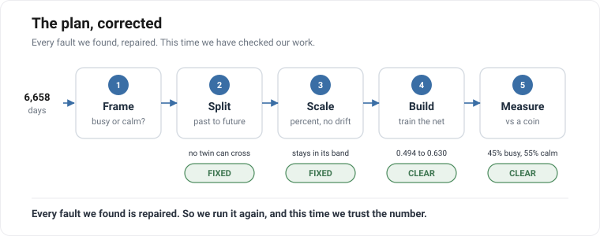

Four suspects where once there were three, and every one of them clean. We run the corrected plan, and the number settles a little under 0.60.

And this is the moment the whole chapter has been climbing toward. It is not a score we are hoping is **honest**. It is a score left standing after we asked, at every step, what it took for granted, and found each answer sound. This is exactly what the loan clients taught us to reach for: not a number to trust, but a process to trust. And here, for the first time, having questioned a longer list than we ever have, is **a process we believe in**.

So we could stop here. By every rule we have learned, we are finished, and we have earned the right to be. We very nearly close the book.

> **There is one last check, and we very nearly skip it, because we cannot imagine how it could go wrong. We have cleared every station, twice over. What is left to catch us?**

But look at how we got our number. We trained the model on the years up to a point, then tested it on the stretch that came right after, the most recent days, and read off the score. One test, on one slice of time.

So, one fair question. Was that slice special? A number we can trust ought to be a fact about the model itself, and come out much the same whichever slice of time we test it on. If we had stopped a few years earlier, or later, would the number have held? Or did this one stretch just happen to be kind to us?

There is one honest way to find out, and it is no new trick. We run the very same test again, train on the past, test on what comes next, only at five points spaced along the history instead of only at the end. Same honest recipe, five different moments in time.

And the five do not agree.

Think of the model as a student, and each test as an exam it sits. We had marked it on one exam, the most recent years, and written down its grade as if that settled the matter. Now we set the same exam at five different moments in its history, and the grades come back all over the place. On one, the model barely beats a coin. On another, it does genuinely well.

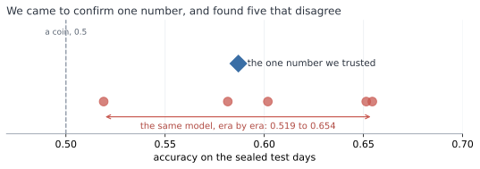

This is the ground giving way. 
> **We opened the chapter asking one question, how good is this model, and it turns out to have NO answer.**

It is barely a coin, or it is genuinely good, depending on nothing but which year we happen to examine it in.

**There was never one number.**

And then it gets worse, because the exams were not equally hard, and we never checked.

To be worth anything, the model has to beat a classmate who never studies. Not one who flips a coin, though. This one is craftier: he notices which answer has been coming up most often lately, and then writes that same answer down for every single question. He understands nothing, and still, on a lopsided exam where most days are one kind, that alone scores high. On an even exam it manages only about half. This is the lazy guesser, the same idle trick as the lazy doctor on the loan clients.

And here is the catch. **How well you can do by not trying changes from one exam to the next.**

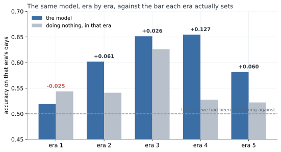

Yet we had marked every one of the model's grades against the same flat line, a coin at 0.5, as though every exam were equally hard. They never were. On the easy exams we set the bar far too low, and praised the model for clearing it, when a classmate who was not even trying had cleared it just as well.

Put the two together, and the result falls apart. Take the two exams the model scored highest on, near-identical grades. One was easy: the lazy classmate nearly matched it, so the model proved almost nothing. The other was hard: the lazy classmate flopped, so the same grade was a real achievement. **The same score, worth five times as much on one exam as on the other.** Marked fairly, each grade against the lazy classmate on that same exam, the model's proud lead more than halves. And on one exam, it is beaten outright by a classmate who never opened a book.

Sit with that for a moment, because it is worse than a bad result. **We did everything right.** We found the leak, and sealed it. We found the drift, and fixed it. We put every step of the recipe on trial, not once but twice, and cleared every one. And the number still came apart in our hands.

So how? If every step was sound, where did the trouble get in?

Follow the one thing that kept moving. How hard each exam was, how well the lazy classmate could do on it without trying, rose and fell from one stretch to the next. But the pass-mark we judged against, the flat 0.5, never moved with it. Where did that fixed pass-mark come from? Not from any step we checked. From before all of them, from the very first thing we ever did: setting the exam. Choosing what it would ask, and what score would count as a pass. That is station one of the recipe. **Frame.**

> **Trust the process, not the score. But what if the frame and the goal are unclear? What is the cleanest process worth then?**

But hang on. We checked every station, didn't we? So how did we miss that one?

Look back at the plan we were so pleased with. The split, we cleared it. The scale, we cleared it. The build and the measure, cleared. Station one, the exam itself? We never even looked. **We cleared every station but the first.**

So why did we never test the exam? It was not laziness. We went hunting for traps twice, and wrote out a list of suspects each time, and the exam was never on it. Not once did we think to add it.

Why not? Because setting the exam never felt like a step. Splitting, scaling, training, marking, those are all things you do, and things you do, you can get wrong. But deciding what the exam asks, and how high to put the pass mark? That did not feel like something we did. It felt like the setup, fixed before the real work even started. And you do not stop to question the setup.

**It was not a step we ran badly. It was a choice we never even saw as a choice.**

And the worst part is how close we came. We had run the one check that might have caught it, the one the loan clients drummed into us: is the exam lopsided enough to flatter the student? We looked. Fifty-fifty, dead even. It was true. And it still was not enough, because we looked once, at all the exams lumped together, and never looked again, while the balance kept shifting under us. We did the right thing. We just did it once, and called it done.

So we are left with one question, and it is not about the market anymore. After all that care, what are we still allowed to say?

### f. So what did all that teach us?

That was a lot. Three times in this chapter we found a number, trusted it, and watched it move under us. Before we go on, it is worth stopping to gather what we actually learned, because it is simpler than it felt.

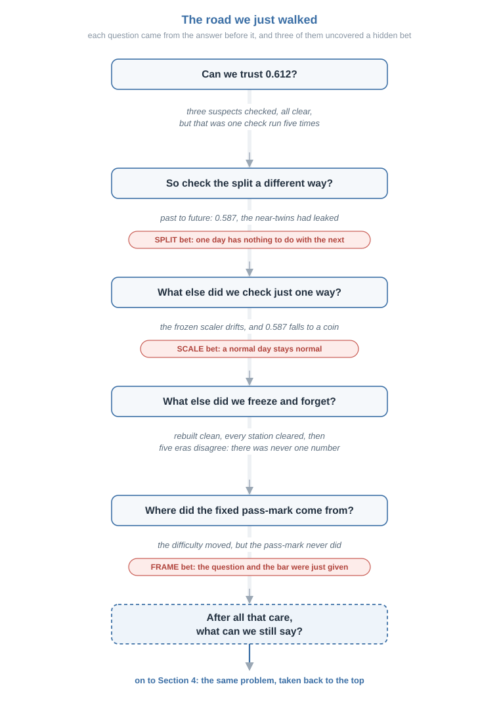

Every time, the trouble had the same shape. We ran a step because the book said to. That step was quietly betting on something. And the bet stayed invisible, folded inside a number that looked perfectly healthy, until we happened to check it from an angle we had not tried.

There were three such bets.

The **split** bet that one day has nothing to do with the next. The near-twins broke it, and 0.612 turned out to be memory, not skill.

The **scale** bet that a normal day stays normal. The drift broke it, and a working model dropped to a coin.

The **frame** bet that the question and the pass-mark were simply given, settled before the real work began. The eras broke it, and the single score we came for turned out never to have existed.

So the recipe was never the thing we took it for. It is not a list of steps to carry out. It is a list of bets to read. Follow it without looking, and you take every one of those bets sight unseen.

And look at how we found all three. Never once in advance. Always after the fall, one ambush at a time, patching the last hole just in time to walk into the next.

What died in all of it is one short sentence, the one we wanted to write: "the model is 61% accurate." It does not survive this data for a moment, because there is no single number here to be right about. What survived is smaller, and real: the size of recent days does carry a little about the size of the next one. But we can only say so honestly with its conditions held right beside it.

> **Here is the one thing we never did in this whole chapter. We never sat down at the start, looked at each step, and asked what it was betting before it could cost us anything.**

We only ever reacted. And we did the whole thing one-handed, with the same tiny untouched network, never once reaching for the tools we actually have.

So there is one thing left to try. We take the same problem back to the top, and this time we read each bet before it bites, and we hold nothing back.

## 6. So what is left?

Let us count up the damage. Four problems, all handled by the book, and the book fell short on every one. On the loan clients the number measured the wrong thing: 0.819 accuracy, but only a third of the defaulters caught. On the market it came out too high, an edge of 0.618 that was really the future leaking backward, then too low, a working model dropped to a coin by a drifting feature. On the phone it read the thirty people instead of the task, a near-perfect 0.966 that was really 0.947 on a stranger. And on data with nothing to learn, our own searching still found an edge, 0.607 out of a truth of 0.5.

Every safeguard we trusted failed somewhere, and none of them warned us. We were not careless. We did everything by the book, and the number lied anyway.

**So which number, exactly, are we still allowed to believe?** The score we set out to chase and report and trust cannot carry that trust, because a hidden assumption can quietly distort it, and our own searching can quietly inflate it, and from the outside a bad number looks exactly like a good one. We have run clean out of numbers to trust. If trust does not live in the number, then where does it live?

## 7. What we can trust

Here is the answer, and it was hiding in plain sight the whole time. Look back at the honest fix at each step. Not one of them was a secret technique. The careful practitioner who got fooled and the honest one who did not use the very same five steps: both shuffle, both scale, both search, both measure. The only difference between them, the whole difference, is understanding.

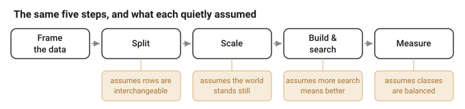

One person reached for shuffle because the book said shuffle. The other looked at the data first, saw that its rows came in time order, and chose a cut that respected time. Same step, opposite result, because one of them understood what the data was before deciding what to do to it. That is the lesson of every problem we walked. The trap was never in the step. It was in doing the step without asking what it quietly assumed, and whether the data in front of us could bear it.

Notice what this is not. It is not a counsel of despair, a warning to stop building or stop searching. We searched, and searching worked: on the loan clients, comparing a handful of architectures and optimisers honestly lifted the score we could actually keep from 0.644 to 0.650, a real gain, and one we could believe precisely because we sealed the test and never chose on it. The tool is powerful, and the goal, a good model on real data, is worth chasing. The discipline is simply how we chase it without fooling ourselves.

So state each assumption and check it against the data. Match the method to the structure in front of you. Search all you like, but search in the open, count your tries, and keep one test you open once and never select on. Do that, and the number at the end is one you have earned the right to believe, not because it is high, but because you can trace, step by honest step, why the way you made it could not have lied.

And we already have four of them. Look at what each honest procedure handed back: a balanced 0.644 on the loan defaulters, around 0.60 on the market with the leak stripped out, about 0.947 on a phone strapped to a stranger, and 0.650 on the loan again after searching a few models in the open. Not one is the flattering number we first saw, and not one is high for its own sake. They are simply what was left standing after every assumption was checked and the test was opened only once. That is why we can believe them.

That is the whole of it. The recipe is a fine place to start and a dangerous place to stop. We cannot trust the goal for its own sake, the number chased and reported and hoped over. We can trust the understanding that earns it, and the number an honest procedure hands back is one worth keeping.

---

## References

*The sources behind Sections 0 to 3, the sections built so far; this list will grow with the report. Formatting to be brought to the handbook style at the end.*

**Deep learning, the standard method (Section 1).**

- Goodfellow, I., Bengio, Y. and Courville, A. (2016). *Deep Learning*. MIT Press.
- Chollet, F. (2018). *Deep Learning with Python*. Manning.

**The loan data, and why accuracy misleads (Section 2).**

- Yeh, I.-C. and Lien, C.-H. (2009). The comparisons of data mining techniques for the predictive accuracy of probability of default of credit card clients. *Expert Systems with Applications*, 36(2). (The UCI credit-card default dataset used here.)
- Provost, F., Fawcett, T. and Kohavi, R. (1998). The case against accuracy estimation for comparing induction algorithms. *ICML*. (Why plain accuracy is the wrong yardstick when the classes are imbalanced.)
- Brodersen, K. H., Ong, C. S., Stephan, K. E. and Buhmann, J. M. (2010). The balanced accuracy and its posterior distribution. *ICPR*. (Balanced accuracy, the honest metric used in Section 2.)

**The market: unpredictable in direction, learnable in size, and the traps in between (Section 3).**

- Malkiel, B. G. (1973). *A Random Walk Down Wall Street*. Norton. (Why the direction of the next move is effectively unpredictable, so the task predicts the size of the move instead.)
- Engle, R. F. (1982). Autoregressive conditional heteroscedasticity with estimates of the variance of United Kingdom inflation. *Econometrica*, 50(4). (Volatility clustering: wild days sit near wild days, the real signal the task learns and the very thing a shuffle leaks.)
- Hastie, T., Tibshirani, R. and Friedman, J. (2009). *The Elements of Statistical Learning*, 2nd ed., ch. 7. Springer. (The random hold-out and cross-validation the recipe leans on.)
- Kohavi, R. (1995). A study of cross-validation and bootstrap for accuracy estimation and model selection. *IJCAI*. (Cross-validation and model selection, the standard practice we put on trial.)
- Kaufman, S., Rosset, S. and Perlich, C. (2012). Leakage in data mining: formulation, detection, and avoidance. *ACM Transactions on Knowledge Discovery from Data*, 6(4). (The shuffle leak: information from the future crossing into the training set.)
- Tashman, L. J. (2000). Out-of-sample tests of forecasting accuracy: an analysis and review. *International Journal of Forecasting*, 16(4). (Rolling-origin evaluation, the academic name for the walk-forward test used in Section 3.)
- Bergmeir, C. and Benitez, J. M. (2012). On the use of cross-validation for time series predictor evaluation. *Information Sciences*, 191. (Why a time series needs a time-respecting split rather than a random one.)
- Shimodaira, H. (2000). Improving predictive inference under covariate shift by weighting the log-likelihood function. *Journal of Statistical Planning and Inference*, 90(2). (Covariate shift: the feature drifting out from under a frozen scaler.)
- Gama, J., Zliobaite, I., Bifet, A., Pechenizkiy, M. and Bouchachia, A. (2014). A survey on concept drift adaptation. *ACM Computing Surveys*, 46(4). (How a learned relationship drifts as time passes.)

---

## Appendix A: The four moves, derived

*Outside the page limit. The four moves of Section 1, written out in full, so the network's own formulae can be checked and not taken on trust. One input `x`, one hidden layer, a guess across the classes.*

*Forward: the guess.* The hidden layer mixes the input with weights `W1` and a bias `b1`, then bends it with ReLU, which just replaces negatives with zero:

> a = W1x + b1,   h = ReLU(a).

A second set of weights turns that into one score per class, and softmax turns the scores into probabilities that add to one:

> z = W2h + b2,   p_k = e^(z_k) / Σⱼ e^(z_j).

That vector `p` is the guess.

*Loss: how wrong.* The true class is `c`. Cross-entropy scores the guess by how little weight it put on the truth:

> L = −log p_c.

Put all the weight on the right class and the loss is zero. Put almost none, and it shoots up.

*Gradient: which way is downhill.* This is the line worth the whole appendix. Write the loss in terms of the scores, using `p_c = e^(z_c) / Σⱼ e^(z_j)`:

> L = −z_c + log Σⱼ e^(z_j).

Now take the slope against one score `z_k`. The first term gives −1 only for the true class; the second gives `e^(z_k) / Σⱼ e^(z_j)`, which is `p_k`. So

> ∂L/∂z_k = p_k − y_k,   that is,   ∂L/∂z = p − y,

where `y` is the truth written as a one-hot vector, a 1 in the true class and 0 everywhere else. Softmax and cross-entropy fall away into something clean: the correction is just the gap between what we guessed and the truth. This is the marvel Section 1 pointed at.

*Backprop: pass the gap back.* That gap sits at the output. The chain rule carries it back to every weight.

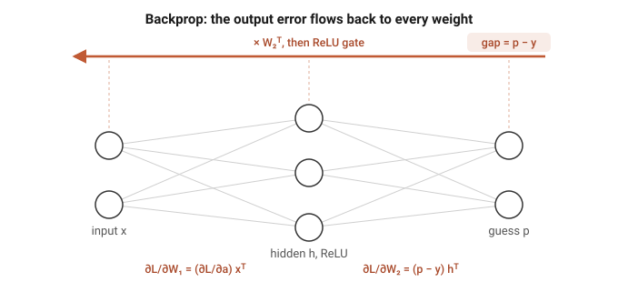

At the second layer the gradient is the gap times the hidden values; then we push the gap through `W2` to the hidden layer, and through the ReLU, which lets it pass only where `a` was positive:

> ∂L/∂W2 = (p − y) hᵀ,   ∂L/∂b2 = p − y,
> ∂L/∂h = W2ᵀ(p − y),   ∂L/∂a = ∂L/∂h  (only where a > 0),

and the first layer gets its gradient the same way, `∂L/∂W1 = (∂L/∂a) xᵀ` and `∂L/∂b1 = ∂L/∂a`. Over a batch we average these across the examples.

*Update: take the step.* Every weight moves a small step `η` against its gradient:

> W ← W − η ∂L/∂W.

That is one round. Do it a few thousand times and the guesses sharpen. The same forward and backward pass, in code, runs in the notebook of Appendix C.

---

## Appendix B: The loan data, up close

*Outside the page limit, and here so the whole of Section 2 can be understood from this document alone. This is the loan data exactly as it arrives: where it came from, what every column holds, and the few facts about its structure the chapter leans on.*

Fetched once and frozen to `data/loan_uci350.csv` (Yeh and Lien, 2009): thirty thousand clients, twenty-four columns, twenty-three features and the label. Here are the first three clients, one column-group per line so a whole row fits on the page:

| column | what it holds | client 1 | client 2 | client 3 |
| --- | --- | --- | --- | --- |
| 0 | LIMIT_BAL, the credit limit | 20 000 | 120 000 | 90 000 |
| 1 | SEX | 2 | 2 | 2 |
| 2 | EDUCATION | 2 | 2 | 2 |
| 3 | MARRIAGE | 1 | 2 | 2 |
| 4 | AGE | 24 | 26 | 34 |
| 5 to 10 | PAY_0 to PAY_6, repayment status, six months | 2, 2, -1, -1, -2, -2 | -1, 2, 0, 0, 0, 2 | 0, 0, 0, 0, 0, 0 |
| 11 to 16 | BILL_AMT1 to 6, the bill, six months | 3 913, 3 102, 689, 0, 0, 0 | 2 682, 1 725, 2 682, 3 272, 3 455, 3 261 | 29 239, 14 027, 13 559, 14 331, 14 948, 15 549 |
| 17 to 22 | PAY_AMT1 to 6, what they paid, six months | 0, 689, 0, 0, 0, 0 | 0, 1 000, 1 000, 1 000, 0, 2 000 | 1 518, 1 500, 1 000, 1 000, 1 000, 5 000 |
| 23 | **default** | **1** | **1** | **0** |

Client 1 is the twenty-four-year-old from Section 2a: a 20 000 limit, small bills, almost nothing paid back, and a 1 at the end. They defaulted. We use the file as it comes, nothing dropped, nothing engineered.

The rest of the file in numbers: 22.1% of clients default (6 636 of 30 000), which is exactly why answering "no default" for everyone already scores 0.779. Thirty-five rows are exact copies of another row. There is no id column and no date column.

Why Section 2c can rule the data out as the source of the trap: with no identifier and no date there is nothing to order the rows by, and the file is a single cross-section, every client watched over the same six months. The thirty-five duplicates are about one in a thousand, far too few to move any split; with features this coarse, two different people can simply land on the same values. So a random split cannot leak, and every way of cutting the data agrees, exactly as we saw.

Honest limits: one bank, one country, one six-month window (Taiwan, 2005). That is a caution about carrying the model elsewhere, but it cannot manufacture a trap; it is why the loan set serves as the clean control.

---

## Appendix C: The market data, up close

*Outside the page limit, and here so the whole of Section 3 can be understood from this document alone. This is the market data exactly as it arrives, and how one column of prices becomes the busy-or-calm task. Every number below is printed by `notebooks/market.ipynb`, which reads the raw file and shows one day moving through each transform.*

Downloaded once and frozen to `data/gspc_2026-07-03.csv`: one column of numbers and nothing else, 6,664 daily closing prices of the S&P 500 in date order. The price wanders from a low near 677 to a high near 7,610. The task is built from that one column in a few steps, and the first days show every one:

| day | close    | the move into it, r | its size, abs(r) |
| --- | -------- | ------------------- | ---------------- |
| 1   | 1,455.22 |                     |                  |
| 2   | 1,399.42 | -0.0383             | 0.0383           |
| 3   | 1,402.11 | +0.0019             | 0.0019           |
| 4   | 1,403.45 | +0.0010             | 0.0010           |
| 5   | 1,441.47 | +0.0271             | 0.0271           |

A day's features are then the five previous sizes, and its label is whether the next size beats the median size, 0.00544:

| row  | lag 5  | lag 4  | lag 3  | lag 2  | lag 1  | label |
| ---- | ------ | ------ | ------ | ------ | ------ | ----- |
| X[0] | 0.0383 | 0.0019 | 0.0010 | 0.0271 | 0.0112 | 1     |
| X[1] | 0.0019 | 0.0010 | 0.0271 | 0.0112 | 0.0131 | 0     |
| X[2] | 0.0010 | 0.0271 | 0.0112 | 0.0131 | 0.0044 | 1     |

Look at what that table shows on its own. `X[1]` is `X[0]` shifted one step to the left with one new number added on the end: consecutive rows share four of their five columns. They are near-twins by construction, before we say a single word about markets, and that overlap is exactly what a shuffle leaks.

Two more numbers are the structure. The **drift**: the index climbs from 1,455 to 7,483 over the years, about five times larger, so the same one-percent day is worth roughly five times the points at the end that it was at the start, which is why a scaler frozen on the early years cannot describe the later ones. The **lag-1 autocorrelation of abs(r) is +0.287**: the size of today's move really does predict the size of tomorrow's. That is volatility clustering (Engle, 1982), the real signal the task learns, and also precisely what a shuffle leaks, because it is what makes neighbouring days alike.

After five lags are used up, 6,658 days remain, and because the threshold is the median the two classes are balanced at 0.500, so a blind guess scores 0.5 and no majority-class trick is available.

Honest limits: one index along one path through history. We read its numbers as directional, not to the third decimal.

---

## Appendix D: The code

*Outside the page limit, and the answer to "how do I run this?" Every number and figure in Sections 2 and 3 is produced by one self-contained notebook per chapter, under `notebooks/`. Each one loads the raw data, trains the model, prints every count the chapter quotes, and plots every chart, and each reads as a standalone walk-through: open it and Run All (it needs only numpy and matplotlib), or read it top to bottom without running a thing.*

| Notebook | Chapter | What it produces |
| --- | --- | --- |
| `notebooks/loan.ipynb` | Section 2, Loan | one client read top to bottom, the split checks, the confusion counts, and balanced accuracy |
| `notebooks/market.ipynb` | Section 3, Market | the price-to-size transform traced day by day, the shuffle-versus-honest leak with its near-twins, the drift under a frozen scaler, and the era-by-era spread |

*From the command line, run either with `jupyter nbconvert --to notebook --execute notebooks/<file>.ipynb`. Later chapters get their own notebook as they are built.*
