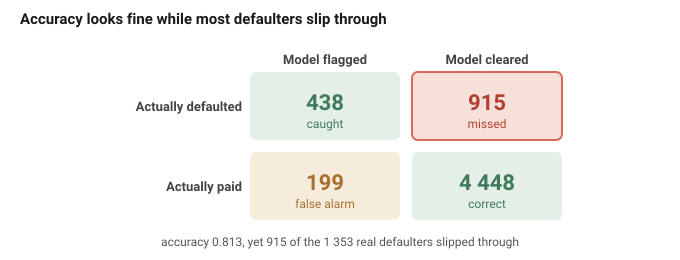
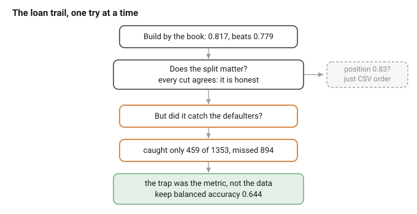
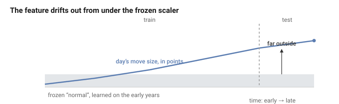
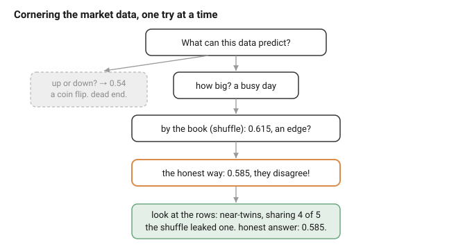
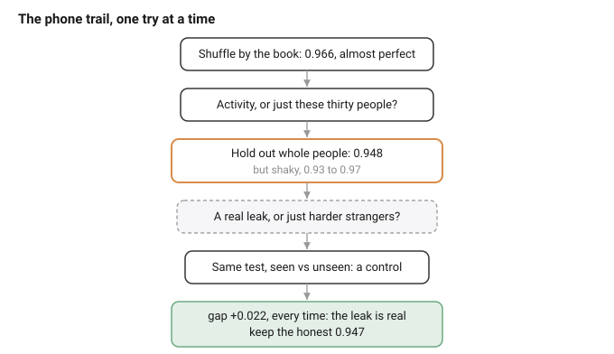
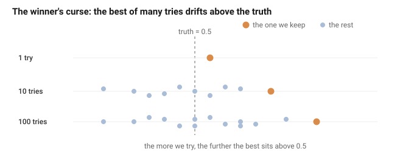

# Data Snooping in Deep Learning: dissertation (working draft)

*Working draft, written as a journey rather than a proof: we start from the ordinary, by-the-book way of judging a model by its number, and follow honestly where it leads. Reasoning first; the code behind every number is in the appendices. Compass in `NORTH_STAR.md`; the underlying argument in `KEY_CORE.html`.*

*Constraint (handbook): final submission ≤ 50 pages, including bibliography, tables and figures, excluding appendices.*

---

## 0. The number we are about to trust

We have a model. Is it any good? How would we even know?

We do the obvious thing. We hide some data from it, let it guess on that data, and count the hits. That gives us a number. Is it high? Good. Low? Not good. So we read the number and we decide.

But we never build just one. We build many and keep the best number. So what are we really trusting in the end? One number.

And here is the question we almost never stop to ask: can we trust it?

Let us find out honestly. We will not bend anything to force a problem into view. We will do the opposite, and follow every rule the books give us, exactly. Then we stand back and ask, together, what that honest number is really worth.

(One limit, so we are not doing everything at once. We stay with deep learning that forecasts and classifies: is tomorrow a busy day on the market, did this borrower default, which activity is this. Not vision, not language, not the rest. Just putting a label on the next case.)

So, where does everyone start? By the book. Let us start there too.

---

## 1. What deep learning really is, and the plan

So we have a job: take the next case and put a label on it. What do we build?

Almost always, the same thing: a small neural network. It is a stack of simple parts. A few features go in, get mixed and bent through a hidden layer, and come out as a guess between the classes.


How does it learn? Not by us programming it, but by correcting itself, the same four small moves over and over. It takes the numbers in and mixes them into a guess (the forward pass). We score how wrong that guess is, in one number (the loss). We work out which way to nudge each knob to shrink that number (the gradient, the downhill direction). Then we take one small step that way (the update). A few thousand rounds of those four, and the guesses come out mostly right.


One small marvel hides in those four moves: when we score wrongness this way, the correction each step makes is exactly how far off the guess was, no more. That is all the training is really doing, over and over. The full working, for anyone who wants it, is in Appendix E.

Give it more knobs, make it wider or deeper, and it can fit more. That is the whole appeal: with enough knobs, a network can fit almost any pattern we hand it.

And there is the catch, the one that shadows this whole report. If it can fit almost any pattern, then it can also fit patterns that are not really there. Show it pure noise for long enough and it will "learn" the noise, memorising which random point got which random label, and score beautifully on the training data.


So here is the question. **If the model can fit anything, even nonsense, how do we know it learned something real, and not just the noise?**

We cannot tell from the training score, it does well either way. The only way to know is to try the model on data it has never seen. That is the idea behind the steps that follow: keep some data back, judge the model on that, and never let it look while it learns.

Which brings us to the plan. To turn a network into a number we can show anyone, we follow a recipe, the same one printed in every course:


Five steps. Frame the data. Split it into training, validation and test. Scale the features. Build and search for a good model. Measure how good it turned out. Every step is standard, careful, exactly what we are told to do, and the number at the end is meant to be honest.

So here is the plan for the whole report. We are not out to attack this recipe, we want it to work. So we follow it faithfully, and carry it to one real problem after another. At each one we ask the same plain question: is this really as safe as it looks? By the end we will know the answer, and what it takes to walk away with a number we can actually trust.

Let us meet the first one.

---

## 2. Loan: the well-behaved one that still lies

### a. Reading the problem

We start with the friendliest problem we have. A bank hands us thirty thousand credit-card clients and one question: which of them will miss their next payment?

Before we plan a single thing, one habit worth keeping for the whole report: look at one client first, top to bottom, and see what we are actually holding.

```
one client (row 0):
  credit limit   : 20000
  age            : 24
  latest bill    : 3913
  latest payment : 0
  ...23 numbers in all...
  defaulted?     : yes
```

We can almost picture them. Twenty-four, a small limit, a modest bill, nothing paid back last month, and a yes at the end: they defaulted. So one row is one person, twenty-three numbers and an answer. About one client in five defaults, six thousand six hundred of the thirty thousand.

Then we notice what is *not* here. No date. No time of any kind. No id tying one row to another. Just separate people, watched over the same few months, with barely a repeat among them: thirty-five exact duplicates in thirty thousand. Nothing puts these rows in any order. They look interchangeable. We file that thought away, and it will matter at the very next step.

So the job is plain: from the twenty-three numbers, say whether this client defaults. But before we can claim anything, there is a floor to clear. Stamp "will not default" on everyone, the safe majority, and we are already right 77.9% of the time. Anything worth building has to beat that.

### b. By the book, and does the split matter?

Now we run the whole recipe, straight down the line. Frame it as a yes-or-no question, split off a random fifth of the clients for the test, scale the twenty-three numbers on the training side only, build the network from Section 1, and train. It learns without a fuss; no scare this time.

We have a number. Before we trust it, we pick up the thought we filed away a moment ago: are the rows really interchangeable? There is a clean way to ask. If they are, then how we cut the deck should not matter, same clients, any split, same score. So let us not assume it, let us check: cut the deck many ways and watch whether the number moves.

```
10 random shuffles :  0.819 0.811 0.819 0.817 0.814 0.824 0.813 0.818 0.814 0.821
              mean :  0.817   (sd 0.004)
stratified split   :  0.816
```

Every cut lands in the same place, within a whisker. Shuffle the clients at random, or force the one-in-five default rate evenly onto both sides, it makes no difference. That is a relief: the split is a formality here, exactly as the book promises, and the rows really are interchangeable.

Then, almost as an afterthought, we try one more cut. Not at random, but by raw row order: the first four fifths of the file to train, the last fifth to test. The score creeps to 0.83, a step outside all the others.

For a second that stops us. A different number, from the same data and the same model: is there something in the order after all? So we go back and look. But loan has no date, no id, nothing that puts one client before another; the file is a single snapshot, and its row order is just an accident of how it was saved. A position split cannot find a pattern in time, because there is no time; it only measures that accident. The flicker fades, and we set the 0.83 aside.

Which leaves us where the book promised. The split is honest, and the number is steady: about 0.817, comfortably above the 0.779 we would get by stamping "no default" on everyone. We could write 0.817 down and move on. Almost everyone would.

### c. But did it catch the defaulters?

So we almost stop here, at a clean 0.817. But a number that smooth is exactly the kind worth one hard question before we trust it. What did we build this model for? Not to score well in the abstract, but to find the clients who will miss their payment. So let us ask it in the only terms that matter.

**Of the clients who actually did default, how many did the model catch?**

The single number cannot answer that; it blends everyone together. So we take one honest split, where the model scores 0.819, right in line with the average, and instead of reading that one number we count what it did, group by group:

```
real defaulters: 1353  ->  caught 459, missed 894
real payers    : 4647  ->  cleared 4454, flagged 193
```



Read the top row twice. Out of 1353 real defaulters, the model caught 459 and let 894 walk straight through, stamped safe. It waves two of every three of them past. And now we can see what the 0.819 was really made of: almost all of it is the big, easy group of payers it correctly cleared. On the very people we built the model for, it is barely better than a coin.

That is the moment the shine comes off the number. It was never wrong, and it is not lying to us now; it is answering a question we did not mean to ask, which is how many clients of either kind we labelled right. Look at the do-nothing model that stamps "will pay" on everyone and catches zero defaulters: it scores 0.779. Ours catches a third of them and scores 0.819. Four points apart on paper, but worlds apart in the job that mattered. Accuracy cannot tell the two of them apart, because it counts the huge easy majority and lets the rare, costly cases dissolve inside it.

### d. The number we keep

The strange part is that nothing here was rigged. We did not cut a corner anywhere. The split was honest, and we checked it many ways; nothing leaked; the number was measured exactly as the book teaches. And yet it misled us. The 0.819 was never a mistake in need of fixing; the measuring was flawless. The fault was in what we asked it to measure.

So we change the question, and with it the yardstick. We stop letting the crowd of payers decide the score, and weigh both kinds of client equally. Balanced accuracy scores the defaulters on their own and the payers on their own, then averages the two, so the small class counts for exactly as much as the big one:

```
over 5 honest splits, mean:
  plain accuracy    : 0.816
  balanced accuracy : 0.644     (baseline: accuracy 0.779, balanced 0.500)
```

**So which number do we keep, and what do we give up?** We give up the flattering 0.816, and keep the 0.644, because it is the only one of the two that notices whether we caught the people we came for. And watch what the honest yardstick does to the do-nothing model: on accuracy it scored 0.779, close enough to ours that they are hard to tell apart; on balanced accuracy it scores 0.500 against our 0.644, and the distance between doing something and doing nothing finally shows. Better still, we can skip the single number altogether and read the four confusion counts directly; nothing hides in a table that small.



So the friendliest problem taught us something we did not expect. Its rows were as clean as they come, and every way we cut them agreed, so the trap was never in the data. It was in what we chose to measure. We measured it perfectly, and answered the wrong question. One problem in, and the recipe has already handed us a false number, not through the data, but through the yardstick we judged it by.

## 3. Market: the edge that was too easy

### a. Reading the problem

Our second problem barely looks like data at all. It is one long column of numbers, the daily closing price of the S&P 500, six thousand six hundred and sixty-four days in a row. Nothing else. No features, no labels, just a price that drifts across the years, from about 677 at its lowest to 7610 at its highest.

So what can we even predict from a single column of prices? We cannot feed raw prices to the network; today's 1400 and next decade's 7000 are not comparable numbers. We have to turn the prices into something a model can learn from, and we do it one step at a time, printing each step so we can see it:

```
trace, day by day:
  day 1: close 1399.42  ->  return -0.0383  ->  size |r| 0.0383
  day 2: close 1402.11  ->  return +0.0019  ->  size |r| 0.0019
  day 3: close 1403.45  ->  return +0.0010  ->  size |r| 0.0010
  day 4: close 1441.47  ->  return +0.0271  ->  size |r| 0.0271
  day 5: close 1457.60  ->  return +0.0112  ->  size |r| 0.0112
```

Each day becomes a return, how much the price moved as a fraction, and then the size of that move, its absolute value, forgetting whether it went up or down. Now every day is a small comparable number, a two-percent day or a tenth-of-a-percent day, no matter what the index was worth at the time.

From that we build the task. A feature row is the sizes of the last five days; its label is whether the next day's move beats the usual size, the median of 0.0054. In plain words: given how wild the last five days were, will tomorrow be a busy day?

```
one feature row X[0] = [0.0383, 0.0019, 0.0010, 0.0271, 0.0112]
             its label = next day's size beats the median?  yes
```

That leaves 6658 rows, split evenly between busy and calm, so there is no majority-class trick; a blind guess scores 0.5. And there is a real signal to find: the size of today's move predicts the size of tomorrow's, an echo worth 0.287 in plain correlation. Wild days cluster together. That is the thing the model can honestly learn.

### b. The edge that was too easy

The obvious first try is direction: will tomorrow close up or down? We build it, split it by the book, and look.

```
direction:  shuffle 0.533,  chronological 0.540
```

A coin flip, both ways. No edge at all. Dead end.

But a market has more than a direction. It has a mood: some stretches are calm, some stormy, and the storms bunch together, a wild day sitting near other wild days. That is the 0.287 echo we found. So we change the question. Never mind which way tomorrow moves, can we say how much? From the sizes of the last five days, predict whether tomorrow is a busy day.

```
volatility, shuffle (by the book):  0.618
```

A real edge, well clear of the coin's 0.5, and on the market an edge like that would be worth a fortune. **Which is exactly the problem. A real edge on the market, won this easily? That is far too good to be true. What is leaking in?**

So instead of celebrating, we ask one plain question: is 0.618 what we would actually get in practice? In real life we train on the days we have and predict days that have not happened yet. So we measure it that way too, past to future.

```
volatility, shuffle       :  0.618
volatility, chronological :  0.587
```

They do not match. And that stopped us. Back on the loan clients, every way of cutting the data agreed to the third decimal. Here, two cuts of the same days, the same model, disagree by three whole points. **One of the numbers is lying**, and we did not know which one, or why.

So we finally did the thing we should have done first. We stopped fiddling with the model and looked at the rows themselves, side by side:

```
X[0]: [0.0383, 0.0019, 0.0010, 0.0271, 0.0112]
X[1]: [0.0019, 0.0010, 0.0271, 0.0112, 0.0131]
```

There it was, in plain sight the whole time. Each row is the last five days; the very next row is those same days slid along by one. Two neighbouring rows share four of their five numbers. They are near-twins. We had been so busy with the model that we never once looked at what a single row actually was.

That one look explains both numbers. When we shuffle, a day and its near-twin can land on opposite sides of the cut, so at test time the model is handed a day whose near-double it already studied in training. The 0.618 was never skill at seeing the future; it was skill at recognising a neighbour. The honest split, past then future, leaves no twin to lean on, which is why it settles lower, near 0.587, or 0.603 when we roll the cut forward through the years.

One doubt still nagged: how do we know the gap is a real leak, and not the shuffle getting lucky once? The direction task answers it. A leak can only inflate an edge that is really there, so on direction, which we already know is a coin flip, the gap should vanish. It does: shuffle and honest split both land near 0.53. The gap shows up only where there is a real pattern to steal. That is how we know it is a true leak.

### c. A working model, killed by a unit

We are not done with the market. There is a step of the recipe we have not questioned yet: scaling. Features arrive on all sorts of sizes, so the book says standardise them, subtract the average, divide by the spread, and fit those numbers on the training data only, never the test. We have done exactly that all along, and it is the careful thing to do.

So let us keep being careful, and change one tiny, innocent thing. Our feature was the size of each day's move, in percent. What if we measure it in points instead, the raw change in the index, which is just what you get by subtracting two prices and forgetting to divide? Same days, same information, a different unit. Everything else stays fixed, the honest split included.

```
same split, only the feature's unit changes:
  size in percent :  0.586
  size in points  :  0.510
```

Read the second row twice, because it should not be possible. **Nothing leaked, the split is honest, the scaler is frozen exactly as taught, and yet the same model that scored 0.586 now scores 0.510, a coin. How can changing a feature's unit kill a working model?**

By now we know where to look. Not at the model, at the data. The two units behave completely differently over the years. A one-percent day is a one-percent day whether the index sits at 1500 or at 7000. In points it is not, because the index climbs from about 677 to 7610 across the data, so the same one-percent day is worth a handful of points early on and dozens near the end. The percent feature holds still; the points feature drifts upward with the market.



We can even measure how badly. The frozen scaler learned what "normal" looks like from the early, low years. Ask it to score the late, high years, and see how far outside its training range the test days land:

```
frozen scaler, test values as z-scores:
  percent :  mean 0.57,  max  9.19
  points  :  mean 1.67,  max 27.69
```

For percent, the test days sit about where the model expects, under one standard deviation on average. For points, they are miles out, nearly twenty-eight standard deviations at the extreme, values the model never met in training and has no idea what to make of. The number is not lying; it is truthfully reporting a model the recipe broke.

The fix is to stop freezing one average for all time, and scale each day by its own recent past, a window that slides forward and only ever looks backward, so it cannot peek at the future:

```
  points, rolling scaler :  0.555
```

That lifts the coin back to 0.555. Better, though the real fix was never to build a drifting feature in the first place.

### d. What the market cost us

So the market cost us twice. The split leaked the future and pushed the number too high, an edge of 0.618 that was really 0.60. The frozen scaler froze a moving world and pushed the number too low, a working 0.586 collapsed to a coin. Two opposite failures, and the same root under both: we kept trusting the recipe without ever looking hard at the data underneath it.



**So which number do we keep, and what do we give up?** We give up the flattering 0.618, which was the leak, and the broken 0.510; both of those were the recipe reporting on a world it had misread. We keep around 0.60, the honest walk-forward score, once the leak is stripped out and the feature is left in percent where it does not drift. And unlike the loan clients, where the trap was in the yardstick, here the number itself was the honest messenger. It came out too high when we leaked, too low when we drifted, and each time it was telling the truth about a model we had quietly broken.

Two datasets in, and the pattern is starting to show. On the loan clients the number lied through the measure; on the market it never lied at all, it was knocked off course twice by the structure of the data. Each time we did everything by the book, and each time the book was not enough on its own. Next we hand the model to thirty people, and watch the same kind of trap open a third way.

## 4. Phone: reading the person, not the task

### a. Reading the problem

This third problem has nothing to do with time. Thirty people strapped a phone to their waist and did a few ordinary things: walking, sitting, standing, lying down. The phone's motion sensors watched, and every short moment of movement was boiled down to 561 numbers, with a label for what the person was doing. Ten thousand such moments in all.

Before we plan anything, we read one row first, top to bottom, to see what we are holding:

```
one window (row 0):
  person   : 1
  activity : standing
  561 features, first six: 0.2886, -0.0203, -0.1329, -0.9953, -0.9831, -0.9135
```

So one row is a single moment of one person, 561 numbers wide, tagged with one of six activities. Nothing odd yet. Then we glance at the next few rows:

```
row 0: person 1, standing
row 1: person 1, standing
row 2: person 1, standing
...
row 5: person 1, standing
```

All still person 1, all still standing. That is how the data arrives: long runs of one person doing one thing, hundreds of rows at a stretch. Thirty people, but ten thousand rows, about three hundred and forty each. A row is not a person. It is a moment of a person, and we only ever have thirty people.

The job itself is plain: from the 561 numbers, name the activity. There are six, so a guess has something to beat. Do nothing clever, call every moment "laying", the commonest, and we are already right 19% of the time. That is the floor. Anything worth building has to clear it.

### b. A first run, and a scare

Now the by-the-book move. Scale the 561 features so none of them shouts louder than the rest, build the small network from Section 1, and train it. We reuse the learning rate that had worked on the market, and set it going.

It falls apart. We watch the training accuracy as it goes:

```
step too big (learning rate 0.5):
  epoch   0: 0.441
  epoch  30: 0.002
  epoch  90: 0.167
  epoch 149: 0.000
```

Worse than a coin, worse than guessing "laying" every time. For a moment the whole task looks hopeless.

But before giving up, we stop and ask a smaller question: is the model even learning, or is something broken? Think about what training does. It walks the model downhill, one step at a time, toward the bottom of a valley where its guesses are best. The learning rate is the size of that step. Make it too big, and each step overshoots the bottom and lands further up the far side. The model never descends; it bounces across the valley and flies apart.

That is what those numbers are. Not a hard problem, just a step too large for it.

So we change one thing, the step, and try again:

```
step made smaller (learning rate 0.1):
  epoch   0: 0.323
  epoch  30: 0.878
  epoch  90: 0.948
  epoch 149: 0.962
```

This time it walks down cleanly, climbing to 0.962 on its own training data. Same network, same features, same data. The only difference was the size of the step.

A small, ordinary mistake, but it leaves a rule we will need in a minute: before we trust any number a model prints, we check that it is learning at all. A contest between two ways of splitting the data means nothing if one of the models never learned a thing.

### c. The number that was too good

We know the model learns now, so back to the recipe. By the book: shuffle all ten thousand rows, keep a random fifth for the test, and read the score.

```
shuffle rows (record-wise):  0.966
```

Almost perfect. The best number in the whole report. That should thrill us.

It does not, quite. **Reading what a person is doing, from a phone in their pocket, right almost every single time? Is the model that good at telling walking from sitting, or is it just recognising these particular thirty people?**

Here is what we should have asked sooner: how would we ever use this model? On someone new, a person it has never met. And the shuffle never tested that. The rows come in long runs of one person; scatter them at random and almost every one of the thirty lands on both sides of the cut. So at test time the model is handed a moment from someone whose other moments it already studied in training.

So we ask the honest question instead. We hold out whole people: six of the thirty go entirely into the test, met for the first time only there. If part of that 0.966 was really recognising people, holding them out should knock it down.

```
hold out people (subject-wise):  0.948   (shaky: 0.93 to 0.97, depending on which six we hold out)
```

Two things happen at once. The number drops, from 0.966 to about 0.948. And it wobbles: hold out one set of six and you get 0.967, another set and you get 0.930. So something did change when we stopped letting the model meet its test people in advance. But the drop is small, and the honest number jumps around depending on who we pick. Did holding out the people really cost us, or did we just land on a harder handful of strangers? We could not yet say.

### d. Is it the activity, or the person?

We have a doubt, not an answer. The honest number was lower, but only by a little, and it wobbled. Maybe holding out whole people really did cost us, because the model had been leaning on faces it already knew. Or maybe we just drew six harder strangers. From the outside the two look the same. Staring at 0.948 will not tell us which.

So we build a test that changes only the thing in question. We fix the exact same test windows, from the same six people, and train the model two ways: once with those people's other moments allowed into training, once with those people kept out entirely. Same test, same people, everything the same, except whether the model got to know them first.

```
same test people, seen in training :  0.968
same test people, never seen       :  0.947
gap                                :  0.022   (positive in all five tries, 0.007 to 0.047)
```

There it is. Knowing a person in advance is worth about two points, every single time; not once did seeing them fail to help. So the doubt is settled. Part of that shiny 0.966 really was the model recognising these particular thirty people, not reading their activity.



**So which number do we keep, and how worried should we be?** We keep the honest one, about 0.947, the score on people the model has never met, because that is the only way it will ever be used. We give back the two points the shuffle handed us for free. But this trap is not the market's. There, the shuffle invented a whole edge out of nothing. Here it only padded a real skill: take the padding away and the model still names a stranger's activity, from a phone in their pocket, about 95 times in 100, far above the 19 of a do-nothing guess. The honest number is lower, and shakier, and still very good. Honesty cost us two points and a little certainty. It was worth paying.

That is the third leak, and the same careless move behind all three: shuffle without looking. Time, rare cases, now people. Next we go somewhere the data is clean and the trap is still waiting, this time in us.

## 5. The search: the trap in us

### a. The question, and a clean test

So far, every trap has lived outside us, in the data or in the measure: the order of time, the people inside it, the rare cases, the yardstick we judged by. Fix all of those, the comforting thought goes, and surely we are safe.

But look at what we kept doing in every chapter. We never built just one model. We tried a setting, trained, and kept the best. We trained for many epochs and kept the one where the validation score looked best. We ran a few seeds and kept the luckiest of them. That searching, keeping the best of many tries, was the busiest thing we did, and the most natural thing in the world. Is it safe?

We cannot answer that on real data, because there the true skill and the luck are tangled together; we never know the number the score should have been. So we build a case where we do know. We take the loan clients, their real twenty-three numbers, and throw the labels away, replacing each with a coin flip that has nothing to do with the person:

```
clients: 30000 | features: 23
label balance: 0.499  (a fair coin)
corr(feature 0, label): -0.0022  (nothing to learn)
```

Now there is nothing in the data to find. Any model, however clever, is guessing, and the true accuracy is exactly 0.5. We split the clients three ways: a training set, a small validation set of two hundred, and a large sealed test of ten thousand that we open only at the very end, as the truth.

```
train 4000 | validation 200 (small: the fuel) | sealed test 10000 (large: the truth)
```

The small validation set is deliberate. It is the fuel: the fewer points we score on, the more a number wobbles by luck, and the more room our searching has to find a lucky one. Now we search the way we always search, and watch what our ordinary habits do to a number that should never move off 0.5.

### b. Early stopping is a search

We train one model, nothing fancy, on data with nothing to learn. We let it run for three hundred epochs, and at each one we do the sensible, standard thing: glance at the validation score and remember the epoch where it looked best. That is all early stopping is. To see what it is really doing, we secretly check the sealed test at every epoch too.

Watch the two numbers over the epochs:

```
  epoch   0: validation 0.530   sealed test 0.494
  epoch  50: validation 0.495   sealed test 0.487
  epoch 100: validation 0.505   sealed test 0.494
  epoch 150: validation 0.525   sealed test 0.498
  epoch 200: validation 0.540   sealed test 0.500
  epoch 250: validation 0.495   sealed test 0.499
```

The validation score never settles. It wanders up and down, 0.49 one epoch, 0.54 another, all of it pure noise, because there is nothing to learn. The sealed test sits quietly near 0.500 the whole time, telling the truth. And here is the move we make without thinking: early stopping keeps the best validation epoch. Out of three hundred wobbles, it picks the highest.

```
early stopping keeps the luckiest epoch (164):
  validation  0.545   <- what we would report
  sealed test 0.500   <- the truth
```

**So when we early-stop and proudly write down 0.545, is that a better model, or just the luckiest of three hundred peeks?** The sealed test answers plainly: 0.500. There was never anything to find. The 0.045 above it is not skill, it is the reward for looking three hundred times and keeping the best look. Early stopping did not tune the model toward the truth. It went shopping through the noise and brought back the prettiest number.

### c. Seeds pile on, and the name for it

One early-stopped run already peeked three hundred times. Now add the other ordinary habit: run the same setup under a few different random seeds, and keep the best. Each seed is a fresh handful of luck. Keep the best of several, and we are searching on top of the search we already did. Watch the kept number as we add seeds:

```
   1 seed : kept validation 0.545   sealed test 0.496   (really  200 hidden tries)
   5 seeds: kept validation 0.581   sealed test 0.496   (really 1000 hidden tries)
  20 seeds: kept validation 0.607   sealed test 0.497   (really 4000 hidden tries)
```



The kept number climbs and climbs, 0.545, 0.581, 0.607, and the sealed test never budges off 0.5. Nothing was learned, nothing improved. We just reached further into the lucky tail each time we added a seed. How fast the best of many climbs above the truth is plain probability, worked out in Appendix A. And look at the count on the right. We think we tried one seed, or five, or twenty. But each one already early-stopped over two hundred epochs, so twenty seeds is not twenty tries, it is four thousand. The number we would report is the best of four thousand, and we would call it "the model".

So count honestly the next time. Five settings, three seeds each, three hundred epochs each: that is four and a half thousand hidden tries, and the number you keep is the best of all of them. The tool we reached for at the very start, so flexible, so powerful, turns out to be a machine for driving one validation score as high as it will go. It is doing, automatically and out of sight, exactly what we just watched invent a number out of nothing. There is an old name for it: **data snooping**. A deep network snoops for a living, and never tells us how many times it looked.

### d. But search is how we improve

So is the answer to stop searching? No. That would throw away the very thing that makes the tool worth using. Searching is not the villain; searching in the dark is. On data with a real signal, the same searching that invented a score out of noise can genuinely find a better model, as long as we do it in the open and keep the test sealed.

So we go back to the real loan labels, where there is something to learn, and we search honestly. Two architectures, a shallow net and a deeper one; two optimisers, plain gradient descent and momentum; four models in all. We pick the best on the validation set, and only then, once, open the sealed test:

```
architecture      optimiser   validation   sealed test
1 hidden layer    plain GD     0.624        0.624
1 hidden layer    momentum     0.660        0.650
2 hidden layers   plain GD     0.618        0.621
2 hidden layers   momentum     0.658        0.653
```

The search paid off. Momentum clearly beats plain gradient descent, lifting the honest score from about 0.62 to 0.65. We keep the best on validation, one hidden layer with momentum, for a sealed-test balanced accuracy of 0.650. That is a real gain over the 0.644 we settled for in Section 2, and because we never touched the test while choosing, it is a gain we can believe.

Notice even here the small tax. The winner's validation, 0.660, still sits a touch above its sealed test, 0.650. A little snooping crept in, as it always does when we keep the best of a few. But it is small, we measured it, and the number we walk away with is the honest one, the 0.650 the test gave up only once.

So there was never a war between searching and honesty. **The careless practitioner and the careful one search exactly the same; the difference is that one reports the number the search inflated, and the other reports the number a sealed test gave back.** Search all you like. Search in the open, count your tries, and keep one test you never select on. Then the number you keep is not the luckiest of four thousand. It is one you earned.

And that is the last trap, and the deepest, because it was never in the data at all. It was in us, in our own eagerness to keep the best. We have now watched the number lie in every way it can: through what we chose to measure, through the hidden structure of the data, and through our own searching. It is time to stand back and ask what, if anything, is left.

## 6. So what is left?

Let us count up the damage. Four problems, all handled by the book, and the book fell short on every one. On the loan clients the number measured the wrong thing: 0.819 accuracy, but only a third of the defaulters caught. On the market it came out too high, an edge of 0.618 that was really the future leaking backward, then too low, a working model dropped to a coin by a drifting feature. On the phone it read the thirty people instead of the task, a near-perfect 0.966 that was really 0.947 on a stranger. And on data with nothing to learn, our own searching still found an edge, 0.607 out of a truth of 0.5.

Every safeguard we trusted failed somewhere, and none of them warned us. We were not careless. We did everything by the book, and the number lied anyway.

**So which number, exactly, are we still allowed to believe?** The score we set out to chase and report and trust cannot carry that trust, because a hidden assumption can quietly distort it, and our own searching can quietly inflate it, and from the outside a bad number looks exactly like a good one. We have run clean out of numbers to trust. If trust does not live in the number, then where does it live?

## 7. What we can trust

Here is the answer, and it was hiding in plain sight the whole time. Look back at the honest fix at each step. Not one of them was a secret technique. The careful practitioner who got fooled and the honest one who did not use the very same five steps: both shuffle, both scale, both search, both measure. The only difference between them, the whole difference, is understanding.


One person reached for shuffle because the book said shuffle. The other looked at the data first, saw that its rows came in time order, and chose a cut that respected time. Same step, opposite result, because one of them understood what the data was before deciding what to do to it. That is the lesson of every problem we walked. The trap was never in the step. It was in doing the step without asking what it quietly assumed, and whether the data in front of us could bear it.

Notice what this is not. It is not a counsel of despair, a warning to stop building or stop searching. We searched, and searching worked: on the loan clients, comparing a handful of architectures and optimisers honestly lifted the score we could actually keep from 0.644 to 0.650, a real gain, and one we could believe precisely because we sealed the test and never chose on it. The tool is powerful, and the goal, a good model on real data, is worth chasing. The discipline is simply how we chase it without fooling ourselves.

So state each assumption and check it against the data. Match the method to the structure in front of you. Search all you like, but search in the open, count your tries, and keep one test you open once and never select on. Do that, and the number at the end is one you have earned the right to believe, not because it is high, but because you can trace, step by honest step, why the way you made it could not have lied.

And we already have four of them. Look at what each honest procedure handed back: a balanced 0.644 on the loan defaulters, around 0.60 on the market with the leak stripped out, about 0.947 on a phone strapped to a stranger, and 0.650 on the loan again after searching a few models in the open. Not one is the flattering number we first saw, and not one is high for its own sake. They are simply what was left standing after every assumption was checked and the test was opened only once. That is why we can believe them.

That is the whole of it. The recipe is a fine place to start and a dangerous place to stop. We cannot trust the goal for its own sake, the number chased and reported and hoped over. We can trust the understanding that earns it, and the number an honest procedure hands back is one worth keeping.

---

## References

*Sources for the four traps we walked, from §2 to §5. The formatting is to be fixed to the handbook style at the end.*

**The standard recipe we put on trial.**

- Stone, M. (1974). Cross-validatory choice and assessment of statistical predictions. *Journal of the Royal Statistical Society, Series B*, 36(2).
- Kohavi, R. (1995). A study of cross-validation and bootstrap for accuracy estimation and model selection. *IJCAI*.
- Hastie, T., Tibshirani, R. and Friedman, J. (2009). *The Elements of Statistical Learning*, 2nd ed., ch. 7.
- Pedregosa, F. et al. (2011). Scikit-learn: machine learning in Python. *Journal of Machine Learning Research*, 12. (The utilities named in this section: `train_test_split`, `KFold`, `TimeSeriesSplit`, `GroupKFold`, `LeaveOneGroupOut`.)

**Splits matched to a structure.**

- Tashman, L. J. (2000). Out-of-sample tests of forecasting accuracy: an analysis and review. *International Journal of Forecasting*, 16(4). (Rolling-origin evaluation: the academic name for walk-forward.)
- Bergmeir, C. and Benitez, J. M. (2012). On the use of cross-validation for time series predictor evaluation. *Information Sciences*, 191.
- Hyndman, R. J. and Athanasopoulos, G. *Forecasting: Principles and Practice*. (Rolling origin, time-series cross-validation.)
- Saeb, S. et al. (2017). The need to approximate the use-case in clinical machine learning. *GigaScience*, 6(5). (Subject-wise versus record-wise cross-validation: the mistake and its fix.)
- Roberts, D. R. et al. (2017). Cross-validation strategies for data with temporal, spatial, hierarchical, or phylogenetic structure. *Ecography*, 40(8). (One survey covering every structure in this section.)

**Drift, and the assumption that the world stands still.**

- Shimodaira, H. (2000). Improving predictive inference under covariate shift by weighting the log-likelihood function. *Journal of Statistical Planning and Inference*, 90(2). (Covariate shift.)
- Quinonero-Candela, J., Sugiyama, M., Schwaighofer, A. and Lawrence, N. (eds.) (2009). *Dataset Shift in Machine Learning*. MIT Press.
- Gama, J., Zliobaite, I., Bifet, A., Pechenizkiy, M. and Bouchachia, A. (2014). A survey on concept drift adaptation. *ACM Computing Surveys*, 46(4).
- Box, G. E. P. and Jenkins, G. M. (1976). *Time Series Analysis: Forecasting and Control*. (Differencing a series to stationarity.)

**Leakage.**

- Kaufman, S., Rosset, S. and Perlich, C. (2012). Leakage in data mining: formulation, detection, and avoidance. *ACM Transactions on Knowledge Discovery from Data*, 6(4).

**The metric, and imbalanced classes.**

- Provost, F., Fawcett, T. and Kohavi, R. (1998). The case against accuracy estimation for comparing induction algorithms. *ICML*. (Why accuracy is the wrong yardstick when classes or error costs are uneven.)
- He, H. and Garcia, E. A. (2009). Learning from imbalanced data. *IEEE Transactions on Knowledge and Data Engineering*, 21(9). (Rare-class classification, and what goes wrong when the positive class is small.)
- Brodersen, K. H., Ong, C. S., Stephan, K. E. and Buhmann, J. M. (2010). The balanced accuracy and its posterior distribution. *ICPR*. (Balanced accuracy, the honest metric reported in §2.)

**The data, and the effect the market task leans on.**

- Yeh, I.-C. and Lien, C.-H. (2009). The comparisons of data mining techniques for the predictive accuracy of probability of default of credit card clients. *Expert Systems with Applications*, 36(2). (The UCI loan-default set.)
- Anguita, D. et al. (2013). A public domain dataset for human activity recognition using smartphones. *ESANN*. (The UCI HAR set.)
- Engle, R. F. (1982). Autoregressive conditional heteroscedasticity with estimates of the variance of United Kingdom inflation. *Econometrica*, 50(4). (Volatility clustering.)

---

## Appendix A: Where the two formulas come from

*Outside the page limit; here so the two formulas the winner's curse leans on can be checked, not taken on trust. Nothing below goes past first-year probability, we derive it in place.*

The winner's curse in §5 leans on two formulas: the spread of a chance score, σ = 0.5/√n, and the best of N scores, about 0.5 + σ√(2 ln N). Here is where each one comes from.

### Part 1: The spread of a chance score: σ = 0.5/√n

A validation score is the fraction of the n validation points the model gets right. Take a model that is really at chance, on random labels, every model is. On each point it is either right or wrong, and being right is a fair coin: probability 0.5, independent of the other points.

So the number it gets right, call it k, is the number of heads in n fair flips, a Binomial(n, 0.5). Two standard facts about it:

- its mean is n·0.5, so the score k/n has mean 0.5;
- its variance is n·0.5·0.5 = n/4, so the score k/n has variance (n/4)/n² = 1/(4n).

The spread is the square root of the variance:

> σ = √(1/(4n)) = 0.5/√n.

That is the first formula. A chance model does not sit at exactly 0.5, it scatters around 0.5, and the smaller the validation set n, the wider it scatters. With n = 200, σ = 0.5/√200 ≈ 0.035.

We need one more thing. For n even moderately large, the Binomial looks like a bell curve (the Central Limit Theorem), so we may write each score as 0.5 + σ·Z, where Z is a standard normal, mean 0, spread 1. For n = 200 this is a close fit.

### Part 2: The best of N: 0.5 + σ√(2 ln N)

Now we draw N configurations. Each gives a score 0.5 + σ·Z, with Z₁, …, Z_N standard normals, and for now independent. We keep the best, so the best score is 0.5 + σ · (the biggest of the N normals). Everything comes down to one question: how big is the biggest of N standard normals?

The answer is about √(2 ln N). Here is why. The biggest of N draws is roughly the value t that only about one draw in N gets past, the level where P(Z > t) ≈ 1/N. So we need how far out the normal's tail sits.

The tail of the bell curve falls off fast. Beyond t, the tail area is close to

> P(Z > t) ≈ e^(−t²/2) / (t·√(2π)),

and the e^(−t²/2) is what dominates. Set this equal to 1/N and take logs:

> −t²/2 − ln(t√(2π)) ≈ −ln N.

The ln N term is the big one; the ln(t√(2π)) grows only like ln t, far slower, so we drop it and keep the leading term:

> t²/2 ≈ ln N  =>  t ≈ √(2 ln N).

So the biggest of N standard normals is about √(2 ln N), and the best score is

> 0.5 + σ · √(2 ln N).

That is the second formula.

### Part 3: Reading the formula, and its honest limits

The formula is worth more than its number, because it explains the shape of the gap:

- **It grows with N.** More tries, bigger best. Searching harder inflates the number, the winner's curse in one line.
- **But it grows only like √(ln N).** ln N barely moves when we double N, and its square root moves less. So the gap jumps early and then crawls. This is why we try N at 1, 2, 5, 10, 20, … and not 1, 2, 3, 4, the action is in the first few tries.
- **It scales with σ = 0.5/√n.** A smaller validation set means a larger σ means a larger gap. The small validation set is the fuel, exactly as §5 said.

Two honest limits, both pushing the real gap a little below the formula:

- **Independence.** We assumed the N draws were independent. Configurations that differ only by a seed, or by one more epoch, are near-copies, not fresh draws, so N of them count as fewer than N independent tries, and the real best sits a touch below σ√(2 ln N). (This is the hidden-search point of §1: seeds and epochs are extra draws, but correlated ones.)
- **The Gaussian approximation.** The Binomial is only approximately a bell curve, and √(2 ln N) is the leading term of a longer expression. Both are close for the n and N we use, not exact.

So we do not lean on the formula as truth. We use it to see the mechanism, and we measure the real gap in §5. The two agree in shape, and that agreement is the point: the gap is not a quirk of one dataset, it is the biggest of many noisy draws, behaving as the biggest of many noisy draws must.

---

## Appendix B: How to run the code

*Outside the page limit. All the code lives in four Jupyter notebooks, one per chapter, under `notebooks/`. Each notebook runs its chapter's whole trail from top to bottom and prints every number the chapter quotes, so nothing in the body has to be taken on trust. Run any one with `jupyter nbconvert --to notebook --execute notebooks/<file>.ipynb`, or open it and run all the cells.*

| Notebook | Chapter | What it produces |
| --- | --- | --- |
| `notebooks/loan.ipynb` | §2 Loan | one client read top to bottom, the eleven split checks, the confusion counts, and balanced accuracy |
| `notebooks/market.ipynb` | §3 Market | the price-to-return-to-size transform traced day by day, the shuffle-versus-honest leak with its near-twins, and the drift under a frozen scaler |
| `notebooks/phone.ipynb` | §4 Phone | the learning-rate divergence and recovery, record-wise versus subject-wise splits, and the paired identity-leak control |
| `notebooks/lab.ipynb` | §5 The search | early stopping and seeds inflating a score out of pure noise, and the honest architecture-and-optimiser comparison |

*The notebooks use only numpy and matplotlib. The three real datasets are described in Appendix C; the network's own formulae are derived in Appendix E.*

---

## Appendix C: the three datasets, up close

*Outside the page limit. The report leans on these three datasets, so here they are as they actually arrive: where each came from, what the raw rows hold, what makes its structure the structure we claim it is, and how each becomes the task we run. Every number below is printed by the notebooks (Appendix B), which read the raw files and show one row moving through each transform.*

### Loan: UCI credit-card default

Fetched once and frozen to `data/loan_uci350.csv` (Yeh and Lien, 2009). Thirty thousand rows and twenty-four columns: twenty-three features and the label. Here are the first three clients, one column-group per line so a whole row fits on the page:

| column   | what it holds                                | client 1                   | client 2                                 | client 3                                       |
| -------- | -------------------------------------------- | -------------------------- | ---------------------------------------- | ---------------------------------------------- |
| 0        | LIMIT_BAL, the credit limit                  | 20 000                     | 120 000                                  | 90 000                                         |
| 1        | SEX                                          | 2                          | 2                                        | 2                                              |
| 2        | EDUCATION                                    | 2                          | 2                                        | 2                                              |
| 3        | MARRIAGE                                     | 1                          | 2                                        | 2                                              |
| 4        | AGE                                          | 24                         | 26                                       | 34                                             |
| 5 to 10  | PAY_0 to PAY_6, repayment status, six months | 2, 2, -1, -1, -2, -2       | -1, 2, 0, 0, 0, 2                        | 0, 0, 0, 0, 0, 0                               |
| 11 to 16 | BILL_AMT1 to 6, the bill, six months         | 3 913, 3 102, 689, 0, 0, 0 | 2 682, 1 725, 2 682, 3 272, 3 455, 3 261 | 29 239, 14 027, 13 559, 14 331, 14 948, 15 549 |
| 17 to 22 | PAY_AMT1 to 6, what they paid, six months    | 0, 689, 0, 0, 0, 0         | 0, 1 000, 1 000, 1 000, 0, 2 000         | 1 518, 1 500, 1 000, 1 000, 1 000, 5 000       |
| 23       | **default**                                  | **1**                      | **1**                                    | **0**                                          |

Client 1 reads as a person: twenty-four years old, a 20 000 limit, small bills, almost nothing paid back, and a 1 at the end. They defaulted. We use the file as it comes: nothing dropped, nothing engineered.

The rest of the file in words: 22.12% of clients default (6 636 of 30 000), so always saying "no default" already scores 0.779. Thirty-five rows are exact copies of another row. There is no id column and no date column.

Why we call the rows exchangeable, from the file itself: with no identifier and no date there is literally nothing to order the rows by, and the source is a single cross-section, every client watched over the same six months. The thirty-five duplicates are one in a thousand, far too few to move any split; with a feature set this coarse, two different people can simply land on the same values.

Honest limits: one bank, one country, one six-month window (Taiwan, 2005). That is a caution about carrying the model to another period, but it cannot create an order between rows, which is why the set still serves as the control.

### The market: S&P 500 daily closes

Downloaded once and frozen to `data/gspc_2026-07-03.csv`. The file is one column of numbers and nothing else: 6 664 closing prices in date order. The task is built from that column in four steps, and the first days show every one of them:

| day | close    | the move into it, r | its size, abs(r) |
| --- | -------- | ------------------- | ---------------- |
| 1   | 1 455.22 |                     |                  |
| 2   | 1 399.42 | -0.0383             | 0.0383           |
| 3   | 1 402.11 | +0.0019             | 0.0019           |
| 4   | 1 403.45 | +0.0010             | 0.0010           |
| 5   | 1 441.47 | +0.0271             | 0.0271           |

A day's features are then the five previous sizes, and its label is whether the next size beats the median size, 0.00544:

| row  | lag 5  | lag 4  | lag 3  | lag 2  | lag 1  | label |
| ---- | ------ | ------ | ------ | ------ | ------ | ----- |
| X[0] | 0.0383 | 0.0019 | 0.0010 | 0.0271 | 0.0112 | 1     |
| X[1] | 0.0019 | 0.0010 | 0.0271 | 0.0112 | 0.0131 | 0     |
| X[2] | 0.0010 | 0.0271 | 0.0112 | 0.0131 | 0.0044 | 1     |

Look at what that table shows on its own. `X[1]` is `X[0]` shifted one step left with one new number added on the end: consecutive rows share four of their five columns. They are near-twins by construction, before we say a single word about markets.

Two more numbers are the structure. The **drift**: the index runs from 1 455 to 7 483, five times larger, so the same one-percent day is worth five times the points at the end that it was at the start. The **lag-1 autocorrelation of abs(r) is +0.287**: the size of today's move really does predict the size of tomorrow's. That is volatility clustering (Engle, 1982). It is the real signal the task learns, and it is also precisely what a shuffle leaks, because it is what makes neighbouring days alike. After five lags are used up 6 658 days remain, and because the threshold is the median the two classes are exactly balanced at 0.500, so chance is 0.5 and no majority-class trick is available.

Honest limits: one index along one path through history. We read its numbers as directional, not to the third decimal.

### Activity recognition: UCI HAR

Downloaded once from the UCI archive (dataset 240) and cached to `data/har.npz` (Anguita et al., 2013). Thirty volunteers wore a waist-mounted phone; its accelerometer and gyroscope traces are cut into short overlapping windows, and each window arrives already summarised by 561 precomputed features. The first three rows, with the first six of those features:

| row | subject | activity        | f1     | f2      | f3      | f4      | f5      | f6      |
| --- | ------- | --------------- | ------ | ------- | ------- | ------- | ------- | ------- |
| 0   | **1**   | **4, standing** | 0.2886 | -0.0203 | -0.1329 | -0.9953 | -0.9831 | -0.9135 |
| 1   | **1**   | **4, standing** | 0.2784 | -0.0164 | -0.1235 | -0.9982 | -0.9753 | -0.9603 |
| 2   | **1**   | **4, standing** | 0.2797 | -0.0195 | -0.1135 | -0.9954 | -0.9672 | -0.9789 |

The structure sits in the two bold columns, and in none of the 561 features. Three rows in a row: all subject 1, all standing, and their features agree with each other to two decimals. Rows arrive in runs, one person doing one thing for hundreds of windows at a time.

The rest in words: 10 299 windows, 561 features, six activities (walking, upstairs, downstairs, sitting, standing, laying), thirty subjects with ids 1 to 30, and between 281 and 409 windows each, 343 on average. That last figure is the whole point: a row is not a person, it is a moment of a person, and thirty people is all we have.

The archive ships a train folder and a test folder that are already subject-disjoint. We pool them into one bag of 10 299 windows so we can draw the subject split ourselves instead of inheriting somebody else's, which is what lets us put a record-wise draw and a subject-wise draw against each other on identical data.

Honest limits: thirty people, all healthy adults, one phone in one position.

---

## Appendix E: the four moves, derived

*Outside the page limit. The four moves of §1, written out in full, so the network's own formulae can be checked and not taken on trust. One input `x`, one hidden layer, a guess across the classes.*

*Forward: the guess.* The hidden layer mixes the input with weights `W₁` and a bias `b₁`, then bends it with ReLU, which just replaces negatives with zero:

> a = W₁x + b₁,   h = ReLU(a).

A second set of weights turns that into one score per class, and softmax turns the scores into probabilities that add to one:

> z = W₂h + b₂,   p_k = e^(z_k) / Σⱼ e^(z_j).

That vector `p` is the guess.

*Loss: how wrong.* The true class is `c`. Cross-entropy scores the guess by how little weight it put on the truth:

> L = −log p_c.

Put all the weight on the right class and the loss is zero. Put almost none, and it shoots up.

*Gradient: which way is downhill.* This is the line worth the whole appendix. Write the loss in terms of the scores, using `p_c = e^(z_c) / Σⱼ e^(z_j)`:

> L = −z_c + log Σⱼ e^(z_j).

Now take the slope against one score `z_k`. The first term gives −1 only for the true class; the second gives `e^(z_k) / Σⱼ e^(z_j)`, which is `p_k`. So

> ∂L/∂z_k = p_k − y_k,   that is,   ∂L/∂z = p − y,

where `y` is the truth written as a one-hot vector, a 1 in the true class and 0 everywhere else. Softmax and cross-entropy fall away into something clean: the correction is just the gap between what we guessed and the truth. This is the marvel §1 pointed at.

*Backprop: pass the gap back.* That gap sits at the output. The chain rule carries it back to every weight.


At the second layer the gradient is the gap times the hidden values; then we push the gap through `W₂` to the hidden layer, and through the ReLU, which lets it pass only where `a` was positive:

> ∂L/∂W₂ = (p − y) hᵀ,   ∂L/∂b₂ = p − y,
> ∂L/∂h = W₂ᵀ(p − y),   ∂L/∂a = ∂L/∂h  (only where a > 0),

and the first layer gets its gradient the same way, `∂L/∂W₁ = (∂L/∂a) xᵀ` and `∂L/∂b₁ = ∂L/∂a`. Over a batch we average these across the examples.

*Update: take the step.* Every weight moves a small step `η` against its gradient:

> W ← W − η ∂L/∂W.

That is one round. Do it a few thousand times and the guesses sharpen. The same forward and backward pass, in code, runs in the notebooks listed in Appendix B.

---

