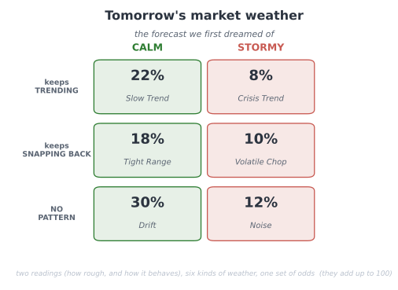
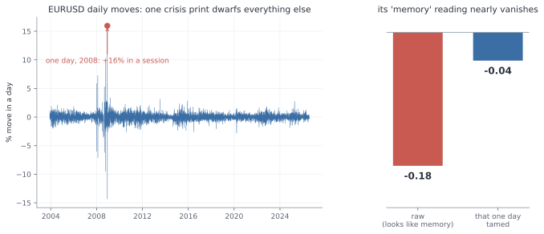
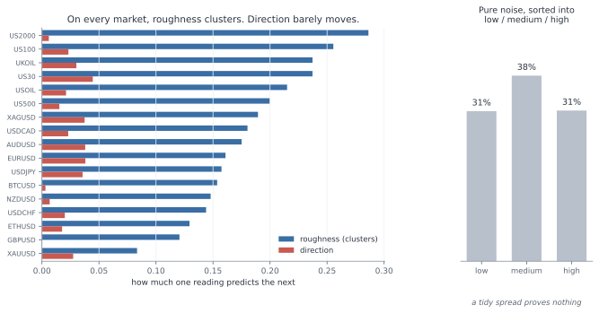
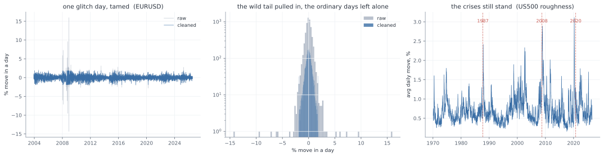
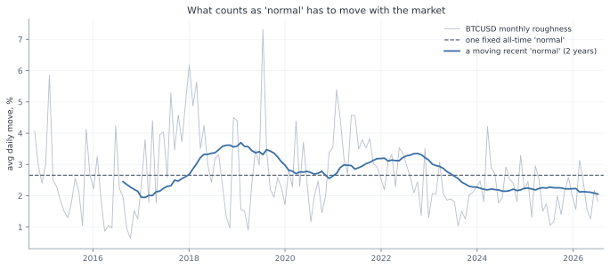
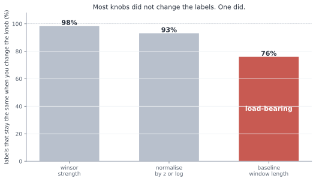

# Data Snooping in Deep Learning: dissertation (working draft)

*Working draft, written as a journey rather than a proof: we start from the ordinary, by-the-book way of judging a model by its number, and follow honestly where it leads. Reasoning first; the code behind every number is in the appendices. Compass in `NORTH_STAR.md`; the underlying argument in `KEY_CORE.html`.*

*Constraint (handbook): final submission ≤ 50 pages, including bibliography, tables and figures, excluding appendices.*

---

## Abstract

We start out doing the most natural thing in the world. We have a model, we want to know if it is any good, so we hide some data, let it guess, count the hits, and read off a number. High is good. And we are ready to believe it.

Then we watch that belief break, again and again. On a bank's loan customers the number came out high and was quietly lying, waving through most of the people who went on to default. On the stock market a promising edge turned out to be tomorrow's answer leaking back into today, and the moment we sealed the leak a working model fell apart into a coin flip. By the end of that chapter the market had beaten us outright, and we walked away with no number at all, only a suspicion. So we went back to the very same market, watching for it this time, and with the full deep learning toolkit, and it did not catch us once.

Look back over all of it and the enemy was always the same: a number that looked exactly like a good one. The books have a narrow name for one corner of this, data snooping; the one we came away with is wider, not just the reuse of held-out data but any good-looking number that comes out of an assumption nobody checked. And what we keep at the end is better than any result: a plain way of working that a good number can no longer fool. Name what each step is quietly assuming and test it against the data, clean the problem before you unleash the tool, try every finding on ground it has never seen, and when a check still catches you, trust the loop and not yourself. Because in the end the trust was never in the number. It was in the way we made it.

## Aims and objectives

What we set out to do was this: to understand, honestly and from the inside, why a model's number can lie to us, and to come away with a way of working that gives us numbers we can trust.

To get there we set ourselves a few concrete jobs. Build the networks by hand, in numpy, on real credit and market data, following the standard recipe step by step. At each step, stop and ask what that step is quietly taking for granted, then test that assumption against the data instead of taking it on faith. Once the problem is honest, let the full deep learning toolkit off the leash (several architectures and optimisers, regularisation, a proper hyperparameter search, and the four core formulae worked out by hand and checked against the numbers) and measure honestly what all that machinery actually buys. And finally, turn the whole thing into a short workflow that someone else could pick up and follow.

One more thing, and it is personal. Judging a model honestly is a skill every machine learning practitioner needs, and almost nobody is taught to name it. Working through it this slowly has left me with a habit I expect to lean on in any job where I build something other people are asked to trust. That felt worth more to me than another model that scores well.

## Background and related work

The tools here are standard. The network we train by hand is the ordinary feed-forward one, taught to learn by backpropagation (Rumelhart, Hinton and Williams, 1986), and where it needs an optimiser we reach for Adam (Kingma and Ba, 2015). When we want to know whether to believe the probabilities it prints, we lean on calibration (Guo et al., 2017), which just asks whether the things it calls seventy percent likely happen about seventy percent of the time. The data is all public: a set of credit-card customers from a bank (Yeh and Lien, 2009), and daily prices from Yahoo Finance, whose direction is famously about as predictable as a coin (Malkiel, 1973) even though the size of its moves clusters together and can be forecast (Engle, 1982).

The trap at the heart of the book is old and has many names. Statisticians call it data dredging. In finance, White (2000) pinned down one sharp version of it, searching over a great many trading rules and keeping the luckiest, and called it the data snooping bias. That work, and most of what is written about the problem, points at the searching. One small thing we try to add here, from worked examples rather than theory, is the argument that the danger is much bigger than searching alone. It is really the ordinary, default state of any pipeline whose assumptions nobody stopped to check.

---

## 0. The number we are about to trust

We have a model. Is it any good? How would we even know?

We do the obvious thing. We hide some data from it, let it guess on that data, and count the hits. That gives us a number. Is it high? Good. Low? Not good. So we read the number and we decide.

But we never build just one. We build many and keep the best number. So what are we really trusting in the end? *One number.*

And here is the question we almost never stop to ask.

> **Can we trust it?**

Let us find out honestly. We will not bend anything to force a problem into view. We will do the opposite, and *follow every rule the books give us, exactly.* Then we stand back and ask, together, what that honest number is really worth.

(One limit, so we are not doing everything at once. We stay with deep learning that forecasts and classifies: is tomorrow a busy day on the market, did this borrower default, which activity is this. Not vision, not language, not the rest. Just putting a label on the next case.)

So, where does everyone start? By the book. Let us start there too.

---

## 1. What deep learning really is, and the plan

So we have a job: take the next case and put a label on it. What do we build?

Almost always, the same thing: a small neural network. It is a stack of simple parts. A few features go in, get mixed and bent through a hidden layer, and come out as a guess between the classes.


How does it learn? Not by us programming it, but by correcting itself, the same four small moves over and over. It takes the numbers in and mixes them into a guess (the forward pass). We score how wrong that guess is, in one number (the loss). We work out which way to nudge each knob to shrink that number (the gradient, the downhill direction). Then we take one small step that way (the update). A few thousand rounds of those four, and the guesses come out mostly right.


One small marvel hides in those four moves: when we score wrongness this way, the correction each step makes is *exactly how far off the guess was*, no more. That is all the training is really doing, over and over. The full working, for anyone who wants it, is in Appendix A.

Give it more knobs, make it wider or deeper, and it can fit more. That is the whole appeal: **with enough knobs, a network can fit almost any pattern we hand it.**

And there is the catch. If it can fit almost any pattern, then **it can also fit patterns that are not really there.** Show it pure noise for long enough and it will "learn" the noise, memorising which random point got which random label, and score beautifully on the training data.


So the training score can look flawless and prove nothing, which leaves a nagging question: *if the model can fit anything, even nonsense, how do we know it learned something real, and not just the noise?* We cannot tell from the training score, it does well either way. The only way to know is to try the model on data it has never seen: keep some data back, judge it there, and never let it look while it learns.

Which brings us to the plan. To turn a network into a number we can show anyone, we follow a recipe, the same one printed in every course:


Five steps. Frame the data. Split it into training, validation and test. Scale the features. Build and search for a good model. Measure how good it turned out. Every step is standard, careful, exactly what we are told to do, and the number at the end is meant to be honest.

So here is the plan for the whole report. We are not out to attack this recipe, we want it to work. So we follow it faithfully, and carry it to one real problem after another. At each one we ask the same plain question.

> **Is this really as safe as it looks?**

By the end we will know the answer, and what it takes to walk away with a number we can actually trust.

---

We carry it to two real problems, and we take the friendlier first. We start with a bank's loan clients, the ordinary, clean kind of data the recipe was built for. Then the stock market, one long column of daily prices, a tougher animal, and one we end up facing not once but twice. The first time, it beats us outright, and teaches us the hard way everything the recipe was quietly taking for granted. The second time we come back to that very same market wiser, with the full deep learning toolkit in hand, to see whether we can finally do it right. Each pass is its own journey, with its own dead ends and its own moment of doubt, and the pipeline stays the map that keeps us oriented across all of them. We are not here to collect tidy results. We are walking one long climb, to the place where a number can finally be trusted.

Let us meet the first one.

---

## 2. Loan: the well-behaved one that still lies

### a. Reading the problem

A bank hands us thirty thousand credit-card clients and one question: which of them will miss their next payment?

So who are these people? Let us look at one, top to bottom.


We can almost picture them: twenty-four, a small limit, a modest bill, nothing paid back last month, and a yes at the end. They defaulted. So one row is one person: twenty-three plain numbers about them, and the answer we want to predict. There are thirty thousand of them, and about one in five default.

What exactly is the job? From those twenty-three numbers, for a client we have never seen, say yes or no: will they default? A plain two-way guess, and nothing about it is exotic.

What do we build? The small network from Section 1. Twenty-three numbers go in, pass through one hidden layer of sixteen units with a ReLU, and come out as two scores that softmax turns into a probability for "yes" and "no"; we keep whichever is larger.

And how do we turn that into a number we can put in front of the bank? We run the recipe from Section 1, step for step:


1. **Frame** it as the yes-or-no question it already is.
2. **Split** the thirty thousand clients once, into training (60%), validation (20%), and test (20%); the test part stays sealed until the end, and the validation part waits unused until Section 4.
3. **Scale** the twenty-three features, subtracting the mean and dividing by the spread, with those statistics measured on the training part only.
4. **Build and train**: from small random weights, run three hundred passes over the training clients, scoring the guess with cross-entropy, finding the downhill direction by the backprop of Section 1, and stepping every weight a little that way with plain gradient descent (a learning rate of 0.3).
5. **Measure** how good it is by accuracy: the fraction of the sealed test clients it labels correctly.

Two numbers, then, and worth keeping straight. While it trains, the network drives down one loss, cross-entropy, the score of how wrong its probabilities are. When it is done, we judge it by another, accuracy, the plain fraction it gets right. It learns by the first and is graded by the second.

So what do we expect? Honestly, not much drama. The data is clean, the question is plain, the model is standard, and every step is straight from the book. We expect the network to learn the pattern and hand us a high, honest number. So we run it, and see.

### b. By the book

So we run it, exactly as planned. Nothing fights us: epoch after epoch the network settles into the training clients, its accuracy climbing and then levelling off, the clean shape of something that is learning.


And the number it hands back is good. On the sealed test clients, the ones it never trained on, it is right **81.9%** of the time. Into the eighties, on our very first honest try.

One careful thought before we celebrate. Is that 82% real, or a fluke of the particular fifth we happened to hold out? Easy enough to check: we cut the deck again and again, a fresh random split each time, then a stratified one that forces the same default rate onto both sides, then even a cut by raw file order. If the score is solid, none of that should move it.


It does not move. The five random cuts sit between 0.813 and 0.820, a few thousandths apart, and even a stratified draw and a cut by raw file order stay close, at 0.815 and 0.808. The score is no accident of one lucky split; it is rock-steady, which is just what a trustworthy result looks like. So there it is: a clean, standard model, trained by the book, scoring 82% on clients it has never seen, and holding that score no matter how we slice the data. Everything points the same way. Trust this number.

**But** wait. That 82%, how much of it is really ours?

Try answering with no model at all. Train nothing, look at nothing; for every client, just answer "no default," the same answer every time. How often is that right? It is right about every client who never defaults, and most of them never do.


Of the 30,000, 23,364 never default; only 6,636 do. Answer "no default" for all of them and you are right about the 23,364 and wrong about the 6,636: that is 23,364 out of 30,000, or **0.779**. That score is free. It takes no model, no training, no thought at all; the data gives it away because most people simply pay.

Now stand our trained network next to that free answer.


Our network, twenty-three features and three hundred epochs of training: **0.819**. The free answer, which never looks at the data at all: **0.779**. **Everything we built sits four points above what the data was handing out for nothing.**

Four points. Where did even those come from, and what did all that training actually add? And a colder doubt behind it: is our model any good at all, or is it mostly just riding that free 78%?

And then the question that should stop us cold. We have judged this entire thing on one number, its accuracy. But if that number can barely tell our careful, trained model apart from an answer that never even looked at the data, then what is it really measuring? What have we been trusting this whole time?

> **If one number cannot tell a trained model from an answer that never looked at the data, what is it measuring, and can we trust it at all?**

### c. What the number was hiding

So we stop trusting the single number, and go looking for what it hides.

First, rule out the obvious. Is the score high because we split the data badly, or because something leaked from the training set into the test? No. We watched it hold rock-steady across every cut we tried, and there is nothing in this data to leak: no dates, no ids, nothing that puts one client ahead of another or ties a training row to a test row. The data is clean and the split is honest. The fault is not there. It is in the number itself.

So take the number apart. Accuracy asks one plain thing: of all the clients, how many did we label correctly? Notice what it does not ask. It does not care who. **Getting a payer right and getting a defaulter right count for exactly the same.** And there is the crack, because the two are not the same job at all. We did not build this to wave through the people who pay; we built it to catch the people who will not. So we ask the only question that was ever the point.

**Of the 1,353 clients in the test set who really did default, how many did our model catch?**

We stop reading the blended score and count, group by group.


It caught 472 of them. It missed 881. Two of every three people who default, our carefully trained, 82%-scoring model waved straight through, stamped safe. Then look at the payers, and the picture turns over: it cleared 4,445 of the 4,647. That is where the 82% lives. Almost the whole score is the big, easy group it got right; almost none of it is the small, hard group we actually cared about.

Put it in the plainest terms. Picture an illness that 78% of people do not have. A lazy doctor tells everyone the same thing, "you are healthy," and is right 78% of the time, because most people really are healthy. **And yet that doctor catches zero sick people.** A 78% that looks perfectly respectable, and is useless at the one job that mattered: finding the sick.

Our model is a little better than that lazy doctor: it does catch about one in three of the sick. But its accuracy barely moves, **82% against the doctor's 78%**, because accuracy is mostly measuring how well it labels the healthy majority, which was always the easy part.

That is what makes the four points so slippery. The number was never measuring the thing we cared about. It answers "did we get most clients right?", where the answer is easily yes, and it stays silent on "did we catch the defaulters?", where the answer is mostly no. So the entire gap between our model and doing nothing, those four points, is almost nothing by the number and almost everything in the job, and the number gives us no way to tell which.

> **Four points over doing nothing: nearly nothing, or nearly everything? And if our one number cannot tell the two apart, how are we ever meant to judge this model?**

### d. The number we can trust

So how do we judge this model without being fooled? We stop handing the whole verdict to one blended number, and we measure in a way that gives the rare, costly cases their due.

The fix is small. Instead of asking "how many clients did we get right," a question the majority always wins, we score the two groups apart and then average them. How well did we do on the people who default? How well on the people who pay? Average those two, and each group counts the same, however many are in it. That is balanced accuracy.

Now judge our model and the "always no" answer both ways at once:


On plain accuracy they are near twins, 0.817 and 0.779, four points apart. On balanced accuracy they split wide open: our model scores **0.646**, and the "always no" answer scores exactly **0.500**, a flat coin, because it never catches a single defaulter. Same model, same data. We changed only the ruler, and a difference that was four grudging points became fifteen. The skill that accuracy was drowning is suddenly there to see.

**So which number do we keep?** Here is the honest answer: **neither**, if we keep it on faith. We are not saying trust 0.646 instead of 0.819. That would be the same mistake in new clothes, swapping one number we do not really understand for another.

What we actually trust is not a number at all. It is the four counts underneath both of them: **472 caught, 881 missed, 4,445 cleared, 202 flagged.** Those are not a summary of anything, they are simply what the model did to 6,000 real people, and nothing can hide inside four counts. Accuracy blended them so the majority buried the failure; balanced accuracy weighs the two groups evenly so the failure shows. We keep the 0.646 only because we can see it is an honest reading of the counts, and we drop the 0.819 only because we can see it is not. The counts are the evidence. A number is just shorthand, trustworthy exactly as far as we have checked what it is made of.

And there, at last, is the assumption we never knew we had made. **Reaching for accuracy without a second thought, we assumed that every client counts the same, and that getting most of them right means the job is done.** That holds only when the two outcomes are roughly balanced and the two mistakes cost the same. Here neither did, and accuracy was blind to both. This is the shape of the whole report in miniature: a plain step of the recipe, followed without question, carrying a hidden assumption that the data quietly breaks.

So notice, in the end, what is worth trusting and what is not. The number itself wobbles: 0.646 today, a hair different tomorrow under another split, and none of it shakes us, because the number was never what we were trusting. We trusted the way we made it. We looked at the real counts, we chose a measure that credits the job we actually cared about, and we can trace, step by step, why it cannot be quietly lying. 

> **The score, the goal we chase, we cannot trust on its own. The process that earns it, we can.**

If a clean, honest process is the only thing worth trusting, then at the next problem, where inside that process is the next **hidden assumption** hiding?

## 3. Market: busy days and calm days

### a. Reading the problem

We come to the second problem already a little wary. The last one taught us that a number can look clean, steady, and high, and still be lying, so this time we make ourselves a promise: we will not trust a score just because it looks good.

And then we open the problem, and there is almost nothing there to trust. No neat rows of features like the loan clients. Just one long column of numbers: the closing price of the S&P 500 at the end of each day, 6,664 days in a row. A single price that wanders across the years, from a low near 677 to a high near 7,610.


So what can we predict from one column of prices? With the loan clients we had twenty-three numbers about each person. Here we have one number a day, and nothing else.

The first idea is the obvious one: predict tomorrow's price. But 677 back then and 7,610 now are not the same kind of thing, and a model fed the raw prices would learn only that the numbers drift upward with the years. Useless. We need to turn the price into something that means the same thing in any year.

**So we stop looking at the price and look at how much it moved.** Not "the price is 1,402" but "today it moved 0.2%", which means the same thing in any decade. **Then we drop the direction as well, and keep only the size of the move.** Calling the direction is hopeless, and not only for us: the market's ups and downs are the textbook "random walk", famously unpredictable (Malkiel, 1973). Size is a different story. Wild days sit near other wild days, which is the texture in the lower panel above.

From that we build the task. Take the sizes of the last five days, and guess one thing about tomorrow: is it a busy day, a move bigger than usual, or a calm one? "Usual" we pin at the middle day, so that half of all days count as busy and half as calm. There is no lopsided majority to lean on the way the loan data had; here a blind guess is a straight coin, 0.5.


Now, what do we build, and how do we run it? Nothing new, and that is deliberate. We keep the same small network from Section 1, untouched: five numbers in, the sizes of the last five days, through one hidden layer of sixteen ReLU units, out to two scores that a softmax turns into a chance of "busy" and a chance of "calm"; we keep the larger. We tune nothing and add nothing, precisely so that whatever we find later has to come from the data, not from us fiddling with the model.

And we run it through the very same recipe as the loan clients, step for careful step:


1. **Frame** it as the plain busy-or-calm question we just built.
2. **Split** the days once into the same three parts as before: training (60%), validation (20%), and test (20%), dealt out by a random shuffle, exactly as we did for the loans. The test stays sealed until the end, so we only grade ourselves on days the model has never seen. We keep the validation slice too, following the recipe exactly, though this chapter only measures one model rather than searching for the best, so it waits untouched.
3. **Scale** the five inputs the standard way, `(x - mean) / std`: measure the average and the spread once, on the training years, and then use those same two numbers to level every day that follows.
4. **Build and train** exactly as before: small random weights, three hundred passes over the training days, each scored by cross-entropy, every weight nudged downhill by plain gradient descent at a learning rate of 0.3.
5. **Measure** by accuracy, the plain fraction of the sealed test days it calls right, against the coin's 0.5.

Step two is worth pausing on, because it is the one place where we had a real choice to make. How should the days be dealt into those three piles? We do what the book says, and what worked on the loans: **shuffle them all together, then deal them out at random.** And here that feels like more than convention, it feels correct. Remember what this market is: a random walk, unpredictable, impossible to time. **If nobody alive can say what the market will do tomorrow, then the particular order we happen to file the days in cannot matter either.** Shuffling is simply us refusing to hand ourselves any advantage from the calendar, and it is the fairest test we could set ourselves.

And that last step is where the new us stops short. **Accuracy: that is the exact number that fooled us on the loan clients.** So before we lean on it again, we do what Loan should have taught us, and cross-examine it now, before a single day is trained. Why did it lie last time? Because the classes were lopsided, 78 payers to every 22 defaulters, and accuracy let the easy majority drown the group we cared about. So we ask the only question that matters: is anything lopsided here? No. We cut busy from calm at the middle day, on purpose, so the two are 50/50, dead even. There is no majority to hide behind, which means accuracy and the fairer balanced-accuracy would land in the same place. **On balanced classes like these, accuracy is an honest judge.** The trap that caught us last time is simply not set here, and we know it because we checked, not because we took the number on faith.

So this time we have earned our confidence, and more of it than before. There is a real pattern to learn, we are running the same trusted network with nothing tuned to flatter it, and the one measure that fooled us last time we have just cross-examined and cleared. Every trap we know to look for, we have looked in the eye. We run it, and see.

### b. By the book

So we run it, exactly as planned, and the score comes back.

**0.612.** The model is right about 61% of the time on days it has never seen, against the 50% a blind guess would get. Eleven points of something.

Now, before we believe a word of it, there is only one question in this chapter.

> **Can we trust 0.612?**

Everything from here is an attempt to answer it. And if the number is lying, the lie has to be sitting at one of the five stations we ran the data through. **Three of them we can check right now:**

1. **The build.** Maybe the network never learned anything, and 0.612 is a lucky roll.
2. **The measure.** Maybe it is not deciding at all, just saying the same thing over and over, and accuracy is letting it get away with it.
3. **The split.** Maybe the exam we set it was not a fair one.

So we take them one at a time.

**Suspect one, the build. Did the network actually learn?** We watch the training itself. From random starting weights the network is worth nothing, a coin at 0.494. Then, pass by pass, it climbs, fast at first and then slower, and settles around 0.630.


That is the shape of something genuinely learning: a climb while there is a pattern to pick up, then a flattening when there is no more to take. **Suspect one is clear.**

**Suspect two, the measure. Is it deciding, or just parroting?** That was the trap on the loan clients, where a model could look good by telling everybody "no default". Not here. On the sealed test it answers busy 45% of the time and calm 55%, close to the even split the data really has, and it gets 56% of the busy days right and 66% of the calm days right. It is making real calls, on both sides. **Suspect two is clear.**

**Suspect three, the split. Was the exam fair, or did we just draw a lucky test set?** Easy enough to check: deal the days out again, a fresh shuffle each time, and run it again.


It barely moves. Every shuffle lands near 0.61. That is the same reassurance the loan clients gave us, where every way of slicing agreed. **Suspect three is clear.**


All three checked, all three clean. The model learned, it decides both ways, and the score holds however we deal the cards. Trust this number.

And then, quietly, something does not sit right.

And then something very simple gets in the way.

Look at what we actually did to clear suspect three. Shuffle, and score. Shuffle, and score. Shuffle, and score. Five times over.

**That is not five checks. It is one check, five times.**

Of course it kept giving us the same answer. We kept asking it the same question. All the care above, the curve, the counts, the five re-runs, and not one of them ever asked the test anything it had not already been asked. Suspect three was never examined at all.

> **We never checked the test. We only ran the same check five times. So what happens if we check it a completely different way?**

### c. So was it the shuffle?

Back to suspect three, and this time we check it a genuinely different way.

Every check so far shuffled the days. But nobody in real life shuffles time. You stand on today and face tomorrow, and tomorrow has not happened yet. So we cut the days the way the world actually deals them: learn from the early years, test on the latest years, sealed.

**0.587.**

Same model. Same days. We changed nothing but which day went into which pile, and the score fell by more than two points. On the loan clients every cut agreed to the third decimal. Here two honest-looking cuts give two different answers, which means **one of these two numbers is wrong.**

That tells us where the trouble is. It does not tell us what it is. Why should it matter at all which pile a day lands in?

So we stop looking at scores and look at the data. Two rows, side by side.


They are almost the same row. Four of their five numbers are identical.

Then we see why. Row one is days one to five. Row two is days two to six. The window slides along one day at a time, so **every row overlaps the next by four days.** We had built thousands of near-copies, and never once looked at them.

Now put near-copies like that through a shuffle.

Think of revising with flashcards, where each card covers five days running, so each card and the next are nearly identical. Shuffle the pack, and card one lands in your revision pile while card two lands in the exam. You sit the exam, recognise card two, and get it right, not because you learned anything, but because you had already revised its twin.

> **So the test was never a test. The model had already revised the exam.** The 0.612 was not skill at predicting tomorrow. **It was memory.**

Cut by time and it cannot happen. A row and its twin sit side by side in the same years, so they land in the same pile, and nothing sneaks across. That is why the honest score comes out lower.

A neat story is not proof, though. Could the shuffle simply have got lucky?

There is a clean way to check. A leak like this can only help if there is a real pattern for the twin to carry. So run the same comparison on a task with no pattern in it at all: guessing whether the market goes up or down, a pure coin flip.


The gap disappears. On up-or-down, shuffle and honest land together, 0.540 and 0.539. **The gap turns up only where there is something worth stealing.** So it was not luck. The shuffle really was leaking.


Strip the leak out and the honest number is about 0.60. And we had been careful: sealed test, trusted model, the measure cross-examined. **The one step we never questioned is the one that broke us.**

And there it is, the **hidden assumption**. 
> **When we shuffled, we assumed the days were interchangeable: that one row has nothing to do with the next, so it could not matter which pile each one fell into.** 

We even had a reason for it. The market is a random walk, we said, impossible to time, so surely the order could not matter. But the random walk is about **which way** the market moves, not **how big**, and the sizes do remember each other. On the loan clients the assumption held, and the shuffle was fine. Here it did not.

One last thing, and it is the part worth carrying out of this chapter. **A number can be steady, repeatable, and wrong, and it will never tell you so itself.** 0.612 was all three, and no amount of staring would have made it confess. It took checking from a different angle.

What else have we only ever checked one way?

### d. And what about the scaling?

So we go looking for one.

Which steps have we actually put to the test? The split, twice over now. The build and the measure, back in part b, when we were still sure of ourselves. The rest we have simply run, because the book said to.

**Scaling**, for instance. We measured the average and the spread on the training years, froze those two numbers, and used them on every day afterwards. **Why? Because that is what you do. We never asked what has to be true for it to be sensible, and if someone had stopped us and asked, we are not sure we could have answered.**

So we ask the question now. What does that formula, `(x - mean) / std`, actually need in order to be sensible? It needs those two frozen numbers, the mean and the spread, to keep describing the world. **That is the bet sitting quietly inside the arithmetic: that a normal day, and the spread of days, will stay what they were back on the training years.** We never said it out loud, and we never checked it.

How would we even see a bet like that? Only by watching it lose. So we hand the frozen scaler a feature whose normal really does drift, the simplest one there is to build: the size of each move in raw points, the plain change in the index, instead of in percent. Same day, same market, same information. We run it.

**0.509.**

A coin. The model that scored 0.587 a moment ago now knows nothing at all. Nothing leaked, the split is honest, the scaler was frozen exactly as taught, and the bet has quietly lost.


The picture shows it losing. The grey band is the one normal we froze, the mean and spread from the training years, and we had pinned a normal day at about 10.6 points. But the index climbs across the years, so the same move in points grows with it, and by the test years a normal day had drifted to 37, three and a half times larger. Every test day now arrives looking like a wild outlier: measured against the frozen normal it sits **2.73** standard deviations out on average, and 43.7 at the very worst. Imagine grading today's coffee prices by what felt normal to you thirty years ago and never updating. Four pounds is not expensive, it is off the scale, a number you have no category for. That is exactly where the frozen scaler leaves the network. It is not being asked a hard question. **It is being asked a question in a language it has never heard.**

And here is the part that should keep us up at night. Percent did not survive because percent is safe. Percent drifted too: we froze its normal at 0.85% and by the test years it had slipped to 0.75%. It simply drifted a little where points drifted a lot, so the frozen scaler could still cope. And we never measured that. We reached for percent because the book reaches for percent, and this time the book happened to be right. Hand the very same recipe a feature that drifts hard, and it dies, and nothing anywhere tells us in advance which kind we are holding.

Could a cleverer scaler rescue it? Re-fit the mean and the spread every day, on a window that only ever looks backward, and points climbs back to just 0.528: better, and still nowhere near 0.587.


So it was never about a smarter scaler, and it was never really about the unit either. It was those two frozen numbers, and the bet hiding inside them.

And there it is again, the **hidden assumption**.

> **Standardizing froze one mean and one spread and used them forever, betting a normal day would stay normal. We never once checked whether it would.**

The scaler, it turns out, is not really a piece of arithmetic. It is a **memory**: two numbers we took from one stretch of the past, and then used to mark everything that came after. While the world stayed roughly as it had been, the memory held. The moment it moved, we were grading today against a yesterday that had stopped existing.

We keep the feature in percent, where the bet happens to hold, and we are left holding 0.587 again. But we are less easy about it now. If one step of the recipe is a frozen memory like that, we would very much like to know how many others are.

What else did we freeze once, and then forget we had frozen?

### e. The process we can finally trust

Twice now the same thing has happened, and it is worth stopping to name, because it is the real lesson of this chapter. Both times we ran a step simply because the book said to. Both times that step was quietly betting on something: the shuffle, that one day has nothing to do with the next; the scaler, that a normal day stays normal. And both times the bet was invisible, folded inside a number that looked perfectly healthy, until we happened to check it from an angle we had not tried.

So the recipe is not the thing we took it for. It is not a list of instructions to carry out. **It is a list of bets to read.** Every step quietly assumes something is true, and to follow it without looking is just to take the bet sight unseen.

That is what changes now. We do not patch the two holes and rerun. We build the plan again from the top, and this time, at every step, we stop and ask the question we kept skipping: **what does this quietly assume, and is it true here?**

First the plan, the way we laid it out in part a. The same five stations, in the same order, only now we walk them with our eyes open. **Frame** the question, busy or calm. **Split** the days, no longer by a shuffle but past to future, so no near-twin can cross into the exam. **Scale** the sizes in percent, whose normal barely moves, so the frozen mean and spread still fit the world. **Build** the same little network. **Measure** against the coin. The recipe, corrected.

Then the trial, the way we ran it in part b. Back then we asked the question that saved us: if this number is lying, where could it be hiding? We named three suspects. This time we are wiser by one, because the market taught us to distrust the scaling too, so we make the list again, longer now, and go down it.

- **The split?** Repaired. Past to future, no twin can cross. Clear.
- **The scale?** Repaired, and a chapter ago we would not have thought to check it. Percent, barely drifting. Clear.
- **The build?** We watched it climb from a coin and settle. Clear.
- **The measure?** We watched it call busy days and calm ones both, with no majority to hide behind. Clear.


Four suspects where once there were three, and every one of them clean. We run the corrected plan, and the number settles a little under 0.60.

And this is the moment the whole chapter has been climbing toward. It is not a score we are hoping is **honest**. It is a score left standing after we asked, at every step, what it took for granted, and found each answer sound. This is exactly what the loan clients taught us to reach for: not a number to trust, but a process to trust. And here, for the first time, having questioned a longer list than we ever have, is **a process we believe in**.

So we could stop here. By every rule we have learned, we are finished, and we have earned the right to be. We very nearly close the book.

> **There is one last check, and we very nearly skip it, because we cannot imagine how it could go wrong. We have cleared every station, twice over. What is left to catch us?**

But look at how we got our number. We trained the model on the years up to a point, then tested it on the stretch that came right after, the most recent days, and read off the score. One test, on one slice of time.

So, one fair question. Was that slice special? A number we can trust ought to be a fact about the model itself, and come out much the same whichever slice of time we test it on. If we had stopped a few years earlier, or later, would the number have held? Or did this one stretch just happen to be kind to us?

There is one honest way to find out, and it is no new trick. We run the very same test again, train on the past, test on what comes next, only at five points spaced along the history instead of only at the end. Same honest recipe, five different moments in time.

And the five do not agree.

Think of the model as a student, and each test as an exam it sits. We had marked it on one exam, the most recent years, and written down its grade as if that settled the matter. Now we set the same exam at five different moments in its history, and the grades come back all over the place. On one, the model barely beats a coin. On another, it does genuinely well.


This is the ground giving way. 
> **We opened the chapter asking one question, how good is this model, and it turns out to have NO answer.**

It is barely a coin, or it is genuinely good, depending on nothing but which year we happen to examine it in.

**There was never one number.**

And then it gets worse, because the exams were not equally hard, and we never checked.

To be worth anything, the model has to beat a classmate who never studies. Not one who flips a coin, though. This one is craftier: he notices which answer has been coming up most often lately, and then writes that same answer down for every single question. He understands nothing, and still, on a lopsided exam where most days are one kind, that alone scores high. On an even exam it manages only about half. This is the lazy guesser, the same idle trick as the lazy doctor on the loan clients.

And here is the catch. **How well you can do by not trying changes from one exam to the next.**


Yet we had marked every one of the model's grades against the same flat line, a coin at 0.5, as though every exam were equally hard. They never were. On the easy exams we set the bar far too low, and praised the model for clearing it, when a classmate who was not even trying had cleared it just as well.

Put the two together, and the result falls apart. Take the two exams the model scored highest on, near-identical grades. One was easy: the lazy classmate nearly matched it, so the model proved almost nothing. The other was hard: the lazy classmate flopped, so the same grade was a real achievement. **The same score, worth five times as much on one exam as on the other.** Marked fairly, each grade against the lazy classmate on that same exam, the model's proud lead more than halves. And on one exam, it is beaten outright by a classmate who never opened a book.

Sit with that for a moment, because it is worse than a bad result. **We did everything right.** We found the leak, and sealed it. We found the drift, and fixed it. We put every step of the recipe on trial, not once but twice, and cleared every one. And the number still came apart in our hands.

So how? If every step was sound, where did the trouble get in?

Follow the one thing that kept moving. How hard each exam was, how well the lazy classmate could do on it without trying, rose and fell from one stretch to the next. But the pass-mark we judged against, the flat 0.5, never moved with it. Where did that fixed pass-mark come from? Not from any step we checked. From before all of them, from the very first thing we ever did: setting the exam. Choosing what it would ask, and what score would count as a pass. That is station one of the recipe. **Frame.**

> **Trust the process, not the score. But what if the frame and the goal are unclear? What is the cleanest process worth then?**

But hang on. We checked every station, didn't we? So how did we miss that one?

Look back at the plan we were so pleased with. The split, we cleared it. The scale, we cleared it. The build and the measure, cleared. Station one, the exam itself? We never even looked. **We cleared every station but the first.**

So why did we never test the exam? It was not laziness. We went hunting for traps twice, and wrote out a list of suspects each time, and the exam was never on it. Not once did we think to add it.

Why not? Because setting the exam never felt like a step. Splitting, scaling, training, marking, those are all things you do, and things you do, you can get wrong. But deciding what the exam asks, and how high to put the pass mark? That did not feel like something we did. It felt like the setup, fixed before the real work even started. And you do not stop to question the setup.

**It was not a step we ran badly. It was a choice we never even saw as a choice.**

And the worst part is how close we came. We had run the one check that might have caught it, the one the loan clients drummed into us: is the exam lopsided enough to flatter the student? We looked. Fifty-fifty, dead even. It was true. And it still was not enough, because we looked once, at all the exams lumped together, and never looked again, while the balance kept shifting under us. We did the right thing. We just did it once, and called it done.

So we are left with one question, and it is not about the market anymore. After all that care, what are we still allowed to say?

### f. So what did all that teach us?

That was a lot. Three times in this chapter we found a number, trusted it, and watched it move under us. Before we go on, it is worth stopping to gather what we actually learned, because it is simpler than it felt.


Every time, the trouble had the same shape. We ran a step because the book said to. That step was quietly betting on something. And the bet stayed invisible, folded inside a number that looked perfectly healthy, until we happened to check it from an angle we had not tried.

There were three such bets.

The **split** bet that one day has nothing to do with the next. The near-twins broke it, and 0.612 turned out to be memory, not skill.

The **scale** bet that a normal day stays normal. The drift broke it, and a working model dropped to a coin.

The **frame** bet that the question and the pass-mark were simply given, settled before the real work began. The eras broke it, and the single score we came for turned out never to have existed.

So the recipe was never the thing we took it for. It is not a list of steps to carry out. It is a list of bets to read. Follow it without looking, and you take every one of those bets sight unseen.

And look at how we found all three. Never once in advance. Always after the fall, one ambush at a time, patching the last hole just in time to walk into the next.

What died in all of it is one short sentence, the one we wanted to write: "the model is 61% accurate." It does not survive this data for a moment, because there is no single number here to be right about. What survived is smaller, and real: the size of recent days does carry a little about the size of the next one. But we can only say so honestly with its conditions held right beside it.

> **Here is the one thing we never did in this whole chapter. We never sat down at the start, looked at each step, and asked what it was betting before it could cost us anything.**

We only ever reacted. And we did the whole thing one-handed, with the same tiny untouched network, never once reaching for the tools we actually have.

So there is one thing left to try. We take the same problem back to the top, and this time we read each bet before it bites, and we hold nothing back.

## 4. The market, put to use: a weather forecast for its roughness

Section 3 left us with a number, and we almost walked away from it. A forecast of how rough tomorrow would be, right about six days in ten. Six in ten is not a number you brag about, and we felt let down. But we never asked the one question that would have saved it.

**What is this number for?**

So we go back to the same market, wiser, and this time we do not rush to build. The tool we are about to pick up is deep learning, and it is worth being plain about it. It is powerful, and it is convenient. It is also very easy to fool. Hand it a messy problem and it will find a pattern that was never there, then hand back a confident number you cannot trust. That is the trap of the last two chapters, waiting to spring again.

> **So we do not try to tame the tool. We clean the problem instead.**

A problem with no hidden leaks, no borrowed answers, and a known ceiling is one where even a powerful tool cannot lie to us. Get that right, and we can let deep learning off the leash later without fear.

But clean is not something we know in advance. We find it the only honest way. We make a guess, we test it, and when the test says the guess is wrong, we hunt down the hidden assumption that fooled us and fix it. Then we guess again. That loop, repeated until there is nothing left to catch, is the whole of this chapter.

### a. First, what are we even forecasting?

Section 3 built something and then could not use it. It forecast whether tomorrow would be busy or calm on the market, it was right about six days in ten, and it sat there useless, because we had never once asked what the number was for. A forecast with no job is just a number. So this chapter begins where Section 3 should have: not with what we can predict, but with what the prediction is for.

The job we chose was a weather forecast for the market. Something you could read each morning the way you read the sky. And the moment you take that seriously, the shape of the thing changes.

For one, it does not give a single answer. A real forecast does not say "it will rain," it says seventy percent chance of rain. So ours would not hand back a flat busy-or-calm; it would give the odds across the possible weathers, a probability for each. That is not decoration. Section 3's yes-or-no was a blunt thing that could not admit doubt, and here doubt is most of the truth. A probability can be honest about how unsure it is.

For another, it is not about one market. Weather is something every market has. So we would read it across many at once, seventeen of them, from stock indices to currencies to gold and oil, building a history of weather for each and a picture of the whole.

And the weather itself had two readings. How rough the market is, calm or stormy. And how it behaves, whether it keeps pushing one way, keeps snapping back, or just wanders. Cross the two and you get six named kinds of weather.



We did not invent those six. A tool we had been handed already sorted every market into one of them, and it was a genuinely lovely picture, the kind you would want to open each morning.

> **And if we are honest, that was the danger in it. A picture that lovely is one you want to be true, and wanting a result is already half the road to fooling yourself into one.**

Now, how does an honest forecaster actually work? In two steps, and it is worth keeping them apart, because one is safe and one is not. First you DESCRIBE the weather that has already been. Looking back, with the whole stretch in front of you, saying "that was a stormy month, that was a calm one" is easy and honest. Then you FORECAST the change, the turn from one weather into the next, and that is the hard part. An honest forecaster stays humble there, because the turns are exactly where any forecast is weakest. Describing the past is not the same as forecasting the future, and we would never let the ease of the first fool us about the difficulty of the second.

Before building a thing, we also named what was solid ground and what was quicksand, because Section 3 had already mapped it. Roughness is solid: Section 3 proved that rough and calm cluster, that there is real signal in the size of the moves. Behaviour, which way the market leans, is the quicksand: Section 3 proved that direction is very near a coin flip, and any forecast that dressed itself up as knowing which way the market will go would be betraying the hardest lesson of the last chapter. So we went in planning to lean our weight on roughness and keep behaviour on a very short leash.

And here is the deepest reason we built it across seventeen markets and not one, the idea the rest of this chapter stands on. It was not to look impressive. It was a test, the same test this whole book is about. A real weather pattern shows up in market after market; a fluke shows up in one and vanishes the moment you carry it somewhere new. So the seventeen markets were never a bigger dataset to boast about. They were seventeen chances to catch ourselves believing a ghost. **A signal that survives being carried to a market it has never seen is real, and one that dies on the journey was never there.** Hold onto that, because it is the spine of everything that follows, and it went to work immediately, on the behaviour reading, which was the first thing it caught.

We began, as Section 3 had taught us, by trying to fool ourselves on purpose. We took pure noise, random numbers with nothing in them, and sorted it into low, medium, and high behaviour exactly as we would the real thing. It came out a tidy 31, 38, 31, a neat three-way split from nothing at all. So the neat spread we saw on the real data proved nothing by itself; **a pretty picture is never the proof.** The only honest test is on the raw numbers, and the measure we used was the plainest one: the lag-one autocorrelation of the daily moves. If today's move tends to be followed by one the same way, it is positive, which is trending; if it tends to reverse, negative, which is reverting; near zero is random. We knew the textbook tool, the Hurst exponent, and we passed it over on purpose, because it is finicky and adds settings to argue about while saying the same thing. Know the fancy tool, reach for the simple one. We will make that exact choice again with the deep learning at the end.

So we ran the test, against a null that assumes no signal and asks whether we could have seen this much by luck. At first it looked real, but only in places: the behaviour reading cleared the noise on a scattered handful of markets, a few currencies, the metals, one or two of the indices, and stayed dark on crypto and much of the rest. Uneven like that is already the transfer test whispering a warning, because a real signal does not pick and choose its markets so arbitrarily. And when we forced a proper audit rather than admire the result, the whole thing came apart, in two ways.

First, the measure was fragile. The autocorrelation is not robust to a single wild day, and a handful of crisis days had manufactured almost the entire signal. The euro read a strong-looking minus 0.175, real mean-reversion by the look of it, and **almost all of it came from one afternoon, the 8th of December 2008**, when it moved sixteen percent in a single session. Pull that one day back toward the pack and the reading collapses to minus 0.038, essentially nothing. The yen told the same story, minus 0.124 down to minus 0.036. The S&P did not merely shrink, it flipped sign, from minus 0.019 to just above zero, plus 0.015, on the strength of the 1987 crash alone.

There is a particular sinking feeling in that, watching a signal you had already half written down as real dissolve into a handful of bad days.



Second, **our own test was wrong.** Our first null shuffled the daily moves around freely, but shuffling freely also destroys the roughness clustering, the one thing that genuinely is there, and a null that empty makes any real data look significant beside it. Eight of the seventeen markets came out "significant" against it, which flattered us badly. The right null keeps the roughness and destroys only the behaviour, which you do by flipping the sign of each move at random instead of scrambling their order. Against that honest null only five of seventeen survived, and even those sat around 0.04, small enough to be worth nothing.

> **That one was harder to sit with, because the fault was not in the market this time. It was in us.**

And the five survivors were not a market memory at all. Look at which five, and the last of the case falls apart: three currencies, one metal, and a single stock index, with nothing tying them together, every one of them a mere whiff of mean reversion near minus 0.04. No shared family, no common cause, just five names scattered across unrelated corners of the market. That is not what a real pattern looks like. A real one shows up in market after market, the same way each time; this showed up in five of seventeen with no thread between them, which is exactly the picture noise paints. And they scraped past the bar at all only because the series are so long that a hair of autocorrelation registers as "significant" while being worth nothing to anyone actually trying to forecast. Set the two readings side by side across all seventeen markets and it is not close: roughness clusters at about plus 0.18, behaviour sits near minus 0.02, nine times weaker and pointing the wrong way for a signal. The full per-market table is in Appendix E.



So the transfer test had done exactly the job we built it for. The behaviour reading was a ghost, scraping past in a scattered five for no reason that held together and dead everywhere else, and we dropped it. Six kinds of weather collapsed into one honest question. **How rough, not which way.** And it is worth being exact about why, because it is not the obvious reason. The data was not dirty; we had cleaned it. The market simply has almost no real behaviour signal to read, and saying that plainly is a scientific finding, not a failure.

It is worth stopping on what that cost us. The lovely two-reading bulletin was down to a single reading. The livelier half, the part that told you how the market was moving, was gone, and only the quieter half remained. But the quieter half was the only one that had ever been real, and a forecast built on the real half beats a beautiful one built on noise.

This was the station Section 3 never reached. Every earlier chapter interrogated how we split the data, how we scaled it, how we scored it. Not one of them ever put the question itself on the suspect list. Here we did, and the question was where the rot was. We checked it first, and it saved us from building the whole chapter on noise.

And notice the shape of what just happened, because we will repeat it at every step from here. We made a guess. We tested it, and we tested it across every market, not just the one that flattered us. When the result looked too good, we grew suspicious instead of pleased. We hunted down the flaw, first in the data and then in our own test, and we dropped what could not survive. That loop is the whole method of the chapter.

Because this part turned up more than one buried assumption, it is worth setting them all down in one place: what we nearly believed, what we did about it, and why it no longer bites.

**Hidden assumptions:**

| What we nearly believed | What we did about it | Why it no longer bites |
| --- | --- | --- |
| A tidy low, medium, high spread means a real signal | Ran the exact same sorting on pure noise, which also gave a tidy 31, 38, 31 | We judge the raw numbers against a null now, never the picture |
| The autocorrelation is safe from one wild day | Traced the euro's whole reading to a single 2008 session, then cleaned and re-measured | Every reading is taken on cleaned data and re-tested afterwards |
| A free shuffle makes a fair "no signal" world | Saw it destroyed the roughness too and flattered us, eight of seventeen "significant" | The null keeps the roughness and destroys only the behaviour now, five of seventeen, all tiny |
| A signal that shows up anywhere is real | Carried it across all seventeen markets, where it clung to a scattered five with no thread between them | Nothing counts unless it survives being carried to a market it has never seen |
| The market has a behaviour we can forecast | Measured it against roughness: near zero, nine times weaker, and scattered noise when it survived at all | We forecast only roughness, the one reading Section 3 proved is real |

The reading we kept is measured on cleaned data, judged against the right null, and confirmed on every one of the seventeen markets. What survives all of that is real, not a ghost.

### b. Making the problem clean

We had our one honest reading now, roughness, and it would have been tempting to start building. We did not, because a real signal is not the same thing as a clean problem, and the tool we were about to pick up made the difference matter. Deep learning is powerful, and it is easy to fool. Hand it a problem with a hidden leak and it will find the leak, fit it, and hand back a confident number that means nothing. So we did not try to tame the tool. We spent everything from here on making the problem so clean that even a powerful tool could not lie to us.

One rule governed all of it, the rule the behaviour reading had just beaten into us. Every choice we make here is a knob, and every knob is a chance to fool ourselves, so we would not guess which ones matter. We would test every one, and the few that turned out to matter we would pin by reason, in advance, before the model ever saw a number, so that we could never be caught later quietly turning a knob until the answer looked good.

The first knob was the data itself. The market's history holds a few genuinely insane days, and we had just watched one of them fake a whole signal, the euro's sixteen percent afternoon in 2008. Left alone, a day like that dominates any average it falls into. So before measuring anything, we pulled the wildest days back toward the pack, gently, trimming only the most extreme half a percent at each end. The test that this was safe is the one that matters: the real crises had to survive it, and they did. The S&P's roughness in 2008 came down from 1.74 to 1.45 percent a day, in 2020 from 1.35 to 1.16, and both still stand four to five times over a calm year's 0.30 percent. **We cleaned out the glitches without cleaning out the storms.**



Then the rule went to work on the smaller knobs. How hard should we trim? Which exact formula should turn a raw roughness number into low, medium, or high? These are the settings it is tempting to agonise over, so instead we tested them. We labelled the whole history one way, then the other, and counted how often the two disagreed. Trim at half a percent or at a tenth: the labels agreed 98 times in a hundred. Standardise the numbers one way or another: 93. Both were, in the language we were building, knobs that do not matter, so we took the simpler setting and moved on. A knob that does not change the answer is not worth an argument. Keep those two numbers, 98 and 93, in mind, because they are about to make a surprise land.

Next came how often to take a reading and how far ahead to forecast, and this is where we were very nearly beaten. We started the obvious way, a reading every week and a one-week horizon, and ran the natural test: from this week's roughness, how much of next week's can we explain? The answer came back as an R-squared of 0.70. For a moment, we let ourselves believe it. Then sit with that number, because if it does not alarm you, you have not been paying attention. It says we could account for fully seven-tenths of next week's roughness from this week's alone. Section 3 fought for weeks to wring a few percent of edge out of this exact market, and here we were apparently nailing seventy percent of it. On a problem this hard, a result that good is never a gift. It is a symptom. So we did not celebrate, we went looking for the leak, and it did not hide for long.

To measure one week's roughness we averaged the last twenty trading days. A week later we did it again, averaging the last twenty days again. But those two windows sit only five days apart, so they share fifteen of their twenty days. When we "forecast" next week from this week, **we were mostly comparing a number with itself.** Fifteen days out of twenty were the same days. That is not forecasting, it is measuring one thing twice and being impressed that the two agree.

> **It is obvious once you see it, and that is the uncomfortable part. It was obvious, and we still walked straight in.**


The fix is to keep the windows from touching. Take one reading a month, over twenty days that belong to that month alone, and forecast each month from the one before. Look at what happens to the edge over simply guessing the most common weather. Measured the overlapping way it was plus 30.6 percent, the mirage that had thrilled us. With the windows pulled apart at the weekly speed it fell to plus 3.4 percent, as faint as the behaviour reading we had just buried. Only when we stepped all the way back to a month did a real, modest edge appear, plus 14.2 percent better than guessing. So the seventy percent was never real. The honest signal was small, and it lived at the scale of a month, and that is the scale we would build on.

Working in clean, separate months, the next job was to turn each one into a label, calm, normal, or stormy, and that hid two questions we again nearly got wrong. The first is what "normal" even means. A month is rough compared to normal, but the market's normal does not hold still. There are calm years and violent ones, and a move that is a storm in a quiet decade is an ordinary week in a turbulent one. So **normal could not be one fixed number for all of history**; it had to be a moving benchmark, the market's own recent past. And it had to be built only from that past. If we let months that have not happened yet help set what counts as normal today, we would have **slipped the future into the label**, the very leak that fooled us in Section 3.



So normal was a rolling window of the recent past. How long a window? Here we nearly slipped again, and it is worth admitting how. We assumed the length could not matter much and reached to just pick one. The rule stopped us: we would not guess, we would test. So we tested one year against two against three, and the answer was not what we assumed. The same month came out calm or stormy depending on the choice, and the three lengths agreed only about three times in four. Set that beside the knobs we had waved through, the 98 and the 93, and it stands out at once: **this one was load-bearing.** So we pinned it the careful way, in advance and by reason, at two years, long enough to be steady and short enough to keep up as the market changes.

> **We had very nearly waved it through with the others. That is the one that stays with us, not the trap we saw coming, but the one we almost did not.**



One choice was left, how many bands and where to cut them. Three felt right, calm, normal, and stormy; five flickered, a month hopping between them on noise, and two were too blunt to be a forecast. Where to cut was load-bearing in its own right: draw the lines too wide and "normal" swallows almost everything, leaving nothing to warn about. So we set them where the three come out balanced, each holding a real share of the months, which is also what a probability forecast needs if anyone is going to trust it.

With the months clean and labelled, we asked what the model should actually look at. The tempting answer was a long run-up, this month and several before it. But roughness moves slowly, so last month already carries almost everything the earlier months would add. We checked, and the numbers were plain: this month's roughness alone explains 27 percent of next month's, adding last month lifts that by barely a hundredth, and **adding the months before that adds nothing at all.** So the model is handed just two numbers, how rough this month was and how rough the month before, and nothing it does not need.

Before letting deep learning anywhere near it, three last guards. The first was a placebo. We scrambled the answers until there was truly nothing left to learn, and checked that the model then scored no better than a blind guess. It did: **a real 54.8 percent fell to 34.5, which is pure chance.** Had it still found a pattern in nonsense, we would have known a leak survived. It found nothing, which is exactly what a clean problem gives.

The second guard was the split, and it was the transfer test from before, now built into the bones of the problem. We held out the future, training on the older months and testing on newer ones the model had not seen. And we held out whole markets, training on thirteen and keeping four aside that it would never meet while it learned. A score that comes only from memorising cannot survive being shown a market it has never met. This is the same idea that killed the behaviour reading, turned now into a standing rule: nothing counts until it carries to somewhere new.

The third guard was the ceiling, written down before we began. A plain rule on this data, just carrying last month's weather forward, reaches about 54 percent, and a simple linear model barely beats it. That is the ceiling the signal allows. So we fixed the alarm in advance: anything much above sixty percent would not be a triumph, it would be a leak we had failed to catch, and it would send us hunting rather than cheering.

And one last honesty, written down before any result could soften it, about what this forecast will never do. It is a tilt, not a crystal ball. The signal is weak, so it will be wrong a good four times in ten. It reads roughness relative to each market's own recent past, not an absolute level of danger. It is blind to the true catastrophe, the once-in-a-generation crash, both because we cleaned those very days out and because the markets that died are not in our data. It speaks a month at a time, so a storm that flares and fades inside a month goes unseen. And it fails hardest at the turns, when a calm stretch tips into a rough one, which is exactly the moment a forecast would be wanted most. None of this makes it useless. It makes it honest, and a forecast you can place inside its limits is worth more than one that pretends it has none.

That is the whole machine, and every stage of it was settled by the slow work above, not left for the model to sort out. One worked example, the latest month of the S&P, runs the length of it: the daily prices become cleaned daily moves, the last twenty days average to a roughness of 0.79 percent a day, that reads as plus 0.46 against the past two years, which lands in the normal band, the model is handed that 0.46 and last month's minus 0.43, and out comes a forecast of next month's weather.


Now the problem was clean. No borrowed future, no shared days, no single day writing the answer, and its limits named out loud. The cage was built, and it was honest.

> **The same stock-taking is worth doing here, because the cleaning turned up a buried assumption at almost every step.**

**Hidden assumptions:**

| What we nearly believed | What we did about it | Why it no longer bites |
| --- | --- | --- |
| A handful of wild days will not sway an average | Trimmed the extreme half a percent, and checked the real crises survived, 2008 from 1.74 to 1.45 percent a day | The glitches are tamed while the storms still stand |
| We can guess which settings matter | Tested each one: trimming agreed 98 percent of the time, the formula 93, but the baseline window only 76 | The one knob that moves the answer is pinned by reason, in advance |
| Overlapping windows are fine to forecast across | Found that a twenty-day window on a weekly step shares fifteen of its twenty days | One reading a month, no shared days: the honest edge is 14.2 percent, not 30.6 |
| "Normal" can be one fixed level for all time | Saw a fixed normal call recent, calmer years stormy, because volatility drifts era to era | Normal is a rolling two-year window of the recent past |
| Normal can be set using the whole history | Realised that lets months which have not happened yet into today's label | Normal is built only from the past, never from the future |
| More history helps the model | Measured it: this month explains 27 percent of next, last month adds a hundredth, older months nothing | The model is handed just two numbers, and nothing it does not need |
| A high score means it learned something real | Scrambled the answers, and the model fell to chance, 54.8 down to 34.5 | The placebo passes, and the split holds out both the future and whole markets |

Every leak is closed, every knob that moves the answer is pinned before the model sees a thing, and a ceiling and an alarm are fixed in advance. A high score from here can only be real, or an alarm we have promised to chase.

So before we open the door, it is worth saying out loud, plainly, what we have settled and how we mean to judge it, because the discipline of the whole next part rests on this one page. The pipeline is locked, every station of it checked and clean.


What remains is the rule for judging the model, and we fix that now too, in advance, so that no result can ever tempt us to bend it. We split the data along two lines at once.


The first line is time. We take thirteen of the markets and cut their months into three. An early stretch to learn on, three thousand months of it. A middle stretch, six hundred and forty-two months, for validation: every choice we are about to make, every architecture, every setting, every search, is made here and nowhere else. And the most recent stretch, six hundred and thirty-five months, sealed away as the test. It stands for the future, and we open it exactly once, at the very end.

The second line is the market itself. Four whole markets, one for each kind of weather, are set aside from the very start and never shown to the model while it learns: the small-cap index, a currency, a crypto, and an oil. This is the transfer test from Section 4a, now built into the shape of the data. A signal that is real carries to a market it has never seen; a fluke does not, and the four held-out markets are where a fluke goes to die.

That is the whole plan, fixed before a single model runs. The pipeline decided, the split drawn along both lines, the ceiling written down at about five and a half in ten and the alarm set at six, so that a number climbing past it would send us hunting rather than cheering. Now, and only now, we open the door and let deep learning run.

### c. Off the leash

The door was open, and now we could finally do the thing this chapter had been holding back: reach for the whole of deep learning, every architecture and optimiser and trick, and throw it at the problem. But not yet at the problem. First at a wall.

Before letting a single network try, we drew the ceiling, because you cannot tell a good score from a suspicious one until you know how high honest can even reach. We drew it with three baselines, dumbest first.

The dumbest is to ignore the data entirely and always guess the commonest weather. On the sealed test that is right 42 percent of the time, which is just the base rate, the coin of this problem. The next is barely cleverer: guess that next month will be like this month. That reaches 54 percent. The third is a simple linear model, the plainest thing that actually looks at the numbers, and it gets 56.


Stop on those two numbers, 54 and 56, because they are the whole story of what is coming. **A rule a child could apply, repeat last month, already reaches 54.** A model with no hidden layers, no depth, nothing to tune, reaches 56. That is the ceiling. That is as far as the signal in this problem can carry anyone, and we knew it before the deep learning ran a single step.

Which throws the alarm we set in the last part into sharp relief. We had written it down in advance: anything much above 60 is not a triumph, it is a leak we failed to catch. Look at the gap now. The honest ceiling is 54 to 56, and the alarm is 60. There is almost no room between them. If a deep network comes back at 58, we do not cheer, we get suspicious. If it comes back at 65, we do not publish, we go hunting.

And one quiet thing was already true, before any network learned anything: the baselines score about the same on markets they have never seen as on the future they have never seen. Repeating last month gets 54 on the future and 55 on the four held-out markets. The transfer test is already passing for the dumb rules, which is exactly what should happen when the signal underneath is real.

So this is the strange place we start from, and it is worth feeling how unusual it is. We are about to unleash the most powerful pattern-fitter ever built, and we already suspect it cannot do much better than repeating last month. Everything from here is really one question: with all that machinery, can we honestly beat 56? And if we cannot, that is not a failure. That is the answer.

The first and most obvious reach is for more brain. If a small network gets us to the ceiling, surely a bigger one gets us past it. So we tried. Beside the small network, two numbers in and one little hidden layer, we set a deeper one, and a rich one fed a whole year of history instead of just this month and last.

On the sealed test, all three landed in the same place. The small one, 56. The deep one, 56. The rich one, 54. **More capacity, and the ceiling did not move an inch.**


But the training scores tell the other half of the story, and it is the important half. As the networks grew, the scores they got on the data they had already seen climbed steadily, from 58 to 59 to 62. The rich network scored 62 on its training months and 54 on the sealed test. That gap, eight points of it, is the oldest tell in the book. The extra capacity was not finding more signal, because there is no more signal to find. It was memorising noise, and noise does not carry to the test.

So we reached for the standard cure, the tools built for exactly this: L2, dropout, early stopping, applied to the most overfit network to stop it fitting the noise. And they worked, in the precise sense you would hope and no more. Strong L2 pulled the training-to-test gap from fourteen points down to two, and the test score climbed back from 52 to 56.

But look where it climbed back to. **56. The ceiling.** Regularising did not lift the model above the honest number; it simply stopped it throwing the honest number away. There was never any hidden skill under the overfit for it to rescue, only the same 56 we had already reached with a network a fraction of the size.

So the first lever turned out not to be a lever at all. Capacity does not buy skill on a problem like this. A bigger brain does not find a pattern that is not there; it invents one, scores well on it in private, and gets caught the moment it meets the sealed test. There is something almost funny in it, watching us hand the model more and more power and get the same number back each time. But it is exactly what the plan predicted, and exactly what an honest ceiling means.

The next reach is for a cleverer way down. If more brain does not help, perhaps a smarter descent does. So we tried three ways of rolling the network downhill toward a lower loss. The plainest is gradient descent: find which way is downhill and take a small step, `W ← W − η g`. Momentum adds a running velocity, so steps build up speed on a steady slope, `v ← μ v − η g` then `W ← W + v`. And Adam scales each weight's step by its own recent gradient, `W ← W − η m / (√v + ε)`, so flat directions get a bigger push and steep ones a smaller. Three different ideas, and we ran all three and watched the loss fall.


They take different paths down. Gradient descent slides straight in, momentum overshoots and bounces before it settles, Adam glides. But look where the three lines end. 0.886, 0.884, 0.885. **Effectively the same floor.** The optimiser changed how we got there, and almost nothing about where we landed.

The story repeated for every other knob of the training. The batch size, whether we corrected the network on all the data at once or a handful of examples at a time, changed how noisy the descent was and nothing else; the noisiest, one example at a time, jittered its way down to the same place. The activation, the little bend inside each unit, was the same: ReLU, its leaky cousin, tanh, and the old sigmoid all reached the ceiling, with sigmoid a touch slower off the mark, exactly as its known weakness predicts. Every one of these is **a knob of how fast and how smoothly, never how high.**

Now a fair worry, and the one place in this chapter where we owe the reader some real mathematics. We wrote this network by hand, in plain numpy, the forward pass and the backward pass both. How do we know the backward pass, the part that works out which way is downhill, is even correct? A bug there would send the whole thing confidently in the wrong direction and we might never notice.

There is a small marvel that makes it checkable. When you score the guesses with cross-entropy and squash them through a softmax, all the tangled calculus of the two collapses into something absurdly clean. The gradient of the loss at the output is just `p − y`, the predicted probabilities minus the truth. The correction each step makes is exactly, and only, how far off the guess was. From that one clean line the chain rule carries the error back through the network, and the full working of all four moves, the forward pass, this loss gradient, the backprop, and the optimiser update, is written out in Appendix A.

Then we did the thing that turns a derivation into a proof. We nudged each weight by a hair and measured how the loss actually moved, a brute-force numerical gradient, and set it beside the analytic one our backprop computes. If our maths were right, the two would agree. **They agreed to a relative error of four parts in ten billion.** The machinery is correct, and every number it hands us from here can be trusted to be its honest opinion, bug and all removed.

We could have reached for far heavier machinery. A convolutional network for images, a recurrent one or a transformer for sequences: the famous names, and all wrong for this. There is nothing spatial here to convolve and almost nothing to carry across time, just two numbers and a modest map to a band. A tiny network is not a compromise on this problem. It is the honest match to a small one, and the short survey of what we chose not to use, and why, sits beside the derivation.

So there is the whole training toolkit, every optimiser and batch size and activation, and the verified backprop running under all of them, and not one of them moved the ceiling. They are the tools that carry you to the honest number faster and more surely. Not one of them is a tool for making the honest number bigger.

The last tool in the box is the most dangerous one, and we knew it before we touched it. Instead of choosing the settings by hand, you try many combinations and keep the best. And keeping the best of many tries is not a neutral act. It is, precisely and exactly, how a number inflates by luck. It is the winner's curse, the thing this entire book has been circling since the first page.

So we put it on the tightest leash we had. We declared the budget in advance, a fixed number of configurations, with no adding more once we had seen the scores. We chose the winner on the validation months alone, never on the test. And we left the test sealed.

We ran a careful grid first, thirty-six configurations. The typical one scored 51.5 on validation. The best scored 53.7. That small gap, a couple of points, is the winner's curse in miniature: the best of thirty-six is a little inflated above the ordinary, not because it is better but because it is the luckiest of thirty-six draws.

Then we searched harder, to watch the effect grow. A hundred and twenty configurations this time, a wide sweep over every knob at once. And watch what the best score did.


The typical configuration did not move; it sat at 50.9, right where the honest signal lives. But the best of the search crept upward, from 53.7 over thirty-six configurations to 54.8 over a hundred and twenty, climbing clean over the honest ceiling. That climb is the whole lesson in a single line. We did not build a better model between the two searches. We just took more draws, and the luckiest of more draws is higher. **The number went up and the truth did not move an inch.**

The one thing that kept us safe through all of it was the thing we had promised in advance: we never opened the sealed test. Not once, through capacity and optimisers and activations and this whole search. The validation score is where the curse lives, and we used it only to choose, never to believe. The truth was waiting, untouched, behind the one door we had not yet opened.

One honest wrinkle is worth owning, because it cuts the other way. In the disciplined grid, the winning configuration scored 53.7 on validation but 55.0 when we finally checked it, higher on the test than on the validation it was chosen by. That is not the winner's curse, which would have flattered the validation number, not the test. It is the era, exactly the trap Section 3 named: the validation months happened to fall on a harder stretch of market, while the test years were kinder. So we do not read that gap as selection. We read it as the world drifting under our feet, which is the one thing we had been told to expect.

Before we open the door, here is the whole toolkit on a single page: every tool we unleashed, and exactly what each one bought.

**The toolkit, scored:**

| The tool we unleashed | What the numbers said | The verdict |
| --- | --- | --- |
| Baselines, to draw the ceiling | majority 42, repeat-last-month 54, a plain linear model 56 | The ceiling is 54 to 56, and a dumb rule already reaches it |
| More capacity, deeper and richer | all land at 54 to 56 on the test; the rich one trains at 62 and tests at 54 | Capacity is not a lever; the extra brain only fits noise |
| Regularisation: L2, dropout, early-stop | the train-to-test gap closes from +14 to +2; the test stays at 56 | It stops the overfit throwing skill away; it cannot add skill that was never there |
| Optimisers: gradient descent, momentum, Adam | all settle at the same loss floor, 0.885, by different paths | The optimiser changes the speed of the descent, never its floor |
| Batch size and activation function | batch changes only the noise; ReLU, tanh and sigmoid all reach the ceiling | Knobs of how fast and how smoothly, never how high |
| The backprop under all of it | the analytic and numerical gradients agree to four parts in ten billion | The maths is correct; every number it hands us is its honest opinion |
| Disciplined search, 36 then 120 configs | the best validation score creeps from 53.7 to 54.8; the typical stays at 51 | Searching harder inflates the best by luck, not skill: the winner's curse |

Every tool changed the speed of the descent, or the steadiness of it, or the honesty of the maths, or the illusion of a higher number. Not one of them moved the honest ceiling.

And so we are left holding one tempting number, the validation winner at 54.8, sitting just above the ceiling, whispering that maybe, this time, the machinery found something real. There is exactly one honest way to find out whether it did. It is the thing we have been saving since the start. We open the sealed test.

### d. The one honest verdict

Everything came down to this. One test, sealed since before the first model ran, opened now, once, with all five candidates laid side by side: the two dumb rules, the simple network, the deeper one the careful grid had picked, and the 3011-parameter monster that had won the big search.

We looked at the accuracy first. The simple models landed together, logistic and the simple network and the deeper one, all at 56.4 percent on the future. And the big-search winner, the largest and most expensive model in the room, the one that had scored highest of all on the validation months? 54.2. The worst of the trained models. There it was in the open at last, the winner's curse we had watched creep up on the validation set, paid in full on the one test that could not be gamed. The model that looked best where we could see it was the worst where it counted.

But accuracy was never going to be the whole verdict, because this is a weather forecast, and a forecast's real job is an honest probability. So we asked the question the whole design had been built around: when the model says seventy percent, does it happen about seventy percent of the time? That is calibration, and one number measures it, the gap between the percentages promised and the weather delivered. Lower is better.

Here the verdict turned from close to unarguable. The simple network scored a calibration error of 0.012, the best of every candidate; when it says a number, you can very nearly believe the number. Persistence, the hard rule that had managed a respectable 54 percent, scored 0.461, forty times worse, because it never offers a probability at all, only a flat "it will be exactly this", so its numbers are useless the moment you need a chance instead of a certainty. And the big-search winner came in at 0.069, over-confident, the worst-calibrated of the trained models, losing on trust exactly as it had lost on accuracy.


Put every candidate on one plot, accuracy running across and trustworthiness up, and the size of each dot the number of parameters it carries, and the answer needs no words. The smallest trained model in the room, fifty-one parameters, sits alone in the best corner, most accurate and most trustworthy at once. The largest, three thousand and eleven parameters, the one that cost the most and won the search, sits worst on both. **The cheapest model won.**

So here is the verdict, and it is the numbers' verdict, not ours: the simple network is the useful one, and complexity plus search did not buy a little. **It bought less than nothing.** We spent the entire toolkit of modern deep learning, and the honest, useful forecaster left standing at the end of it was a network so small you could almost write its weights on the back of a hand.

This is the whole book, arrived at on a single line of a table. A modest number you can trust, 56 percent with honest odds beneath it, beats a higher number you cannot, and the higher number is exactly what the machinery hands you when you let it off the leash and believe what it says about itself. The only reason we could see the difference at all is that we had sealed one test and opened it once. Without that, the validation winner at 54.8 would have walked out of here calling itself the best.

And the alarm we set never made a sound. Nothing came back above 60, or anywhere near it. There was no leak to hunt and no number too good to be true, because the problem had been cleaned until there was nothing left to fool us, and the ceiling held exactly where the baselines had drawn it. The honest number turned out to be honest, which, after Section 2 and Section 3, felt like something close to a relief.

### e. Does it earn its keep?

A number on a sealed test is not the same thing as a tool. The whole reason we built this was to use it, so the last question is the only one that ever really mattered: put in front of a person, on a market it has never seen, is this forecast any good to them?

Start with what using it looks like. Each month, on the S&P, the forecast issues its odds, a chance of calm, a chance of normal, a chance of stormy, and you read it the way you read the sky before you leave the house.


The coloured bands in the top panel are those odds, month by month, across the recent years; the black line is the roughness that actually arrived. Watch them move together. When the market tore itself apart in early 2020, the black line spiking off the top of the chart, the stormy band had already swelled to fill most of the forecast. Through the long calm that followed, the green sits fat at the bottom. It is not perfect, and it never pretended to be, but it is plainly reading the same weather you are.

But "it looks like it tracks" is the oldest trap in this book, and we did not come this far to fall for it now. The real question is whether the number itself can be trusted, and there is a clean way to ask it. When the forecast says a forty percent chance of a stormy month, does a storm actually come about forty percent of the time? We checked exactly that, and we checked it on the four markets the model had never once trained on.

The answer is the bottom-left panel, and it is the most important picture in this section. When the forecast said eleven percent, storms came ten percent of the time. When it said twenty-six, they came twenty-eight. Forty-three, thirty-eight. Sixty-eight, sixty-four. The points sit close to the diagonal, which is to say the percentage means very nearly what it claims to. **This is the thing Section 3 said you could almost never have. You can trust the number.**

And trusting it pays. The bottom-right panel is the plainest test of all: does acting on the warning actually help? On those unseen markets, a stormy month arrives about twenty-seven percent of the time, taken across the board. But on the months the forecast had flagged, the ones where it put the chance of a storm at better than even, storms actually came sixty percent of the time, more than double. And on the months it called quiet, only seventeen percent turned rough. Lighten your exposure when it warns, and you are caught out far less often than a coin would leave you.

And it discriminates, which is the same trust seen from the other side. Pooled across those unseen markets, the months it had called stormy really did turn out rougher, averaging about one and a half times the daily roughness of the months it called calm. The label is not just a word; it lines up with what actually arrives.

But a calibration curve is a summary, and a summary hides what using this actually feels like. So here is the least flattering view we can offer: the forecast run on one market it never trained on, Ethereum, month by month across the most recent stretch, every call kept in, the misses printed right beside the hits.

| Month | It said | Chance of a storm | What came | The verdict |
| --- | --- | --- | --- | --- |
| Nov 2025 | stormy | 50% | normal | false alarm |
| Dec 2025 | normal | 35% | calm | quiet |
| Jan 2026 | calm | 8% | stormy | caught out |
| Feb 2026 | stormy | 50% | stormy | good call |
| Mar 2026 | stormy | 51% | calm | false alarm |
| Apr 2026 | calm | 13% | calm | quiet |
| May 2026 | calm | 3% | normal | quiet |
| Jun 2026 | calm | 9% | calm | quiet |

Read down the last column and there is the honest truth of the thing. One clean good call, the February storm seen coming a month out. One month caught badly out, a quiet-looking January that turned rough. Two false alarms, storms cried that never came. And a run of quiet months read correctly. That is what a weak but honest signal looks like from close up: right more often than not, wrong often enough to keep you humble, and never once a certainty. It is not a crystal ball, and the diary is the proof that we are not selling one. The worth was never in any single month. It is that, taken month after month, the odds sit tilted your way.

And this, finally, is the forecast simply in use, four real markets read as of this writing, the plain bulletin a person would actually open of a morning:

| Market | calm | normal | stormy |
| --- | --- | --- | --- |
| S&P 500 | 28% | 44% | 28% |
| Ethereum | 67% | 25% | 8% |
| Gold | 12% | 31% | 56% |
| Euro | 64% | 27% | 9% |

Not a fortune and not a promise, just an honest set of odds for the month ahead, each percentage carrying exactly the trust the calibration earned it.

And that, in the end, is the whole of what Section 4 set out to build. Not a number to brag about, because there is no bragging number to be had here, and pretending otherwise is exactly the lie Section 3 taught us to fear. Something quieter and much harder to come by: a modest forecast whose every percentage is honest, that carries to a market it has never seen, and that genuinely helps the person who reads it. Section 3 left us unable to trust a high number. **Here, at last, is a low one we can.**

### f. What we actually built

Step back from all of it, and something quietly surprising comes into focus. Look at everything the deep learning did in this chapter. The architectures, the optimisers, the activations, the searches: page after page of the most powerful machinery in the field, and every last piece of it landed on the same modest number the plainest baseline had already reached. The deep learning, the thing the chapter was ostensibly about, **changed almost nothing.**

Which means the real work was somewhere else entirely, and we had done it before the first network ran. It was in the cleaning. The dropped axis that turned out to be a ghost, the leak hiding in overlapping windows, the normal that had to be built from the past alone, the load-bearing knob we nearly waved through: that slow, unglamorous work of making the problem honest was the whole of it. We spent our effort on the problem and not the model, and that is precisely why the model could not fool us. **A powerful tool turned loose in a clean cage has nowhere to hide.**

And here is the honest shape of how it felt, because it was not the serene confidence of someone who had it all worked out. We were wrong, repeatedly. We nearly kept a fake signal, twice. We nearly waved through the one setting that mattered. What made the difference was never being right the first time. It was having a loop we trusted to catch us: guess, test, grow suspicious of anything too good, hunt down the flaw, and let go of whatever could not survive. The relief at the end of this chapter, the thing that felt so unlike the flailing of the loan clients and the market, was not that we had finally become clever. It was that we had stopped needing to be. **We could be wrong and know we would catch it.**

So the real product was never the forecast. The little calibrated weather report is a genuine and useful thing, but it is not what we made. **What we made was the loop.** And the strange part is that it was never new. It is the same loop that got ambushed at every station of Section 2 and left Section 3 empty-handed, only run this time on purpose, with our eyes open, from the very start. The novice and the master walked the exact same five steps. The only thing that changed was that the master knew to distrust each one.

Here is the whole chapter on a single page, that one loop run eleven times over.


That loop has been the real subject of this whole book, running quietly under the loan clients and the market and now the weather, and we have not once given it a name. **It is time we did.**

## 5. The thing worth keeping

So here we are at the end, and it is worth sitting still for a moment and asking what the whole journey was really for.

We started, right at the beginning, doing the most natural thing in the world. We had a model, we wanted to know if it was any good, so we hid some data from it, let it guess, counted how often it was right, and read off a number. High was good. And we were ready to believe it.

Then we watched that belief break, again and again. On the loan clients the number was high, 0.819, and it was quietly lying, because it had waved through most of the very people who went on to default, the only people the bank had asked us about. On the market a promising edge turned out to be tomorrow's answer leaking backward into today, and the moment we sealed that leak, a working model fell apart into a coin flip, undone by a single setting that had assumed the world never changes. By the end of that chapter the thing had beaten us outright, and we walked away with no number at all, only a suspicion. And then, in the last chapter, we went back to the very same market, watching for it this time, and it did not catch us once.

Look back over all of it, and it was always the same enemy. Every single time, it wore the face of a number that looked exactly like a good one.

That enemy has a name. The books call it data snooping, and if you go and look it up you will find a fairly narrow definition: that you try a great many models, or a great many trading rules, and keep the one that happened to score best, and it scored best only by luck. The winner's curse. That is real, and we met it head on in the last chapter, when searching harder kept handing us a higher number that meant nothing at all.

But here is the thing the journey taught us that the definition leaves out. That is only one corner of it. Almost nothing that actually fooled us along the way was "trying too many models". The leak on the market was not a search, it was a quiet assumption about how to cut the data. The lie on the loan clients was not a search, it was the wrong ruler held up to lopsided classes. The ghost in the last chapter came from a single wild day and a badly built comparison, not from trying too many things. If we had only ever guarded against the textbook's version, we would have walked straight into nearly every trap that got us.


So this is the definition we would give you instead, the one we actually earned. Snooping is not some special technique that you occasionally misuse. It is the plain, everyday result of trusting a number without checking what each step of making it quietly took for granted. It is not the exception. **It is the default.** The textbook names one corner of the room; **what we found was the whole room.** A number can be bent by a leak, by the wrong measure, by one bad day, by a broken test, by data that secretly overlaps, or, yes, by too much searching, and in every one of those cases it comes out looking exactly like an honest number. That is the whole of the danger. From the outside, you cannot tell them apart.

Which is why the thing worth keeping from all of this was never a result. It was a way of working, and it is much simpler than it sounds.

Before you run any step, say out loud what it is quietly assuming, and then ask the data in front of you, not the textbook, whether that assumption is actually true here. Clean the problem before you reach for the powerful tool, because a powerful tool let loose on a messy problem will find the mess and proudly call it a discovery. Try your idea on ground it has never seen, because a real pattern travels to a new place and a fake one dies on the road. Lock one test away, open it exactly once at the very end, and never let it help you choose. And work out beforehand roughly how good an honest answer could even be, so that a number sailing far past that makes you suspicious instead of pleased.

And underneath all of it sits the quietest lesson of the whole book, the one that took us three chapters to feel. Do not try to be right the first time. You will not be, and you do not need to be. What you can do is build yourself a loop that catches you when you are wrong, and then trust the loop instead of trusting yourself. That, in the end, was where the calm came from. Not from being clever, but from having a way of working we could lean on even as we kept getting things wrong.

We set out to find a number we could trust. We came back with something better, and much harder to lose: a way of making numbers we can trust. **The trust was never in the number**, and it never could be, because a good number and a lie look the same from where you stand. It is in the method that earned it, the one you can walk back through, one honest step at a time, until you can see for yourself that it had no room left anywhere to fool you.

That is the whole of it. **And it is worth far more than any answer it will ever give you.**

---

## 6. Self-assessment

The thing that surprised me most was how little of this project turned out to be about the models. I came in expecting to spend my nights on architectures and training tricks, the parts that feel like deep learning. What actually happened was that it kept stalling on the same kind of question, whether the data was even honest, and somewhere along the way it stopped being a modelling project and became a project about method. Almost all of the real work happened before any model was allowed to look at the data, in the slow, unglamorous business of cleaning the problem and asking, over and over, whether each step was actually allowed to do what it did. Once the problem was honest, the modelling was the easy part. That reversal is the biggest thing I am taking away, and the spine of the whole report.

The parts I am proud of are the quiet ones. Building the network by hand in numpy, and watching my gradients agree with a finite-difference check to about four parts in ten billion, gave me a kind of confidence I could not have bought by importing a library: I understood every line, so I could trust it. And the stubborn habit of testing each assumption against the data instead of the textbook is what actually saved me, again and again. It is what caught the overlapping windows faking an R-squared of 0.70, the future leaking into a scaler, the single wild day pretending to be a signal. Every one of those looked completely fine until I tried to break it.

What I got wrong, I got wrong the same way every time. My instinct was always to run the code before I had really thought, and more than once that nearly cost me a false result I would have been glad to believe: a direction signal that was really one outlier and some noise, an early number that a proper test later demolished. The fix was never cleverness. It was slowing down and putting one honest check between the guess and the belief. If there is one thing I would do differently from the start, it is to write down what a step assumes before I open the notebook, not after it has already fooled me.

And that, in the end, is where the calm came from. I stopped needing to be right the first time. I am not. Almost nobody is. And it turns out you do not have to be, not if you build a loop that catches you when you are wrong, and learn to trust the loop instead of yourself. If I carried this further I would put the market work to a real out-of-sample test with trading costs, which I deliberately stopped short of here, and turn the same discipline loose on a bigger, messier dataset to find where it strains. But the habit itself is the thing I am keeping, and I suspect I will lean on it for a long time.

---

## References

*The sources behind Sections 0 to 4, the sections built so far; this list will grow with the report. Formatting to be brought to the handbook style at the end.*

**Deep learning, the standard method (Section 1).**

- Rumelhart, D. E., Hinton, G. E. and Williams, R. J. (1986). Learning representations by back-propagating errors. *Nature*, 323. (Backpropagation, the training rule derived by hand and gradient-checked in Section 4.)
- Goodfellow, I., Bengio, Y. and Courville, A. (2016). *Deep Learning*. MIT Press.
- Chollet, F. (2018). *Deep Learning with Python*. Manning.

**The loan data, and why accuracy misleads (Section 2).**

- Yeh, I.-C. and Lien, C.-H. (2009). The comparisons of data mining techniques for the predictive accuracy of probability of default of credit card clients. *Expert Systems with Applications*, 36(2). (The UCI credit-card default dataset used here.)
- Provost, F., Fawcett, T. and Kohavi, R. (1998). The case against accuracy estimation for comparing induction algorithms. *ICML*. (Why plain accuracy is the wrong yardstick when the classes are imbalanced.)
- Brodersen, K. H., Ong, C. S., Stephan, K. E. and Buhmann, J. M. (2010). The balanced accuracy and its posterior distribution. *ICPR*. (Balanced accuracy, the honest metric used in Section 2.)

**The market: unpredictable in direction, learnable in size, and the traps in between (Section 3).**

- Malkiel, B. G. (1973). *A Random Walk Down Wall Street*. Norton. (Why the direction of the next move is effectively unpredictable, so the task predicts the size of the move instead.)
- Engle, R. F. (1982). Autoregressive conditional heteroscedasticity with estimates of the variance of United Kingdom inflation. *Econometrica*, 50(4). (Volatility clustering: wild days sit near wild days, the real signal the task learns and the very thing a shuffle leaks.)
- Hastie, T., Tibshirani, R. and Friedman, J. (2009). *The Elements of Statistical Learning*, 2nd ed., ch. 7. Springer. (The random hold-out and cross-validation the recipe leans on.)
- Kohavi, R. (1995). A study of cross-validation and bootstrap for accuracy estimation and model selection. *IJCAI*. (Cross-validation and model selection, the standard practice we put on trial.)
- Kaufman, S., Rosset, S. and Perlich, C. (2012). Leakage in data mining: formulation, detection, and avoidance. *ACM Transactions on Knowledge Discovery from Data*, 6(4). (The shuffle leak: information from the future crossing into the training set.)
- Tashman, L. J. (2000). Out-of-sample tests of forecasting accuracy: an analysis and review. *International Journal of Forecasting*, 16(4). (Rolling-origin evaluation, the academic name for the walk-forward test used in Section 3.)
- Bergmeir, C. and Benitez, J. M. (2012). On the use of cross-validation for time series predictor evaluation. *Information Sciences*, 191. (Why a time series needs a time-respecting split rather than a random one.)
- Shimodaira, H. (2000). Improving predictive inference under covariate shift by weighting the log-likelihood function. *Journal of Statistical Planning and Inference*, 90(2). (Covariate shift: the feature drifting out from under a frozen scaler.)
- Gama, J., Zliobaite, I., Bifet, A., Pechenizkiy, M. and Bouchachia, A. (2014). A survey on concept drift adaptation. *ACM Computing Surveys*, 46(4). (How a learned relationship drifts as time passes.)

**The deep-learning toolkit: architectures, optimisers, calibration (Section 4).**

- Kingma, D. P. and Ba, J. (2015). Adam: a method for stochastic optimization. *ICLR*. (The adaptive optimiser compared in Section 4.)
- Sutskever, I., Martens, J., Dahl, G. and Hinton, G. (2013). On the importance of initialization and momentum in deep learning. *ICML*. (Momentum, the second optimiser compared.)
- Guo, C., Pleiss, G., Sun, Y. and Weinberger, K. Q. (2017). On calibration of modern neural networks. *ICML*. (Reliability, expected calibration error, and temperature scaling, the calibration check in Section 4.)

**The danger itself: data snooping (Sections 4 and 5).**

- White, H. (2000). A reality check for data snooping. *Econometrica*, 68(5). (The formal statement of the search, or winner's-curse, face of data snooping, the narrow textbook definition Section 5 argues is only one corner of the problem.)

---

## Appendix A: The four moves, derived

*Outside the page limit. The four moves of Section 1, written out in full, so the network's own formulae can be checked and not taken on trust. One input `x`, one hidden layer, a guess across the classes.*

*Forward: the guess.* The hidden layer mixes the input with weights `W1` and a bias `b1`, then bends it with ReLU, which just replaces negatives with zero:

> a = W1x + b1,   h = ReLU(a).

A second set of weights turns that into one score per class, and softmax turns the scores into probabilities that add to one:

> z = W2h + b2,   p_k = e^(z_k) / Σⱼ e^(z_j).

That vector `p` is the guess.

*Loss: how wrong.* The true class is `c`. Cross-entropy scores the guess by how little weight it put on the truth:

> L = −log p_c.

Put all the weight on the right class and the loss is zero. Put almost none, and it shoots up.

*Gradient: which way is downhill.* This is the line worth the whole appendix. Write the loss in terms of the scores, using `p_c = e^(z_c) / Σⱼ e^(z_j)`:

> L = −z_c + log Σⱼ e^(z_j).

Now take the slope against one score `z_k`. The first term gives −1 only for the true class; the second gives `e^(z_k) / Σⱼ e^(z_j)`, which is `p_k`. So

> ∂L/∂z_k = p_k − y_k,   that is,   ∂L/∂z = p − y,

where `y` is the truth written as a one-hot vector, a 1 in the true class and 0 everywhere else. Softmax and cross-entropy fall away into something clean: the correction is just the gap between what we guessed and the truth. This is the marvel Section 1 pointed at.

*Backprop: pass the gap back.* That gap sits at the output. The chain rule carries it back to every weight.


At the second layer the gradient is the gap times the hidden values; then we push the gap through `W2` to the hidden layer, and through the ReLU, which lets it pass only where `a` was positive:

> ∂L/∂W2 = (p − y) hᵀ,   ∂L/∂b2 = p − y,
> ∂L/∂h = W2ᵀ(p − y),   ∂L/∂a = ∂L/∂h  (only where a > 0),

and the first layer gets its gradient the same way, `∂L/∂W1 = (∂L/∂a) xᵀ` and `∂L/∂b1 = ∂L/∂a`. Over a batch we average these across the examples.

*Update: take the step.* Every weight moves a small step `η` against its gradient:

> W ← W − η ∂L/∂W.

That is one round. Do it a few thousand times and the guesses sharpen. The same forward and backward pass, in code, runs in the notebook of Appendix C.

---

## Appendix B: The loan data, up close

*Outside the page limit, and here so the whole of Section 2 can be understood from this document alone. This is the loan data exactly as it arrives: where it came from, what every column holds, and the few facts about its structure the chapter leans on.*

Fetched once and frozen to `data/loan_uci350.csv` (Yeh and Lien, 2009): thirty thousand clients, twenty-four columns, twenty-three features and the label. Here are the first three clients, one column-group per line so a whole row fits on the page:

| column | what it holds | client 1 | client 2 | client 3 |
| --- | --- | --- | --- | --- |
| 0 | LIMIT_BAL, the credit limit | 20 000 | 120 000 | 90 000 |
| 1 | SEX | 2 | 2 | 2 |
| 2 | EDUCATION | 2 | 2 | 2 |
| 3 | MARRIAGE | 1 | 2 | 2 |
| 4 | AGE | 24 | 26 | 34 |
| 5 to 10 | PAY_0 to PAY_6, repayment status, six months | 2, 2, -1, -1, -2, -2 | -1, 2, 0, 0, 0, 2 | 0, 0, 0, 0, 0, 0 |
| 11 to 16 | BILL_AMT1 to 6, the bill, six months | 3 913, 3 102, 689, 0, 0, 0 | 2 682, 1 725, 2 682, 3 272, 3 455, 3 261 | 29 239, 14 027, 13 559, 14 331, 14 948, 15 549 |
| 17 to 22 | PAY_AMT1 to 6, what they paid, six months | 0, 689, 0, 0, 0, 0 | 0, 1 000, 1 000, 1 000, 0, 2 000 | 1 518, 1 500, 1 000, 1 000, 1 000, 5 000 |
| 23 | **default** | **1** | **1** | **0** |

Client 1 is the twenty-four-year-old from Section 2a: a 20 000 limit, small bills, almost nothing paid back, and a 1 at the end. They defaulted. We use the file as it comes, nothing dropped, nothing engineered.

The rest of the file in numbers: 22.1% of clients default (6 636 of 30 000), which is exactly why answering "no default" for everyone already scores 0.779. Thirty-five rows are exact copies of another row. There is no id column and no date column.

Why Section 2c can rule the data out as the source of the trap: with no identifier and no date there is nothing to order the rows by, and the file is a single cross-section, every client watched over the same six months. The thirty-five duplicates are about one in a thousand, far too few to move any split; with features this coarse, two different people can simply land on the same values. So a random split cannot leak, and every way of cutting the data agrees, exactly as we saw.

Honest limits: one bank, one country, one six-month window (Taiwan, 2005). That is a caution about carrying the model elsewhere, but it cannot manufacture a trap; it is why the loan set serves as the clean control.

---

## Appendix C: The market data, up close

*Outside the page limit, and here so the whole of Section 3 can be understood from this document alone. This is the market data exactly as it arrives, and how one column of prices becomes the busy-or-calm task. Every number below is printed by `notebooks/market.ipynb`, which reads the raw file and shows one day moving through each transform.*

Downloaded once and frozen to `data/gspc_2026-07-03.csv`: one column of numbers and nothing else, 6,664 daily closing prices of the S&P 500 in date order. The price wanders from a low near 677 to a high near 7,610. The task is built from that one column in a few steps, and the first days show every one:

| day | close    | the move into it, r | its size, abs(r) |
| --- | -------- | ------------------- | ---------------- |
| 1   | 1,455.22 |                     |                  |
| 2   | 1,399.42 | -0.0383             | 0.0383           |
| 3   | 1,402.11 | +0.0019             | 0.0019           |
| 4   | 1,403.45 | +0.0010             | 0.0010           |
| 5   | 1,441.47 | +0.0271             | 0.0271           |

A day's features are then the five previous sizes, and its label is whether the next size beats the median size, 0.00544:

| row  | lag 5  | lag 4  | lag 3  | lag 2  | lag 1  | label |
| ---- | ------ | ------ | ------ | ------ | ------ | ----- |
| X[0] | 0.0383 | 0.0019 | 0.0010 | 0.0271 | 0.0112 | 1     |
| X[1] | 0.0019 | 0.0010 | 0.0271 | 0.0112 | 0.0131 | 0     |
| X[2] | 0.0010 | 0.0271 | 0.0112 | 0.0131 | 0.0044 | 1     |

Look at what that table shows on its own. `X[1]` is `X[0]` shifted one step to the left with one new number added on the end: consecutive rows share four of their five columns. They are near-twins by construction, before we say a single word about markets, and that overlap is exactly what a shuffle leaks.

Two more numbers are the structure. The **drift**: the index climbs from 1,455 to 7,483 over the years, about five times larger, so the same one-percent day is worth roughly five times the points at the end that it was at the start, which is why a scaler frozen on the early years cannot describe the later ones. The **lag-1 autocorrelation of abs(r) is +0.287**: the size of today's move really does predict the size of tomorrow's. That is volatility clustering (Engle, 1982), the real signal the task learns, and also precisely what a shuffle leaks, because it is what makes neighbouring days alike.

After five lags are used up, 6,658 days remain, and because the threshold is the median the two classes are balanced at 0.500, so a blind guess scores 0.5 and no majority-class trick is available.

Honest limits: one index along one path through history. We read its numbers as directional, not to the third decimal.

---

## Appendix D: How to use my project

*Outside the page limit, and the answer to "how do I run this?" Every number in the report, and every figure that plots real data, is produced by the notebooks under `notebooks/`. Each one loads the raw data, builds and trains the model by hand, prints every count the chapter quotes, and plots its charts, and each reads as a standalone walk-through: open it and Run All, or read it top to bottom without running a thing. The remaining figures are hand-drawn schematics (the pipeline flows, the decision trees, and the conceptual sketches), diagrams of the argument rather than plots of the data.*

**What you need.** Python 3, with only `numpy` and `matplotlib` installed (`pip install numpy matplotlib`), plus `jupyter` if you want to run the notebooks rather than just read them. Every network is written from scratch, so there is no deep learning framework to install. The data is committed alongside the code, so nothing is fetched from the internet at run time.

**The notebooks.**

| Notebook | Section | What it produces |
| --- | --- | --- |
| `notebooks/loan.ipynb` | Section 2, Loan | one client read top to bottom, the split checks, the confusion counts, and balanced accuracy |
| `notebooks/market.ipynb` | Section 3, Market | the price-to-size transform traced day by day, the shuffle-versus-honest leak with its near-twins, the drift under a frozen scaler, and the era-by-era spread |
| `notebooks/weather_regime_scratch.ipynb` | Section 4a and 4b | the panel cleaned, the direction axis measured and retired, and the roughness problem made honest: winsorising, monthly non-overlapping blocks, the past-only rolling baseline, and the balanced bands |
| `notebooks/weather_regime_dl.ipynb` | Sections 4c to 4e | the full toolkit on the clean problem: the architectures and optimisers, the four formulae with the gradient check, the disciplined and the oversized searches, the sealed-test verdict, and the calibration and umbrella figures |

**Where the data lives.** `data/loan_uci350.csv` is the loan set (Section 2). `data/gspc_2026-07-03.csv` is the S&P daily series (Section 3). `data/panel/*.csv` is the seventeen-symbol daily panel used in Section 4, frozen on 2026-07-26; `data/fetch_panel.py` is the script that pulled it from Yahoo Finance, kept for provenance but not needed to run anything.

**To run.** Open any notebook in Jupyter and choose Run All, or from the command line run

```
jupyter nbconvert --to notebook --execute notebooks/<file>.ipynb
```

Read them in section order (loan, market, weather_regime_scratch, weather_regime_dl) and they retrace the report's journey exactly.

---

## Appendix E: The market weather, and why we dropped direction

*Outside the page limit, and here so Section 4a can be read on its own while the full working stays available. This is the behaviour reading, from the first hopeful measurement to the correction that retired it. Every number below is printed by `notebooks/weather_regime_scratch.ipynb`.*

**The two readings, and how they were measured.** Roughness was the average size of the daily moves over a window, the same measure Section 3 used. Behaviour was the lag-one autocorrelation of the daily returns: positive when a market keeps trending, negative when it keeps snapping back, near zero when it is patternless. We chose these on purpose over the fancier options. For behaviour we could have reached for the Hurst exponent, the classic tool, but it is finicky, needs a long window, and carries its own extra choices; the plain autocorrelation says the same thing more simply. For roughness we could have used EWMA or a GARCH model; both add knobs and assumptions the problem did not need.

**Why behaviour is the hard reading.** A memory reading taken from a handful of days is almost pure noise. The typical error of an autocorrelation measured on n points is about one over the square root of n: roughly 0.45 from a week's five days, 0.22 from twenty days, and only 0.06 from a full year. The real autocorrelation of daily returns is tiny, around 0.03. So a weekly reading is like calling a coin biased after five tosses. Behaviour is only readable over long, slow windows, which is why it acts like a near-fixed trait of each market rather than something that changes week to week.

**A tidy spread proves nothing.** Sorting any series into low, medium, and high produces a tidy-looking spread even when the series is pure noise: banded noise comes out around 31 / 38 / 31. Sorting by rank forces an even 33 / 33 / 33, which is worse, an artifact of the method; a plain standardisation gives about 33 / 37 / 30, still a tidy three-way split from nothing. The spread is a property of the sorting, not evidence of a signal. The only test that means anything is on the raw numbers, against a proper null.

**The single days that faked it.** Autocorrelation is not robust to outliers, and a few crisis days were manufacturing most of the apparent signal. EURUSD read -0.175, a strong-looking snap-back, almost all of it from one session, 8 December 2008, that moved sixteen percent; taming that one day leaves -0.038. USDJPY went from -0.124 to -0.036 the same way. US500's reading flipped sign, from -0.019 to +0.015, on the strength of the 1987 crash alone. Clean the crisis prints first, and the behaviour signal mostly disappears.

**The flawed test, and its fix.** Our first null shuffled the returns freely. That destroys the volatility clustering along with the direction, which makes the null too tight and flatters the result: eight of seventeen markets came out "significant". The correct null keeps the roughness and destroys only the direction, by flipping the sign of each return at random. Under that test only five of seventeen survive, with sizes around 0.04, small enough to be worth nothing in practice.

**What was left was scattered noise, not memory.** The five survivors were AUDUSD, EURUSD, USDJPY, XAGUSD and US30: three currencies, a metal, and one stock index, with nothing linking them, every one a tiny negative near -0.04. They cleared the bar only because the series run to thousands of days, long enough that a hair of autocorrelation counts as "significant" while being worth nothing to a forecaster, and most likely nothing but the faint residue that noise and microstructure leave in any recorded price series. Across all seventeen markets, roughness clustered at about +0.18 while direction sat near -0.02, about nine times weaker.

**The conclusion.** The behaviour reading was dropped, not because the data was dirty, it was clean, but because the market has almost no real direction signal to read. That is an honest scientific finding, and it is Section 4a's first and largest cut.
